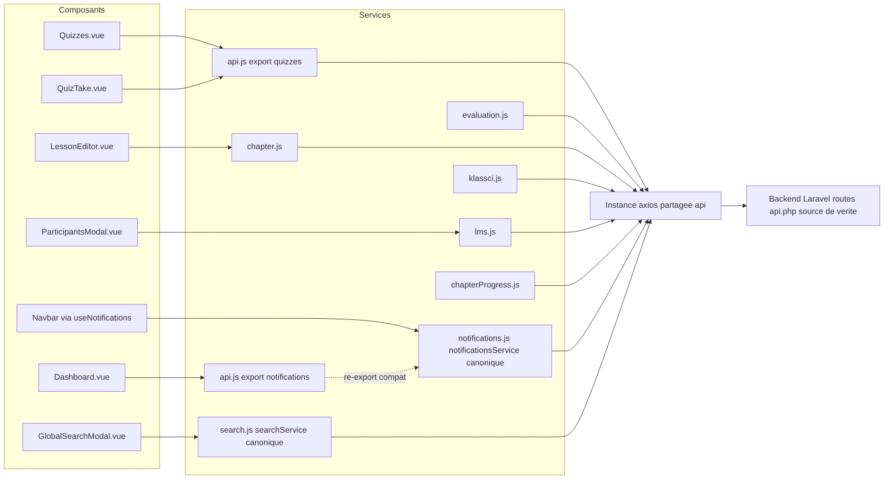
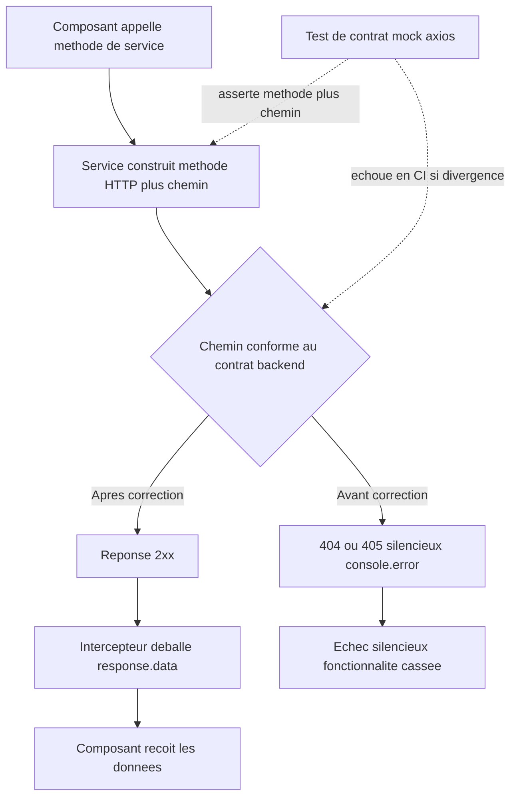
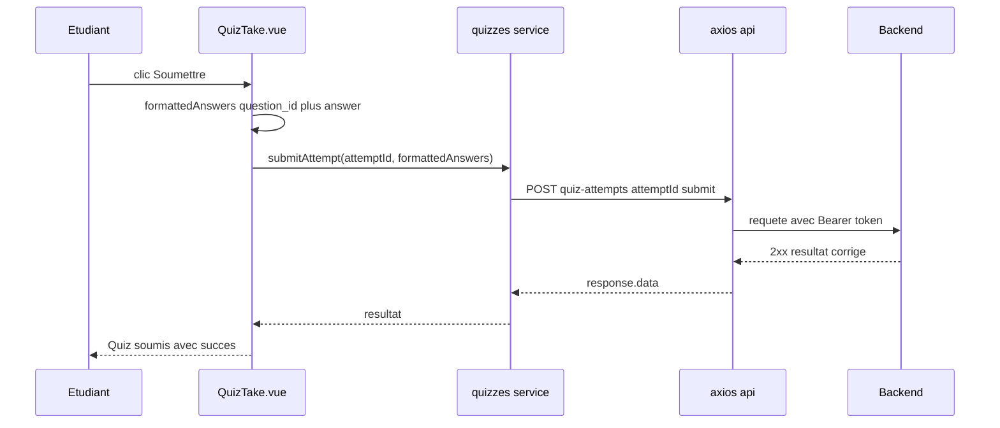
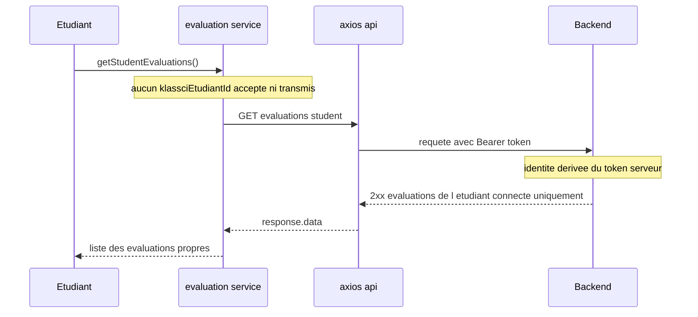
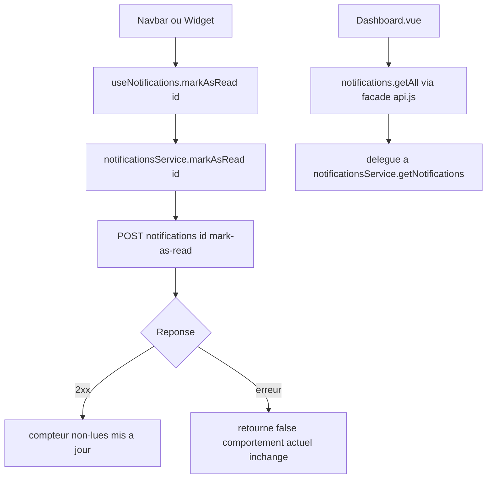

# Design Document — Synchronisation du contrat d'API (api-contract-sync)

> Issue GitHub : #17 — TIER 0 CRITICAL (épique #16)
> Dépôt corrigé : `lms-frontend` (Vue 3). Source de vérité : `lms-backend/routes/api.php` (**NE PAS modifier**).
> Toutes les routes cibles de ce document ont été confirmées par lecture directe de `routes/api.php` (numéros de ligne cités).

## Overview

### Objectif

Aligner la couche de services HTTP du frontend sur le contrat réel du backend. Douze appels
(`Ék-1` à `Ék-12`) ciblent des routes inexistantes et échouent silencieusement en 404/405,
car l'intercepteur de réponse axios se contente d'un `console.error` (`src/services/api.js:33`).
La correction porte sur trois axes :

1. **Réalignement de chemins/méthodes HTTP** des méthodes de service fautives.
2. **Déduplication** des clients dupliqués (`notifications`, `search`) vers un client canonique unique par domaine (NF3 / SRP).
3. **Test de contrat automatisé** asservissant méthode HTTP + chemin de chaque méthode couverte, incluant un garde-fou anti-régression IDOR (R13, NF2).

### Portée

- **Dans la portée** : modification des fichiers `src/services/{api,evaluation,chapter,klassci,lms,chapterProgress}.js`, mise à jour des consommateurs impactés, ajout d'un harnais de test de contrat.
- **Hors portée** : toute modification backend (NF4) ; refonte de l'intercepteur d'erreurs axios (dette tracée, annexe requirements) ; nouvelles fonctionnalités métier.

### Principes de conception retenus

- **Le client canonique gagne.** Quand deux implémentations existent pour le même domaine, on conserve celle déjà correcte et consommée, et on supprime/redirige l'autre.
- **Code mort = code supprimé.** Une méthode pointant vers une route inexistante et sans consommateur est retirée (preuve d'absence de consommateur fournie ci-dessous), conformément à R14.3.
- **Une seule décision par arbitrage.** Pour chaque écart à trancher (R3, Ék-10, Ék-12), une décision unique est prise et justifiée, jamais « A ou B » laissé ouvert.
- **Aucun identifiant d'identité côté client comme valeur autoritaire.** L'identité de l'étudiant est dérivée du token backend (NF1, anti-IDOR).
- **SRP / ≤ 300 lignes par service** : les corrections n'ajoutent pas de lignes significatives ; tous les services concernés restent largement sous 300 lignes après modification.

### Inventaire des consommateurs (vérifié par grep dans `src/`)

| Méthode de service | Consommateur(s) réel(s) | Conséquence design |
|---|---|---|
| `quizzes.startAttempt` | `Quizzes.vue:102` | corriger chemin uniquement |
| `quizzes.submitAttempt` | `QuizTake.vue:201` | corriger méthode+chemin |
| `quizzes.getMyAttempts` | **AUCUN** | **supprimer** (preuve §3) |
| `notifications.markAsRead` / `markAllAsRead` (api.js) | **AUCUN** (seul `notificationsService` est consommé) | **supprimer du client api.js** (preuve §4) |
| `notifications.getAll` (api.js) | `Dashboard.vue:153` | conserver via ré-export de compat (§4) |
| `evaluation.getStudentEvaluations` | (cf. §2, Ék-6) | réaligner sans paramètre |
| `evaluation.syncToKlassci` | (cf. §2, Ék-7) | corriger chemin |
| `chapter.createChapter` / `reorderChapters` | **AUCUN** | corriger chemin + exiger `lessonId` (preuve §2) |
| `klassci.search` | **AUCUN** | **supprimer** (preuve §3) |
| `lms.getVisioParticipants` | `ParticipantsModal.vue:355` | corriger chemin uniquement |
| `lms.getSeanceParticipants` | `VisioManager.vue:488` | **inchangé** (sémantique distincte) |
| `chapterProgress.resetLessonProgress` | **AUCUN** | **supprimer** (preuve §3) |

---

## Architecture

### Le pattern « composant → service → axios »

Le frontend suit une couche de services à trois niveaux. Le composant Vue ne connaît jamais
d'URL : il appelle une méthode de service nommée par intention métier. Le service traduit
l'intention en méthode HTTP + chemin. L'instance axios partagée (`src/services/api.js`) porte
le `baseURL`, l'injection du token Bearer (intercepteur de requête) et le déballage de
`response.data` (intercepteur de réponse). C'est cette traduction service → chemin qui est
désynchronisée du contrat backend : la couche à corriger est exclusivement la couche service.

### Diagramme de la couche service



### Data Flow — où s'insère la correction

Le flux nominal est inchangé ; seule la chaîne « méthode de service → URL émise » est rectifiée.



---

## Components and Interfaces

### Corrections par écart (Ék-1 à Ék-12)

Légende : « État actuel » et « État cible » donnent `MÉTHODE chemin`. « Signature » indique si la
signature publique de la méthode change.

#### Ék-1 — `quizzes.startAttempt` (R1)

- **Fichier** : `src/services/api.js:188`
- **Actuel** : `POST /quizzes/{quizId}/attempts`
- **Cible** : `POST /quizzes/{quizId}/start` (api.php:408)
- **Consommateur** : `Quizzes.vue:102` (`quizzes.startAttempt(quizId)`)
- **Signature** : inchangée. Correction purement de chemin.

#### Ék-2 — `quizzes.submitAttempt` (R2)

- **Fichier** : `src/services/api.js:192`
- **Actuel** : `PUT /quizzes/attempts/{attemptId}/submit` avec corps `{ answers }`
- **Cible** : `POST /quiz-attempts/{attemptId}/submit` (api.php:410)
- **Consommateur** : `QuizTake.vue:201` (`quizzes.submitAttempt(this.attemptId, formattedAnswers)`)
- **Signature** : inchangée. Changement de **méthode HTTP** (`PUT` → `POST`) et de **chemin**.
- **Corps de requête** : voir Data Models §R2.

#### Ék-3 — `quizzes.getMyAttempts` (R3) — **ARBITRAGE, voir §3**

- **Fichier** : `src/services/api.js:196`
- **Actuel** : `GET /quizzes/{quizId}/my-attempts` (route inexistante)
- **Décision** : **suppression** de la méthode (aucun consommateur, preuve §3).

#### Ék-4 — `notifications.markAsRead` (R4, R6) — **DÉDUPLICATION, voir §4**

- **Fichier** : `src/services/api.js:222`
- **Actuel** : `POST /notifications/{id}/read`
- **Cible canonique** : `POST /notifications/{id}/mark-as-read` (api.php:765), déjà implémentée dans `notificationsService.markAsRead`.
- **Décision** : la méthode dupliquée erronée de `api.js` est **supprimée** (aucun consommateur, preuve §4).

#### Ék-5 — `notifications.markAllAsRead` (R5, R6) — **DÉDUPLICATION, voir §4**

- **Fichier** : `src/services/api.js:226`
- **Actuel** : `POST /notifications/read-all`
- **Cible canonique** : `POST /notifications/mark-all-as-read` (api.php:768), déjà dans `notificationsService.markAllAsRead`.
- **Décision** : méthode dupliquée erronée **supprimée** de `api.js`.

#### Ék-6 — `evaluation.getStudentEvaluations` (R7, NF1) — **anti-IDOR**

- **Fichier** : `src/services/evaluation.js:37-39`
- **Actuel** : `GET /evaluations/student/{klassciEtudiantId}` (route **supprimée** côté backend pour vecteur IDOR, api.php:657-661)
- **Cible** : `GET /evaluations/student` (api.php:661), identité dérivée du token.
- **Signature** : **change**. Le paramètre `klassciEtudiantId` est **retiré** de la signature publique : `getStudentEvaluations()`. On ne le transforme pas en query string (interdit par R7.2). S'aligne sur `klassciService.getMyEvaluations` (klassci.js:256) qui utilise déjà `GET /evaluations/student`.
- **Consommateur** : aucun appel passant un identifiant n'a été trouvé sous `src/` ; la méthode reste exportée pour compatibilité d'import, désormais sans paramètre.

#### Ék-7 — `evaluation.syncToKlassci` (R8)

- **Fichier** : `src/services/evaluation.js:133-135`
- **Actuel** : `POST /evaluations/{id}/sync-to-klassci`
- **Cible** : `POST /evaluations/{id}/sync-klassci` (api.php:700)
- **Signature** : inchangée. Correction de chemin. **NE PAS confondre** avec `POST /evaluations/{id}/sync-notes` (api.php:697), endpoint distinct non couvert ici (R8.3).

#### Ék-8 — `chapter.createChapter` (R9)

- **Fichier** : `src/services/chapter.js:50-52`
- **Actuel** : `POST /chapters` avec corps `chapterData`
- **Cible** : `POST /lessons/{lessonId}/chapters` (api.php:244)
- **Signature** : **change** : `createChapter(lessonId, chapterData)`. Le `lessonId` devient le premier paramètre obligatoire et est interpolé dans le chemin.
- **Validation client** (R9.3) : si `lessonId` est falsy, lever une `Error` synchrone **avant** tout appel axios (pas de requête vers un chemin incomplet).
- **Consommateur** : **aucun** appel à `createChapter` n'existe sous `src/` (grep : seules les définitions). Aucun appelant à mettre à jour. Quand un appelant sera ajouté (ex. `LessonEditor.vue`), il devra fournir le `lessonId` du contexte courant (R9.4).

#### Ék-9 — `chapter.reorderChapters` (R10)

- **Fichier** : `src/services/chapter.js:96-98`
- **Actuel** : `POST /chapters/reorder` avec corps `{ chapters }`
- **Cible** : `POST /lessons/{lessonId}/chapters/reorder` (api.php:256)
- **Signature** : **change** : `reorderChapters(lessonId, chapters)`. `lessonId` premier paramètre obligatoire, même garde de validation que Ék-8.
- **Consommateur** : **aucun** sous `src/`.

#### Ék-10 — `klassci.search` (R11) — **ARBITRAGE, voir §3**

- **Fichier** : `src/services/klassci.js:165-167`
- **Actuel** : `GET /proxy/search` (route inexistante)
- **Décision** : **suppression** (aucun consommateur, preuve §3). Le client canonique de recherche globale est `searchService.globalSearch` (`search.js:10`, `GET /search`), consommé par `GlobalSearchModal.vue:223`.

#### Ék-11 — `lms.getVisioParticipants` (R12)

- **Fichier** : `src/services/lms.js:342-344`
- **Actuel** : `GET /lms/seances/{seanceId}/participants`
- **Cible** : `GET /lms/seances/{seanceId}/visio-participants` (api.php:613, route renommée backend)
- **Signature** : inchangée. Correction de chemin.
- **À ne PAS toucher** : `lms.getSeanceParticipants` (lms.js:116, `GET /lms/seances/{id}/participants`) reste inchangée — sémantique distincte (participants AUTORISÉS vs CONNECTÉS), consommée par `VisioManager.vue:488` (R12.2).
- **Consommateur de la correction** : `ParticipantsModal.vue:355`.

#### Ék-12 — `chapterProgress.resetLessonProgress` (R15) — **ARBITRAGE, voir §3**

- **Fichier** : `src/services/chapterProgress.js:79-89`
- **Actuel** : `DELETE /lessons/{lessonId}/progress` (route inexistante)
- **Décision** : **suppression** (aucun consommateur, preuve §3).

---

## §3 — ARBITRAGES TRANCHÉS (R3, Ék-10, Ék-12)

Méthode commune : recherche exhaustive des consommateurs par grep sous `src/`, puis décision
unique (suppression OU remappage) avec justification. Aucune option laissée ouverte.

### R3 — `quizzes.getMyAttempts(quizId)`

**Le problème de sémantique.** `getMyAttempts(quizId)` prend un `quizId` (« mes tentatives pour
ce quiz »), alors que la seule route de consultation backend est
`GET /quiz-attempts/{attemptId}` (api.php:418), qui prend un `attemptId` (« cette tentative
précise »). Les deux ne sont **pas** équivalents : un `quizId` ne permet pas de dériver un
`attemptId`, et le backend n'expose aucune route « liste de mes tentatives pour un quiz » côté
quizzes. Un remappage naïf `getMyAttempts(quizId)` → `GET /quiz-attempts/{quizId}` serait un
**bug** (on enverrait un quizId là où le backend attend un attemptId).

**Recherche de consommateurs.** Grep `getMyAttempts` sous `src/` :
- `src/services/api.js:196` — la définition à corriger.
- `src/services/knowledgeCheck.js:126` — méthode **homonyme d'un domaine différent** (`/knowledge-checks/{id}/my-attempts`), qui possède **sa propre route backend valide** et ses propres consommateurs (`KnowledgeCheckPlayer.vue`). Hors périmètre Ék-3.
- **Aucune vue / aucun composant / aucun store** n'importe et n'appelle `quizzes.getMyAttempts`.

**Décision : SUPPRESSION** de `quizzes.getMyAttempts` (api.js:196-198).

**Justification.** (1) Zéro consommateur → aucune régression d'import (R3.3, R14.3). (2) La route
cible n'existe pas et un remappage introduirait une confusion sémantique `quizId`/`attemptId`
(donc un bug). (3) Introduire une nouvelle méthode `getAttempt(attemptId)` ciblant
`GET /quiz-attempts/{attemptId}` serait une **fonctionnalité nouvelle sans appelant** → hors
portée (R3 n'exige une méthode de consultation que « WHEN le code appelle la méthode de
consultation » ; aucun code ne l'appelle). Le test de contrat couvre malgré tout le chemin
canonique `GET /quiz-attempts/{attemptId}` au cas où une méthode serait réintroduite, mais aucune
méthode n'est ajoutée dans ce changement.

> **Dette tracée (latente, hors portée).** `QuizTake.vue` lit `this.attemptId` (data initialisé à
> `null`, jamais réassigné) et `Quizzes.vue:102` ignore la valeur retournée par `startAttempt`.
> La soumission part donc avec `attemptId = null`. Ce bug fonctionnel **préexiste** et n'est pas
> dans la portée de #17 (qui ne corrige que méthode+chemin). À traiter dans une issue dédiée :
> faire remonter l'`attempt.id` de `startAttempt` jusqu'à `QuizTake`. Documenté ici pour
> traçabilité, non corrigé.

### Ék-10 — `klassci.search(query, type)`

**Recherche de consommateurs.** Grep des appels `.search(` et `klassciService.search` sous
`src/` : **aucun appelant**. Le seul usage de recherche globale est
`searchService.globalSearch` (`GlobalSearchModal.vue:223`), qui cible déjà `GET /search`.

**Décision : SUPPRESSION** de `klassciService.search` (klassci.js:165-175).

**Justification.** Zéro consommateur ; la route `/proxy/search` n'existe pas ; le domaine recherche
a déjà son client canonique (`searchService`). Remapper serait créer une seconde implémentation
concurrente, ce que R11 / NF3 interdisent explicitement (un seul client canonique par domaine).
La suppression élimine du code mort (R14.3) sans orphelin.

### Ék-12 — `chapterProgress.resetLessonProgress(lessonId, userId)`

**Recherche de consommateurs.** Grep `resetLessonProgress` sous `src/` : seules les **définitions**
(`chapterProgress.js:79` et `:86`). **Aucun appelant.**

**Décision : SUPPRESSION** de `resetLessonProgress` (chapterProgress.js:79-89).

**Justification.** Zéro consommateur ; route `DELETE /lessons/{id}/progress` inexistante (R15.1).
La condition R15.2 (« si un consommateur est identifié, réviser la spec ») ne se déclenche pas.
Le test de contrat échouera si un chemin `DELETE /lessons/{id}/progress` réapparaît (R15.3).

---

## §4 — Stratégie de déduplication (R6, R11)

### Domaine notifications (R6)

**État.** Deux clients :
- `notificationsService` (`notifications.js`) — **canonique** : chemins corrects
  `/notifications/{id}/mark-as-read` et `/notifications/mark-all-as-read`. Consommé par
  `useNotifications.js`, `NotificationsWidget.vue`, `Navbar.vue`.
- `notifications` (export de `api.js:217`) — dupliqué, chemins erronés `markAsRead`/`markAllAsRead`.
  Consommé **uniquement** par `Dashboard.vue:153`, et **seulement** via `notifications.getAll(...)`
  (jamais `markAsRead`/`markAllAsRead`).

**Mécanisme retenu : ré-export de compatibilité.** Plutôt que de toucher `Dashboard.vue`, l'export
`notifications` de `api.js` est **réduit à une façade de compatibilité** qui délègue au client
canonique. Les méthodes erronées (`markAsRead`, `markAllAsRead`) sont **supprimées** ; les méthodes
réellement consommées (`getAll`, `getUnreadCount`) sont conservées en déléguant à
`notificationsService` lorsque l'équivalent existe.

```js
// src/services/api.js — APRÈS
import notificationsService from './notifications'

// Façade de compatibilité : Dashboard.vue importe { notifications } depuis api.js
// et n'utilise que .getAll(). On délègue au client canonique pour éviter toute
// divergence de chemin. Les méthodes markAsRead/markAllAsRead erronées sont supprimées.
export const notifications = {
  getAll: (params = {}) => notificationsService.getNotifications(
    params.page ?? 1, params.limit ?? 10, params.unread_only ?? false
  ),
  getUnreadCount: () => notificationsService.getUnreadCount(),
}
```

**Note de compatibilité de forme de retour.** `notificationsService.getNotifications` renvoie
`response` (objet paginé) ou `null`, tandis que `Dashboard.vue:154` fait
`Array.isArray(notifsData) ? notifsData : []`. La façade doit donc soit (a) exposer le tableau
`response.data`, soit (b) laisser `Dashboard.vue` gérer l'objet. **Décision : option (a)** — la
façade `getAll` retourne le tableau de notifications (`response?.data ?? []`) afin de préserver
exactement le contrat de forme attendu par `Dashboard.vue` sans modifier le composant.

```js
getAll: async (params = {}) => {
  const res = await notificationsService.getNotifications(1, params.limit ?? 10, false)
  return res?.data ?? []
},
```

**Impact.** Import `Dashboard.vue:114` (`import { ... notifications as notificationsApi ... } from '@/services/api'`)
inchangé → aucune régression de build (R6.2, R14.1). Plus aucun chemin
`/notifications/{id}/read` ni `/notifications/read-all` dans le code (R4.2, R5.2). Une seule
implémentation canonique des chemins de marquage subsiste (R6.3).

> Alternative écartée : « mettre à jour l'import de Dashboard.vue vers `notificationsService` ».
> Rejetée car elle modifie un consommateur sans bénéfice (le ré-export est plus sûr, plus petit,
> et `getAll` n'a pas d'équivalent strict de nom dans le client canonique). Décision unique
> conforme à §6 : ré-export de compat.

### Domaine recherche (R11)

`searchService.globalSearch` (`search.js`) est canonique et consommé (`GlobalSearchModal.vue:223`).
`klassciService.search` est supprimé (§3, Ék-10). Aucune façade nécessaire : pas de consommateur à
préserver. Plus aucun chemin `/proxy/search` après correction (R11.4).

---

## Data Models

Formats de corps de requête concernés, **à confirmer contre le backend** lors de l'implémentation
(le backend reste source de vérité ; les structures ci-dessous reflètent le code frontend actuel
et le contrat attendu).

### R2 — Soumission de tentative de quiz

`QuizTake.vue:196-199` construit déjà le format attendu :

```ts
interface QuizAnswer {
  question_id: number   // parseInt de la clé de réponse
  answer: string        // valeur sélectionnée
}

// Corps émis vers POST /quiz-attempts/{attemptId}/submit
type SubmitAttemptBody = QuizAnswer[]
```

**Décision de format.** Le service actuel enveloppe dans `{ answers }`
(`api.js:193`, `{ answers }`). `QuizTake.vue` transmet déjà un **tableau plat**
`formattedAnswers`. Le service corrigé doit transmettre ce que le backend attend ; R2.2 parle d'un
« tableau `{ question_id, answer }` ». **À confirmer** : tableau plat vs `{ answers: [...] }`. La
décision par défaut retenue est de **transmettre le payload tel que fourni par l'appelant**
(tableau), le composant étant la source du format. Si le backend exige `{ answers }`,
l'enveloppe sera faite dans le service. Cette confirmation est une étape d'implémentation
(lecture de `QuizAttemptStudentController::submitAttempt`), pas une ambiguïté de design : la
signature `submitAttempt(attemptId, answers)` reste stable quelle que soit l'enveloppe.

### R7 — Évaluations de l'étudiant (anti-IDOR)

```ts
// GET /evaluations/student  (aucun paramètre de chemin ni de query d'identité)
// L'identité de l'étudiant est dérivée du token côté backend.
interface StudentEvaluationsResponse {
  success: boolean
  data: Evaluation[]
}
```

### R9 / R10 — Chapitres rattachés à une leçon

```ts
// POST /lessons/{lessonId}/chapters
interface CreateChapterBody { /* chapterData : titre, ordre, contenu… (inchangé) */ }

// POST /lessons/{lessonId}/chapters/reorder
interface ReorderChaptersBody { chapters: Array<{ id: number; order: number }> }
```

`lessonId` n'est **pas** dans le corps : il est dans le chemin (segment d'URL).

### Diagramme — domaines de service après correction

```mermaid
classDiagram
    class quizzes {
        +getAll()
        +getOne(id)
        +startAttempt(quizId) POST quizzes id start
        +submitAttempt(attemptId, answers) POST quiz-attempts id submit
    }
    class evaluationService {
        +getStudentEvaluations() GET evaluations student
        +syncToKlassci(id) POST evaluations id sync-klassci
    }
    class chapterService {
        +createChapter(lessonId, data) POST lessons id chapters
        +reorderChapters(lessonId, chapters) POST lessons id chapters reorder
    }
    class lmsService {
        +getSeanceParticipants(id) GET lms seances id participants
        +getVisioParticipants(id) GET lms seances id visio-participants
    }
    class notificationsService {
        +markAsRead(id) POST notifications id mark-as-read
        +markAllAsRead() POST notifications mark-all-as-read
    }
    class searchService {
        +globalSearch(query) GET search
    }
```



---

## Business Process

### Processus 1 — Soumission d'une tentative de quiz (R2, après correction)



### Processus 2 — Récupération des évaluations étudiant sans IDOR (R7)



### Processus 3 — Marquage de notification via client canonique (R4, R6)



---

## Error Handling

### Comportement attendu après correction

- **Avant** : chemins erronés → réponses 404/405 → l'intercepteur de réponse
  (`api.js:33`) ne fait qu'un `console.error`, rejette la promesse ; les fonctionnalités échouent
  silencieusement. Les appelants varient : certains `throw` (services evaluation/chapter), certains
  retournent `false`/`null` (notifications/search), certains `alert(...)` (Quizzes/QuizTake).
- **Après** : chemins conformes → réponses **2xx** ; la branche d'erreur n'est plus déclenchée par
  une divergence de contrat. Le comportement de gestion d'erreur applicatif (try/catch existants)
  reste **inchangé** — on ne modifie ni les `try/catch`, ni les retours par défaut, ni les `alert`.

### Validation client (R9.3, R10.2)

Pour `createChapter` et `reorderChapters`, un `lessonId` falsy lève une `Error` synchrone **avant**
tout appel réseau, plutôt que d'émettre une requête vers un chemin incomplet
(`/lessons//chapters`). C'est la seule nouvelle logique d'erreur introduite.

```js
async createChapter(lessonId, chapterData) {
  if (!lessonId) throw new Error('[ChapterService] lessonId requis pour créer un chapitre')
  const response = await api.post(`/lessons/${lessonId}/chapters`, chapterData)
  return response.data
}
```

### Dette tracée (rappel, hors portée — annexe requirements)

L'intercepteur de réponse axios (`api.js:33`) ne remonte pas les erreurs non-401 à l'utilisateur
ni à une supervision. C'est ce qui a masqué les 12 écarts en production. **Non corrigé par #17.**
Le test de contrat (R13) capte les divergences en CI, mais pas au runtime. À traiter dans une issue
dédiée de durcissement de la gestion d'erreurs.

---

## §5 — Stratégie de test de contrat (R13)

### Objectif

Pour chaque méthode de service couverte (R1–R12), asserter **la méthode HTTP exacte et le chemin
exact** émis, axios étant intercepté (aucun appel réseau réel), avec garde-fou anti-IDOR.

### Gestion de la dépendance Vitest (#21 / T0-5) — décision tranchée

`package.json` ne contient **aucun** framework de test (vérifié : ni Vitest, ni Jest, ni dépendance
de test). Le projet est ESM (`"type": "module"`) sur Vite/Node.

**Décision (R13.4) : double cible, une seule implémentation de logique.** On écrit les assertions
de contrat dans un module **agnostique du runner** (`tests/contract/api-contract.spec.js`) qui
expose une fonction `runContractAssertions(register)` pure :

1. **Si Vitest est disponible** (après #21) : un fichier `*.test.js` importe `describe/it/expect`
   de Vitest et délègue à la logique partagée. C'est la cible finale, intégrée à la CI.
2. **Si Vitest n'est pas encore livré** : un **runner léger maison** sans dépendance
   (`tests/contract/run-contract.mjs`, exécutable via `node tests/contract/run-contract.mjs`)
   exécute exactement les mêmes assertions et sort en code 1 au premier échec. Un script npm
   `"test:contract": "node tests/contract/run-contract.mjs"` est ajouté.

Ainsi la fonctionnalité **n'est pas bloquée par #21** : le runner natif Node suffit immédiatement,
et la migration vers Vitest est triviale (le cœur d'assertions est partagé). **On ne choisit pas
« attendre Vitest » : on fournit l'alternative légère ET le point d'entrée Vitest.**

### Pattern de mock axios

On n'effectue aucun appel réseau. Deux approches possibles ; **décision : interception au niveau de
l'instance axios partagée** via un adaptateur de capture, car (a) elle teste le vrai service
(import réel), (b) elle n'exige aucune lib de mock, (c) elle capture méthode+url+params+data en un
point unique.

```js
// tests/contract/captureAdapter.mjs
// Remplace l'adaptateur de l'instance axios pour capturer la requête au lieu de l'envoyer.
import api from '../../src/services/api.js'

export function installCapture() {
  const calls = []
  api.defaults.adapter = (config) =>
    new Promise((resolve) => {
      calls.push({
        method: config.method.toUpperCase(),
        // url relative au baseURL : on neutralise baseURL pour comparer le chemin pur
        url: config.url,
        params: config.params ?? null,
        data: config.data ? JSON.parse(config.data) : null,
      })
      // L'intercepteur de réponse renvoie response.data : on simule { success: true, data: [] }
      resolve({ data: { success: true, data: [] }, status: 200, statusText: 'OK', headers: {}, config })
    })
  return {
    calls,
    last: () => calls[calls.length - 1],
    reset: () => (calls.length = 0),
  }
}
```

> Note : `config.url` est le chemin relatif passé au service (ex. `/quizzes/1/start`), `baseURL`
> n'étant appliqué qu'à l'envoi réel — l'adaptateur reçoit `config.url` tel quel. L'assertion porte
> donc directement sur le chemin canonique.

### Forme d'une assertion de contrat

```js
// Pseudo-structure partagée, indépendante du runner
import { quizzes } from '../../src/services/api.js'
import evaluationService from '../../src/services/evaluation.js'
import lmsService from '../../src/services/lms.js'
import chapterService from '../../src/services/chapter.js'
// … notificationsService, searchService

export const contractCases = [
  { name: 'R1 startAttempt',
    run: () => quizzes.startAttempt(42),
    expect: { method: 'POST', url: '/quizzes/42/start' } },
  { name: 'R2 submitAttempt',
    run: () => quizzes.submitAttempt(7, [{ question_id: 1, answer: 'a' }]),
    expect: { method: 'POST', url: '/quiz-attempts/7/submit' } },
  { name: 'R7 getStudentEvaluations sans id',
    run: () => evaluationService.getStudentEvaluations(),
    expect: { method: 'GET', url: '/evaluations/student' } },
  { name: 'R8 syncToKlassci',
    run: () => evaluationService.syncToKlassci(9),
    expect: { method: 'POST', url: '/evaluations/9/sync-klassci' } },
  { name: 'R9 createChapter exige lessonId',
    run: () => chapterService.createChapter(3, { titre: 'x' }),
    expect: { method: 'POST', url: '/lessons/3/chapters' } },
  { name: 'R10 reorderChapters',
    run: () => chapterService.reorderChapters(3, [{ id: 1, order: 0 }]),
    expect: { method: 'POST', url: '/lessons/3/chapters/reorder' } },
  { name: 'R12 getVisioParticipants',
    run: () => lmsService.getVisioParticipants(5),
    expect: { method: 'GET', url: '/lms/seances/5/visio-participants' } },
  // … R4, R5 (notificationsService), R11 (searchService)
]
```

### Garde-fou anti-IDOR (R13.5, R7.5)

Assertion dédiée qui échoue si une URL émise correspond au motif paramétré
`/evaluations/student/<segment>` :

```js
const IDOR_PATTERN = /^\/evaluations\/student\/.+/
// Après exécution de getStudentEvaluations(), et même si on force un argument :
evaluationService.getStudentEvaluations('999')   // tentative de forge
assert(!IDOR_PATTERN.test(capture.last().url),
  'Régression IDOR : un identifiant d’étudiant a réapparu dans le chemin')
assert(capture.last().params == null || !('klassciEtudiantId' in capture.last().params),
  'Régression IDOR : identifiant transmis en query string')
```

De même, des assertions **négatives** garantissent l'absence des chemins morts :
`/quizzes/{id}/my-attempts`, `/proxy/search`, `DELETE /lessons/{id}/progress`,
`/notifications/{id}/read`, `/notifications/read-all`, `/evaluations/{id}/sync-to-klassci`,
`/chapters` (sans segment de leçon), `/chapters/reorder`, `/lms/seances/{id}/participants` pour
`getVisioParticipants`.

---

## Testing Strategy

### Cas de test par requirement (happy path + edge + anti-régression)

| Req | Happy path | Edge / négatif | Anti-régression |
|-----|------------|----------------|-----------------|
| R1 | `startAttempt(42)` → `POST /quizzes/42/start` | id numérique et string | échoue si `/quizzes/42/attempts` |
| R2 | `submitAttempt(7, answers)` → `POST /quiz-attempts/7/submit` ; corps = answers transmis | answers vide | échoue si `PUT` ou `/quizzes/attempts/7/submit` |
| R3 | `quizzes.getMyAttempts` **absente** (typeof undefined) | — | échoue si `/quizzes/{id}/my-attempts` réapparaît |
| R4 | `notificationsService.markAsRead(1)` → `POST /notifications/1/mark-as-read` | — | échoue si `/notifications/1/read` |
| R5 | `notificationsService.markAllAsRead()` → `POST /notifications/mark-all-as-read` | — | échoue si `/notifications/read-all` |
| R6 | `api.notifications.markAsRead` **absente** ; `api.notifications.getAll()` délègue au canonique | `getAll` retourne un tableau | une seule impl. de chemin de marquage |
| R7 | `getStudentEvaluations()` → `GET /evaluations/student` | appel avec arg forgé `'999'` | **IDOR** : échoue si `/evaluations/student/999` ou query `klassciEtudiantId` |
| R8 | `syncToKlassci(9)` → `POST /evaluations/9/sync-klassci` | — | échoue si `sync-to-klassci` ; `sync-notes` reste distinct |
| R9 | `createChapter(3, data)` → `POST /lessons/3/chapters` | `createChapter(null, data)` **throw** sans requête | échoue si `POST /chapters` |
| R10 | `reorderChapters(3, list)` → `POST /lessons/3/chapters/reorder` | `reorderChapters(undefined, list)` **throw** | échoue si `/chapters/reorder` |
| R11 | `searchService.globalSearch('x')` → `GET /search` ; `klassci.search` **absente** | — | échoue si `/proxy/search` |
| R12 | `getVisioParticipants(5)` → `GET /lms/seances/5/visio-participants` ; `getSeanceParticipants(5)` → `/participants` inchangé | — | échoue si `getVisioParticipants` émet `/participants` |
| R15 | `resetLessonProgress` **absente** | — | échoue si `DELETE /lessons/{id}/progress` réapparaît |

### Non-régression de build et standards (R14)

- **Build** : `npm run build` (Vite) doit réussir après modifications ; tous les imports
  (`Dashboard.vue` `notifications`, `QuizTake.vue`/`Quizzes.vue` `quizzes`) doivent se résoudre
  (R14.1, R3.4, R6.2).
- **SRP / ≤ 300 lignes** : après suppression de code mort et corrections, chaque service concerné
  reste sous 300 lignes (api.js ~ inchangé hors suppressions ; evaluation.js, chapter.js,
  klassci.js, lms.js, chapterProgress.js voient leur taille **diminuer**). Un seul client canonique
  par domaine (notifications, recherche) — NF3 respecté.
- **CONTRIBUTING.md** : branche dédiée, commits conventionnels, revue (R14.5).

### Couverture de la non-régression IDOR

Le cas R7 est testé sous deux angles : (1) chemin nominal sans identifiant, (2) tentative de forge
d'identifiant qui ne doit **jamais** produire un segment d'URL paramétré ni une query d'identité.
C'est le garde-fou explicitement requis par R13.5.

---

## Traçabilité design → requirements

| Section design | Requirements couverts |
|---|---|
| Ék-1 … Ék-12 (Components and Interfaces) | R1, R2, R4, R5, R7, R8, R9, R10, R12 + Ék correspondants |
| §3 Arbitrages | R3, R11 (Ék-10), R15 (Ék-12), R14.3 |
| §4 Déduplication | R6, R11, NF3 |
| §5 Test de contrat | R13, NF2 |
| Data Models | R2, R7, R9, R10 |
| Error Handling | R9.3, R10.2, annexe dette |
| Testing Strategy | R1–R15, R14, NF1, NF2, NF3 |
| Anti-IDOR (Processus 2 + garde-fou §5) | R7, NF1, R13.5 |
| Backend non modifié | NF4 (toutes routes cibles citées depuis api.php, aucune création) |

---

Does the design look good? If so, we can move on to the implementation plan.
