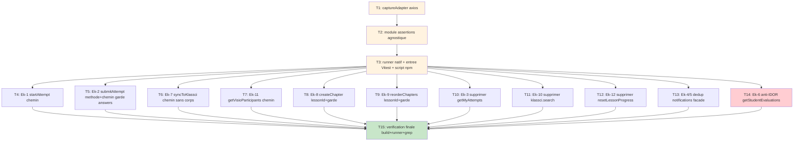

# Plan d'implémentation — Synchronisation du contrat d'API (api-contract-sync)

> Issue GitHub : #17 — TIER 0 CRITICAL (épique #16)
> Dépôt corrigé : `lms-frontend` (Vue 3). Source de vérité : `lms-backend/routes/api.php` — **NE PAS modifier**.
> Chaque tâche de correction cite le chemin cible exact et sa source `api.php`, via `backend-contract-verified.md`.
> Approche TDD (PRODUCTION_STANDARDS §1.3) : la tâche de test de contrat est écrite **avant ou avec** la correction. Le test échoue d'abord (chemin actuel non conforme), puis la correction le fait passer.

---

## Phase A — Harnais de test de contrat (prérequis : aucun framework de test n'existe)

- [x] 1. Mettre en place l'adaptateur de capture axios partagé
  - Créer `tests/contract/captureAdapter.mjs` qui importe l'instance axios réelle (`src/services/api.js`) et remplace `api.defaults.adapter` par un adaptateur qui capture `{ method, url, params, data }` au lieu d'émettre une requête réseau, et résout une réponse `{ data: { success: true, data: [] }, status: 200 }` (cf. design §5, pattern de mock).
  - Exposer `installCapture()` retournant `{ calls, last(), reset() }`. `data` est parsé depuis JSON quand présent ; `url` est le chemin relatif tel que passé au service (le `baseURL` n'est jamais appliqué par l'adaptateur).
  - Critère de complétion : `installCapture()` capture une requête sans appel réseau réel (NF2.1) ; aucun import de lib de mock tierce.
  - _Requirements: R13.1, R13.3, NF2_

- [x] 2. Écrire le module d'assertions de contrat agnostique du runner
  - Créer `tests/contract/api-contract.spec.mjs` exposant une fonction pure `runContractAssertions(register)` et la table `contractCases` (un cas par méthode couverte R1–R12), chaque cas : `{ name, run, expect: { method, url } }`. Importer les services réels (`quizzes` depuis `api.js`, `evaluationService`, `chapterService`, `lmsService`, `notificationsService`, `searchService`).
  - Inclure les assertions **négatives** (chemins morts interdits) et le **garde-fou anti-IDOR** : motif `/^\/evaluations\/student\/.+/` doit être absent même après un appel forgé `getStudentEvaluations('999')` ; aucune query `klassciEtudiantId`.
  - À ce stade les cas REFLÈTENT les chemins CIBLES (donc échouent contre le code actuel) — c'est le « test rouge » TDD attendu.
  - Critère de complétion : module importable, `contractCases` listé, logique d'assertion centralisée et réutilisable par les deux cibles (Vitest + runner natif).
  - _Requirements: R13.1, R13.2, R13.4, R13.5, R7.5_

- [x] 3. Fournir le runner natif Node et le point d'entrée Vitest partagé
  - Créer `tests/contract/run-contract.mjs` exécutable par `node tests/contract/run-contract.mjs` : installe la capture, déroule `contractCases` + assertions négatives + garde-fou IDOR, affiche un rapport et **sort en code 1 au premier échec** (alternative légère, non bloquée par #21 / Vitest).
  - Créer `tests/contract/api-contract.test.mjs` qui importe `describe/it/expect` de Vitest et délègue à `runContractAssertions` (cible CI finale lorsque #21 est livrée).
  - Ajouter le script npm `"test:contract": "node tests/contract/run-contract.mjs"` dans `package.json`.
  - Critère de complétion : `node tests/contract/run-contract.mjs` s'exécute et ÉCHOUE (rouge) sur les écarts non encore corrigés — preuve que le harnais détecte bien les divergences.
  - _Requirements: R13.1, R13.2, R13.4_

---

## Phase B — Corrections de chemins simples (signature inchangée)

- [x] 4. Ék-1 — `quizzes.startAttempt` : corriger le chemin
  - Vérifier que le cas R1 du test (`startAttempt(42)` → `POST /quizzes/42/start`) est rouge, puis corriger `src/services/api.js:188` de `POST /quizzes/{id}/attempts` vers `POST /quizzes/{quizId}/start`.
  - Cible exacte : `POST /quizzes/{quiz}/start` (`api.php:408`) — **aucun corps** (`StartQuizAttemptRequest`). Signature `startAttempt(quizId)` inchangée.
  - Fichiers : `src/services/api.js`.
  - Critère de complétion : cas R1 vert ; assertion négative `/quizzes/42/attempts` absente.
  - _Requirements: R1.1, R1.2 — Ék-1_

- [x] 5. Ék-2 — `quizzes.submitAttempt` : corriger méthode + chemin, **conserver l'enveloppe `{ answers }`**
  - Vérifier que le cas R2 est rouge, puis corriger `src/services/api.js:192` de `PUT /quizzes/attempts/{id}/submit` vers `POST /quiz-attempts/{attemptId}/submit`.
  - Cible exacte : `POST /quiz-attempts/{id}/submit` (`api.php:410`). **Corps : garder l'enveloppe `{ answers }`** — le backend lit `$request->input('answers')` et `SubmitQuizAttemptRequest` exige `answers => required|array` (backend-contract-verified.md, ligne Ék-2 + Point d'attention §1). NE PAS envoyer un tableau plat. Signature `submitAttempt(attemptId, answers)` inchangée.
  - Fichiers : `src/services/api.js`.
  - Critère de complétion : cas R2 vert (méthode `POST`, url `/quiz-attempts/7/submit`, corps `{ answers: [...] }`) ; assertion négative `PUT` et `/quizzes/attempts/7/submit` absentes.
  - _Requirements: R2.1, R2.2, R2.3 — Ék-2_

- [x] 6. Ék-7 — `evaluation.syncToKlassci` : corriger le chemin, **sans corps**
  - Vérifier que le cas R8 est rouge, puis corriger `src/services/evaluation.js:133-135` de `POST /evaluations/{id}/sync-to-klassci` vers `POST /evaluations/{id}/sync-klassci`.
  - Cible exacte : `POST /evaluations/{id}/sync-klassci` (`api.php:700`). **Aucun corps** : `api.post(url)` sans 2ᵉ argument (backend-contract-verified.md, ligne Ék-7 + Point d'attention §2). NE PAS confondre avec `POST /evaluations/{id}/sync-notes` (`api.php:697`) — endpoint distinct à laisser intact. Signature inchangée.
  - Fichiers : `src/services/evaluation.js`.
  - Critère de complétion : cas R8 vert ; assertion négative `sync-to-klassci` absente ; `sync-notes` non affecté.
  - _Requirements: R8.1, R8.2, R8.3 — Ék-7_

- [x] 7. Ék-11 — `lms.getVisioParticipants` : corriger le chemin (et NE PAS toucher `getSeanceParticipants`)
  - Vérifier que le cas R12 est rouge, puis corriger UNIQUEMENT `src/services/lms.js:342-344` de `GET /lms/seances/{id}/participants` vers `GET /lms/seances/{seanceId}/visio-participants`.
  - Cible exacte : `GET /lms/seances/{seanceId}/visio-participants` (`api.php:613`, route renommée). **NE PAS modifier `getSeanceParticipants` (`lms.js:116`)** qui cible `/participants` (participants AUTORISÉS, sémantique distincte, consommé par `VisioManager.vue:488`). Signature inchangée.
  - Fichiers : `src/services/lms.js`.
  - Critère de complétion : cas R12 vert ; cas de garde `getSeanceParticipants(5)` → `/lms/seances/5/participants` toujours vert (inchangé) ; assertion négative : `getVisioParticipants` n'émet PAS `/participants`.
  - _Requirements: R12.1, R12.2, R12.3, R12.4 — Ék-11_

---

## Phase C — Changements de signature (ajout `lessonId` + garde de validation)

- [x] 8. Ék-8 — `chapter.createChapter` : ajouter `lessonId`, garde de validation, chemin imbriqué
  - Vérifier que le cas R9 est rouge, puis modifier `src/services/chapter.js:50-52` : nouvelle signature `createChapter(lessonId, chapterData)`. Lever une `Error` synchrone **avant tout appel axios** si `lessonId` est falsy (R9.3, évite `/lessons//chapters`). Émettre `POST /lessons/${lessonId}/chapters`.
  - Cible exacte : `POST /lessons/{lessonId}/chapters` (`api.php:244`). `lessonId` dans le **chemin**, pas dans le corps. Champs du corps en **FRANÇAIS** (`titre`, `ordre`, `type_contenu`, `fichier` → `multipart/form-data` si fichier joint) — `StoreChapterRequest`, NE PAS confondre avec `UpdateChapterRequest` (anglais) (backend-contract-verified.md, ligne Ék-8 + Point d'attention §3).
  - Aucun consommateur actuel (grep : seules les définitions) — aucun appelant à mettre à jour ; un futur appelant (`LessonEditor.vue`) devra fournir le `lessonId` du contexte (R9.4).
  - Fichiers : `src/services/chapter.js`.
  - Critère de complétion : cas R9 vert (`createChapter(3, {titre:'x'})` → `POST /lessons/3/chapters`) ; cas edge `createChapter(null, data)` **throw sans requête** vert ; assertion négative `POST /chapters` (sans segment leçon) absente.
  - _Requirements: R9.1, R9.2, R9.3, R9.4, R9.5 — Ék-8_

- [x] 9. Ék-9 — `chapter.reorderChapters` : ajouter `lessonId`, garde de validation, chemin imbriqué
  - Vérifier que le cas R10 est rouge, puis modifier `src/services/chapter.js:96-98` : nouvelle signature `reorderChapters(lessonId, chapters)`. Même garde de validation falsy que la tâche 8. Émettre `POST /lessons/${lessonId}/chapters/reorder` avec corps `{ chapters }`.
  - Cible exacte : `POST /lessons/{lessonId}/chapters/reorder` (`api.php:256`). Corps `{ chapters: [{ id, order }] }` (`ReorderChaptersRequest`, required, min 1) (backend-contract-verified.md, ligne Ék-9). Aucun consommateur actuel.
  - Fichiers : `src/services/chapter.js`.
  - Critère de complétion : cas R10 vert (`reorderChapters(3, [{id:1,order:0}])` → `POST /lessons/3/chapters/reorder`) ; cas edge `reorderChapters(undefined, list)` **throw** vert ; assertion négative `/chapters/reorder` (sans segment leçon) absente.
  - _Requirements: R10.1, R10.2, R10.3 — Ék-9_

---

## Phase D — Suppression de code mort (arbitrages tranchés §3, zéro consommateur)

- [x] 10. Ék-3 — Supprimer `quizzes.getMyAttempts` (route inexistante, aucun consommateur)
  - Supprimer la méthode `getMyAttempts` (`src/services/api.js:196-198`) qui ciblait `GET /quizzes/{id}/my-attempts` (inexistante). Aucun remappage : `quizId` ≠ `attemptId`, le remappage serait un bug (design §3, R3). NE PAS introduire de nouvelle méthode `getAttempt` (fonctionnalité sans appelant, hors portée).
  - Vérifier au préalable par grep l'absence de consommateur de `quizzes.getMyAttempts` sous `src/` (la méthode homonyme `knowledgeCheck.js:126` est un domaine distinct à NE PAS toucher).
  - Fichiers : `src/services/api.js`.
  - Critère de complétion : cas R3 vert (`quizzes.getMyAttempts` est `undefined`) ; assertion négative : `/quizzes/{id}/my-attempts` ne réapparaît pas ; les imports de `quizzes` dans `QuizTake.vue`, `Quizzes.vue`, `Dashboard.vue` se résolvent toujours.
  - _Requirements: R3.2, R3.3, R3.4, R14.3 — Ék-3_

- [x] 11. Ék-10 — Supprimer `klassci.search` (route `/proxy/search` inexistante, aucun consommateur)
  - Supprimer la méthode `search` (`src/services/klassci.js:165-175`) qui ciblait `GET /proxy/search`. Le client canonique de recherche globale est `searchService.globalSearch` (`search.js:10`, `GET /search`), consommé par `GlobalSearchModal.vue:223` — aucun remappage (NF3 : un seul client canonique par domaine).
  - Vérifier au préalable par grep l'absence d'appelant de `klassciService.search` sous `src/`.
  - Fichiers : `src/services/klassci.js`.
  - Critère de complétion : cas R11 vert (`searchService.globalSearch('x')` → `GET /search` ; `klassci.search` absente) ; assertion négative `/proxy/search` absente.
  - _Requirements: R11.1, R11.2, R11.3, R11.4, R14.3 — Ék-10_

- [x] 12. Ék-12 — Supprimer `chapterProgress.resetLessonProgress` (route inexistante, aucun consommateur)
  - Supprimer `resetLessonProgress` (`src/services/chapterProgress.js:79-89`) qui ciblait `DELETE /lessons/{id}/progress` (inexistante). Aucun consommateur (grep : seules les définitions) → la condition R15.2 (réviser la spec si consommateur) ne se déclenche pas.
  - Fichiers : `src/services/chapterProgress.js`.
  - Critère de complétion : cas R15 vert (`resetLessonProgress` absente) ; assertion négative : `DELETE /lessons/{id}/progress` ne réapparaît pas.
  - _Requirements: R15.1, R15.3, R14.3 — Ék-12_

---

## Phase E — Déduplication des clients (notifications + recherche)

- [x] 13. Ék-4 / Ék-5 — Dédupliquer le client notifications : façade de compatibilité dans `api.js`
  - Vérifier que les cas R4/R5 (sur `notificationsService`) sont verts ou rouges selon l'état, puis remplacer l'export `notifications` de `src/services/api.js:217` par une **façade de compatibilité** qui délègue au client canonique `notificationsService` (`src/services/notifications.js`). **Supprimer** les méthodes erronées `markAsRead` (`/notifications/{id}/read`) et `markAllAsRead` (`/notifications/read-all`). **Conserver** `getAll` et `getUnreadCount` en déléguant : `getAll` retourne `res?.data ?? []` (tableau) pour préserver le contrat de forme attendu par `Dashboard.vue:154` (`Array.isArray(...)`).
  - Cibles canoniques confirmées : `notificationsService.markAsRead(id)` → `POST /notifications/{id}/mark-as-read` (`api.php:765`) ; `markAllAsRead()` → `POST /notifications/mark-all-as-read` (`api.php:768`), aucun corps (backend-contract-verified.md, lignes Ék-4/Ék-5 + Point d'attention §4). L'import de `Dashboard.vue:114` reste inchangé.
  - Fichiers : `src/services/api.js` (import de `./notifications`).
  - Critère de complétion : cas R4 (`notificationsService.markAsRead(1)` → `POST /notifications/1/mark-as-read`) et R5 (`markAllAsRead()` → `POST /notifications/mark-all-as-read`) verts ; cas R6 : `api.notifications.markAsRead` est `undefined`, `api.notifications.getAll()` délègue et retourne un tableau ; assertions négatives `/notifications/{id}/read` et `/notifications/read-all` absentes ; une seule implémentation de chemin de marquage subsiste.
  - _Requirements: R4.1, R4.2, R5.1, R5.2, R6.1, R6.2, R6.3, NF3 — Ék-4, Ék-5_

---

## Phase F — Correction anti-IDOR + garde-fou

- [x] 14. Ék-6 — `evaluation.getStudentEvaluations` : retirer le paramètre d'identité (anti-IDOR)
  - Vérifier que le cas R7 + le garde-fou IDOR sont rouges, puis modifier `src/services/evaluation.js:37-39` : nouvelle signature **sans paramètre** `getStudentEvaluations()`. Émettre `GET /evaluations/student` **sans** segment d'identifiant ni query d'identité. Si un argument est passé par un appelant legacy, il NE DOIT PAS être interpolé dans le chemin ni transmis en query string (R7.2).
  - Cible exacte : `GET /evaluations/student` (`api.php:661`) — identité dérivée du token ; la route paramétrée `/evaluations/student/{id}` a été **supprimée côté backend** pour vecteur IDOR (`api.php:657-661`) (backend-contract-verified.md, ligne Ék-6). S'aligne sur `klassciService.getMyEvaluations` (`klassci.js:256`).
  - Fichiers : `src/services/evaluation.js`.
  - Critère de complétion : cas R7 vert (`getStudentEvaluations()` → `GET /evaluations/student`) ; **garde-fou IDOR vert** : même `getStudentEvaluations('999')` ne produit ni segment `/evaluations/student/999` (motif `/^\/evaluations\/student\/.+/` non testé positif) ni query `klassciEtudiantId`.
  - _Requirements: R7.1, R7.2, R7.3, R7.4, R7.5, NF1.1, NF1.2 — Ék-6_

---

## Phase G — Vérification finale

- [x] 15. Vérification de non-régression complète (build + tests de contrat + absence des chemins morts)
  - Exécuter `node tests/contract/run-contract.mjs` : doit être **entièrement vert** (tous les cas R1–R12 + R15, garde-fou IDOR, assertions négatives).
  - Exécuter `npm run build` (Vite) : doit **réussir** ; tous les imports doivent se résoudre — notamment `quizzes` (`QuizTake.vue`, `Quizzes.vue`, `Dashboard.vue`), `notifications` (`Dashboard.vue:114`), `evaluationService`, `chapterService`, `lmsService` (R14.1).
  - Prouver par grep sous `src/` l'**absence** des chemins morts : `'/quizzes/' + ... + '/my-attempts'`, `/proxy/search`, `DELETE /lessons/{id}/progress`, `/notifications/{id}/read`, `/notifications/read-all`, `/evaluations/{id}/sync-to-klassci`, `/evaluations/student/${...}` (segment paramétré), `POST /chapters` sans segment leçon, `/chapters/reorder` sans segment leçon, `getVisioParticipants` émettant `/participants`.
  - Vérifier que chaque service modifié reste ≤ 300 lignes / SRP (PRODUCTION_STANDARDS §5) — les suppressions de code mort diminuent la taille.
  - Fichiers : aucun (vérification). En cas d'échec, revenir à la tâche concernée.
  - Critère de complétion : runner vert + build vert + grep prouvant l'absence de chaque chemin mort listé.
  - _Requirements: R3.4, R6.2, R13.1, R13.2, R14.1, R14.2, R14.3, NF3 — tous écarts_

---

## Diagramme de dépendances des tâches

> Légende : orange = harnais de test (prérequis bloquant) ; rouge = correction de sécurité anti-IDOR ; vert = vérification finale.
> Une fois T3 livré, les tâches T4 à T14 sont **indépendantes entre elles** (fichiers/écarts disjoints, sauf T8/T9 qui partagent `chapter.js` et T10/T13 qui partagent `api.js` — à séquencer si exécutées en parallèle). Toutes convergent vers T15.

## Traçabilité tâches → requirements → écarts

| Tâche | Requirements | Écart | Fichier(s) | Source backend |
|-------|--------------|-------|------------|----------------|
| 1-3 | R13, NF2 | — (harnais) | `tests/contract/*`, `package.json` | — |
| 4 | R1 | Ék-1 | `api.js` | api.php:408 |
| 5 | R2 | Ék-2 | `api.js` | api.php:410 |
| 6 | R8 | Ék-7 | `evaluation.js` | api.php:700 |
| 7 | R12 | Ék-11 | `lms.js` | api.php:613 |
| 8 | R9 | Ék-8 | `chapter.js` | api.php:244 |
| 9 | R10 | Ék-9 | `chapter.js` | api.php:256 |
| 10 | R3, R14.3 | Ék-3 | `api.js` | (route inexistante) |
| 11 | R11, R14.3 | Ék-10 | `klassci.js` | api.php:801 (canonique `/search`) |
| 12 | R15, R14.3 | Ék-12 | `chapterProgress.js` | (route inexistante) |
| 13 | R4, R5, R6, NF3 | Ék-4, Ék-5 | `api.js` (← `notifications.js`) | api.php:765, 768 |
| 14 | R7, NF1 | Ék-6 | `evaluation.js` | api.php:661 |
| 15 | R14, R13 | tous | — (vérif) | — |
