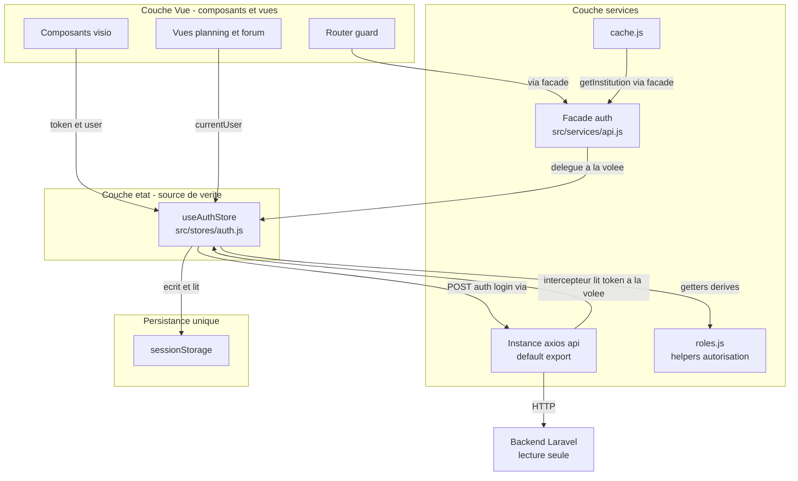
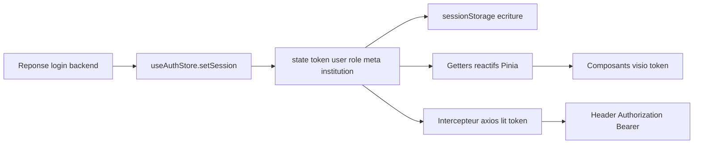
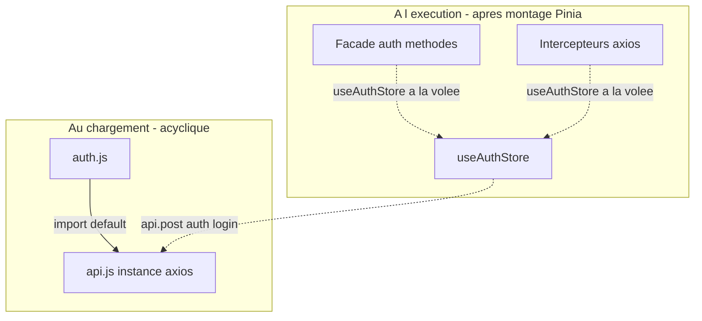
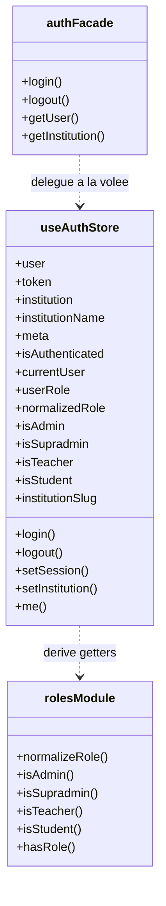
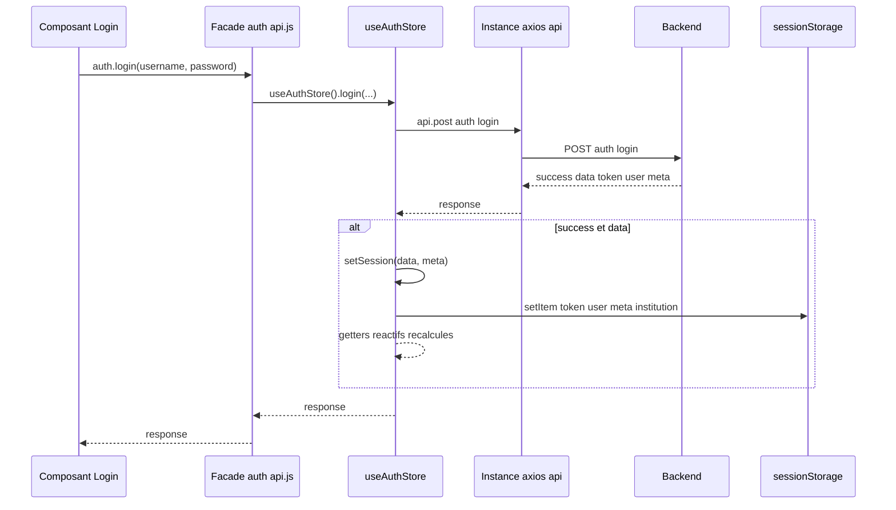
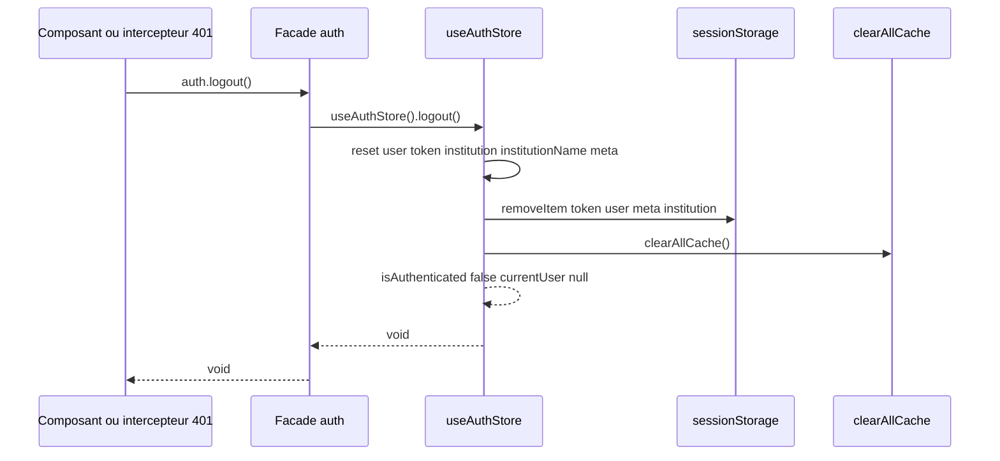
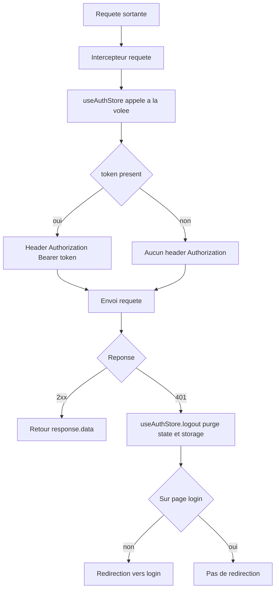
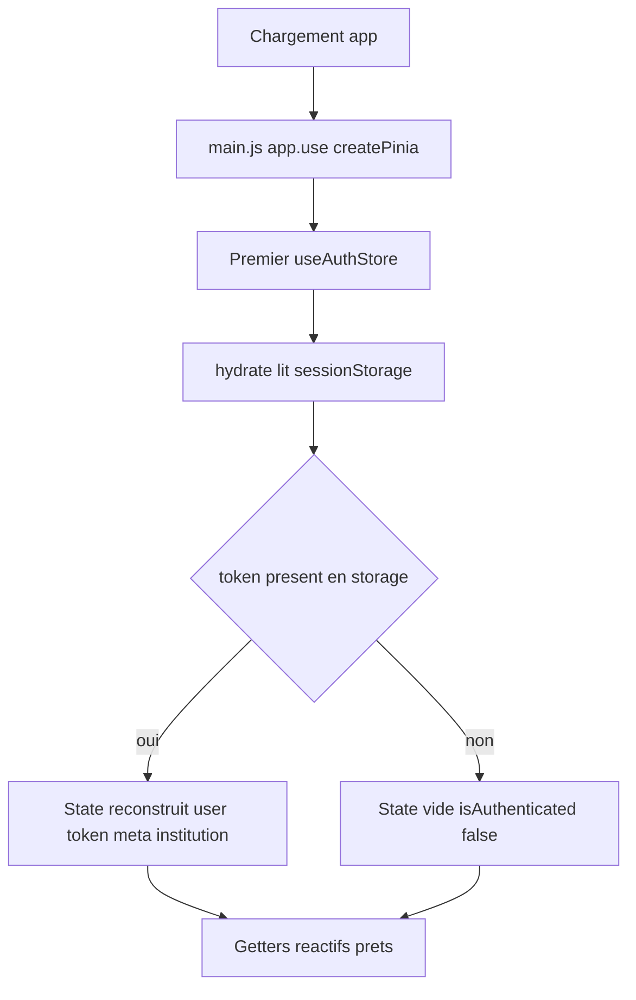

# Design Document — Store d'authentification Pinia (`useAuthStore`)

> Issue GitHub **#19** (TIER 0 CRITICAL, épique #16) — recoupe #2/#6 (token XSS) et #11 (token visio).
> Conforme à `requirements.md` (approuvé). Aucune modification backend (NFR-2 / R12.3).
> Standards : `lms-backend/PRODUCTION_STANDARDS.md` §1.2, §1.6, §5 ; §6 (« une seule solution »).

## Overview

### Objectif et périmètre

Centraliser **tout** l'état d'authentification du frontend Vue 3 dans un store Pinia unique, `useAuthStore` (`src/stores/auth.js`), qui devient la **source de vérité unique** (R1). Le store :

- détient `user`, `token`, `role` (brut), `institution`, `institutionName`, `meta` (R1.2) ;
- expose des getters dérivés (`isAuthenticated`, `currentUser`, `userRole`) et des getters d'autorisation (`isAdmin`, `isSupradmin`, `isTeacher`, `isStudent`) **délégués** à `src/constants/roles.js`, jamais réimplémentés (R2.2) ;
- persiste via **un seul mécanisme** : `sessionStorage`, écrit manuellement dans les actions, hydraté au démarrage (R3, décisions A/E ci-dessous) ;
- élimine les 13 accès directs et incohérents au storage répartis sur 12 fichiers (R3.4, R4.2, R6).

Le bloc `auth` de `api.js` est conservé comme **façade fine** déléguant au store, afin de ne pas réécrire les 88 appels dans 32 fichiers (R5, décision B).

### Ce que ce design ne fait PAS (hors périmètre, R13)

- Refonte de la gestion d'erreurs (#20).
- Migration des comparaisons brutes `role === '...'` résiduelles dans les vues (dette #18-FE-2), sauf aux emplacements directement touchés par R4 et R6.
- `localStorage('userPreferences')` de `StudentSettings.vue:233/239` (préférence UI, pas de l'auth).

### Faits vérifiés sur le code réel (lecture, pas supposition)

| Fait | Preuve (`fichier:ligne`) |
| --- | --- |
| Pinia configuré, style `defineStore` composition | `src/main.js:2,43` ; `src/stores/visio.js:18` (`defineStore('visio', () => { ... })`) |
| **Aucun plugin de persistance Pinia installé** | `package.json:46` (`pinia ^2.1.7` seul ; pas de `pinia-plugin-persistedstate`) |
| L'intercepteur requête lit `sessionStorage` | `src/services/api.js:28` |
| `login` écrit token/user/meta/institution en `sessionStorage` | `src/services/api.js:71-78` |
| `logout` purge `sessionStorage` + `clearAllCache()` | `src/services/api.js:86-90` |
| Intercepteur 401 purge `sessionStorage` + redirige `/login` | `src/services/api.js:49-59` |
| Bug `user` : `visio.js:248` lit le **token** en `localStorage` (incohérent) | `src/stores/visio.js:248` |
| Bug `user` : 6 lecteurs de `localStorage('user')` (jamais écrit par api.js) | `visio.js:347`, `TeacherSeances.vue:357`, `student/StudentSchedule.vue:34`, `teacher/TeacherSchedule.vue:36`, `ForumTopic.vue:199`, `coordinateur/SeanceManagement.vue:309` |
| `cache.js` scope par `auth.getInstitution() \|\| 'default'` | `src/services/cache.js:10` |
| Helpers de rôle disponibles, fail-secure | `src/constants/roles.js:75-133` |
| **api.js est chargé AVANT `createPinia()`** | `main.js:4` importe `router` → `router/index.js:2` importe `auth from '@/services/api'`, évalué au chargement du module, donc avant `main.js:43 app.use(createPinia())` |

Ce dernier fait est l'élément d'architecture central : **toute** lecture du store depuis `api.js` (façade, intercepteurs) doit être **paresseuse** (à l'intérieur d'une fonction exécutée après le montage), jamais au top-level.

---

## Architecture

### Diagramme d'architecture système



### Diagramme de flux de données (token)



### Règle anti-cycle ESM (décision C/D — point critique)

Le risque de cycle est `auth.js` ↔ `api.js`. Il est levé par une règle simple et vérifiable :

- **Au top-level** (au chargement des modules) : `auth.js` importe **uniquement** le `default export` `api` (l'instance axios) de `api.js`. `api.js` n'importe **rien** de `auth.js` au top-level. Le graphe de chargement est donc acyclique : `auth.js → api.js (instance axios)`, terminé.
- **À la volée** (à l'exécution, après montage) : la façade `auth` de `api.js` et les deux intercepteurs appellent `useAuthStore()` **à l'intérieur** de leurs fonctions. Pinia étant alors actif, l'appel réussit. Aucune dépendance circulaire de chargement, car ces références ne sont résolues qu'à l'appel.



Pourquoi `auth.js` importe l'instance axios plutôt que de réutiliser `auth.login` : le store doit émettre le `POST /auth/login` lui-même (R1.4) sans dépendre de la façade (qui, elle, délègue au store) — sinon on crée une boucle d'appel `façade.login → store.login → façade.login`. Le store fait donc l'appel HTTP brut via l'instance `api`, et la façade `auth.login` ne fait que `return useAuthStore().login(...)`.

---

## Décisions tranchées

> Conforme à PRODUCTION_STANDARDS §6 : une seule solution par point, justifiée par preuve. Pas de « A ou B » laissé ouvert.

### A — Mécanisme de persistance : `sessionStorage`, écriture manuelle dans les actions, hydratation au démarrage

**Décision.** Persistance manuelle dans le store via `sessionStorage`, hydratée à l'initialisation du state.

**Justification.**
1. `sessionStorage` est **l'état de fait actuel** d'`api.js` (`api.js:28,71-78,86-89`). Le conserver évite tout changement de sémantique de session pour l'utilisateur et satisfait R3.2/R11.1 (jamais `localStorage` pour le token → atténuation XSS #2/#6).
2. **Écriture manuelle, pas de plugin.** `package.json:46` ne contient aucun plugin de persistance (`pinia-plugin-persistedstate` absent). PRODUCTION_STANDARDS et NFR du projet poussent à ne pas ajouter de dépendance évitable ; l'écriture manuelle dans 2 actions (`setSession`, `setInstitution`) + 1 dans `logout` est triviale et entièrement testable. **Décision : ne pas ajouter de dépendance.**

**Compromis documenté (R3.5 / R11.3), sémantique EXACTE de `sessionStorage` :**

- `sessionStorage` **survit au rechargement de la même page (F5)** et à la navigation interne — il n'est PAS perdu au refresh d'onglet. C'est pourquoi l'hydratation au démarrage (décision E) est nécessaire et suffisante pour qu'un F5 ne déconnecte pas l'utilisateur.
- `sessionStorage` est **effacé à la fermeture de l'onglet/fenêtre** et **n'est pas partagé entre onglets** (chaque onglet a son propre espace ; un nouvel onglet démarre déconnecté).

Ce compromis (pas de SSO multi-onglets, session liée à la durée de vie de l'onglet) est un **choix de sécurité assumé** : il réduit la fenêtre d'exposition du token et est aligné sur le comportement déjà en place.

### B — `auth` de `api.js` devient une FAÇADE FINE déléguant au store

**Décision.** Le bloc `auth` (`api.js:66-162`) est conservé et réécrit en façade fine ; **les 32 fichiers consommateurs ne sont pas touchés** (sauf ceux ciblés par R4/R6 qui migrent vers le store directement).

**Justification.**
1. **Non-régression R5** : 88 appels dans 32 fichiers (dont le router guard, `router/index.js:2`, et `cache.js:1`). Migrer 32 fichiers multiplie la surface de régression sans gain fonctionnel. La façade satisfait R5.1/R5.2/R5.3 (façade fine, pas de duplication de logique).
2. **Appel d'un store Pinia hors composant.** `useAuthStore()` peut être appelé hors d'un composant **dès lors que Pinia est actif** (créé `main.js:43`). Comme `api.js` est chargé AVANT (preuve : `main.js:4 → router/index.js:2`), appeler `useAuthStore()` au **top-level** d'`api.js` lèverait `getActivePinia()` / « no active Pinia ». **Solution : appeler `useAuthStore()` DANS chaque méthode de la façade**, à la volée — au moment de l'appel, l'app est montée et Pinia actif.

### C — Le store COEXISTE avec la façade ; le store ne dépend pas de la façade pour l'état

**Décision.** `useAuthStore` est la source de vérité. La façade `auth` coexiste pour les 88 appels et **délègue** au store. Le store ne lit jamais la façade : il importe l'instance axios `default` de `api.js` pour le seul `POST /auth/login`.

**Justification.** Voir « Règle anti-cycle ESM » ci-dessus. Cette structure satisfait R5.2 (tout résultat provient du store), R1.4 (le store fait l'appel HTTP) et évite la boucle d'appel et le cycle de chargement.

### D — Intercepteurs axios lisent le store À LA VOLÉE

**Décision.**
- Intercepteur **requête** (`api.js:26-37`) : `const token = useAuthStore().token` **dans** la fonction `(config) => {...}`. Si présent → `Authorization: Bearer <token>` ; sinon, aucun header (R7.1/7.2/7.3).
- Intercepteur **réponse 401** (`api.js:49-59`) : `useAuthStore().logout()` (purge state + storage), puis redirection `/login` hors page de login (R7.4 ; comportement de redirection conservé).

**Justification.** Les fonctions d'intercepteur s'exécutent **à chaque requête**, donc bien après le montage : Pinia est actif, `useAuthStore()` réussit. Définir l'intercepteur au top-level n'évalue pas `useAuthStore()` au chargement — seul le corps de la fonction l'appelle, à l'exécution. R10.5 (issue #11) : comme le login écrit le token dans le store et l'intercepteur le lit depuis le même store, **token écrit ≡ token lu** — plus aucun mismatch `localStorage`/`sessionStorage`.

### E — Hydratation au démarrage

**Décision.** Le state initial du store est lu depuis `sessionStorage` à la définition du store (fonction d'hydratation appelée dans le `state`/setup). Les écritures se font dans `setSession`, `setInstitution`, `logout`.

**Justification.** Sans hydratation, un F5 (qui conserve `sessionStorage`, cf. décision A) repartirait avec un store vide en mémoire → déconnexion perçue à tort. L'hydratation reconstruit l'état en mémoire à partir du storage survivant. Cohérence persistance↔hydratation : **même clés, même mécanisme** (`sessionStorage`), lecture au boot / écriture aux mutations.

---

## Composants et Interfaces

### `src/stores/auth.js` — `useAuthStore`

Style `defineStore` composition (cohérent `visio.js:18`, R1.1). Responsabilité unique : détenir et muter l'état d'auth (SRP, PRODUCTION_STANDARDS §1.6-S). DIP (§1.6-D) : la logique de rôle est **injectée par dérivation** depuis `roles.js`, non dupliquée (R2.2).

#### State (R1.2)

| Champ | Type | Source au login | Persisté |
| --- | --- | --- | --- |
| `user` | `object \| null` | `response.data.user` | oui (`sessionStorage['user']`) |
| `token` | `string \| null` | `response.data.token` | oui (`sessionStorage['token']`) |
| `role` | `string \| null` | `response.data.user.role` (brut) | dérivable de `user`, persisté via `user` |
| `institution` | `string \| null` | `response.meta.institution` | oui (`sessionStorage['institution']`) |
| `institutionName` | `string \| null` | `response.meta.institution_name` | via `meta` |
| `meta` | `object \| null` | `response.meta` | oui (`sessionStorage['meta']`) |

> `role` est exposé comme le rôle **brut** (R1.3, R2.1). Pour éviter la redondance d'état, `role` est un getter dérivé de `user?.role` plutôt qu'un champ dupliqué — une seule raison de changer (§1.6-S). Le rôle **normalisé** est exposé séparément (getter dérivé de `normalizeRole`).

#### Getters

| Getter | Dérivation | Exigence |
| --- | --- | --- |
| `isAuthenticated` | `!!token` | R2.1, R8.5 |
| `currentUser` | `user ?? null` (jamais `{}`) | R2.1, R4.4 |
| `userRole` | `user?.role ?? null` (brut) | R2.1 |
| `normalizedRole` | `normalizeRole(user?.role)` | R1.3 |
| `isAdmin` | `roleIsAdmin(user)` | R2.2, R2.5 (admin\|supradmin) |
| `isSupradmin` | `roleIsSupradmin(user)` | R2.2 |
| `isTeacher` | `roleIsTeacher(user)` | R2.2 |
| `isStudent` | `roleIsStudent(user)` | R2.2 |
| `institutionSlug` | `meta?.institution ?? institution ?? null` | R8.1, R8.2 (parité `api.js:137-140`) |
| `institutionDisplayName` | `meta?.institution_name ?? null` | parité `api.js:143-146` |

Fail-secure (R2.3) : tous les getters d'autorisation héritent du fail-secure de `roles.js` (rôle `null`/inconnu → `false`, `roles.js:99-133`). Réactivité (R2.4, R9) : getters Pinia → recalcul automatique à chaque mutation de `user`/`token`.

#### Actions

| Action | Signature | Comportement | Exigence |
| --- | --- | --- | --- |
| `login` | `async (username, password)` | `POST /auth/login` via instance axios `api` ; si `success && data` → `setSession(data, meta)` ; retourne la réponse brute (parité `api.js:67-83`) | R1.4, R5.2, R9.1 |
| `setSession` | `(data, meta)` | peuple `user`, `token` (+ `meta`, `institution`, `institutionName` si `meta`) ; écrit `sessionStorage` | R1.4 |
| `setInstitution` | `(slug)` | met à jour `institution` + `sessionStorage['institution']` (parité `api.js:159-161`) | R8.3 |
| `logout` | `()` | purge **tout** le state (`user/token/role/institution/institutionName/meta`) ; `sessionStorage.removeItem` des 4 clés ; `clearAllCache()` | R8.4, R8.5, R7.4 |
| `me` | `async ()` | `GET /auth/me` via instance axios (parité `api.js:93-95`) | R5.1 |
| `fetchActiveInstitutions` | `async ()` | `GET /institutions/active` (parité `api.js:154-156`) | R5.1 |
| `$hydrate` (interne) | `()` | lit `sessionStorage` → reconstruit le state initial | R3, E |

> `me`, `fetchActiveInstitutions` font des appels HTTP sans muter l'état d'auth : ils sont placés ici pour que la façade ait un point de délégation unique (R5.3). Le module reste sous la limite de taille (§5) ; sinon, extraction d'un `authApi.js` (appels HTTP) injecté dans le store (DIP, §1.6-D).

### `src/services/api.js` — façade `auth` réécrite (fine)

Chaque méthode délègue au store, appelé **à la volée** (décision B/D). Exemple de forme (illustratif, pas le code final) :

```js
import api from … // instance axios, default (déjà présent)
import { useAuthStore } from '../stores/auth' // import top-level OK : auth.js n'importe pas la façade

export const auth = {
  login: (u, p) => useAuthStore().login(u, p),         // store appelé à la volée
  logout: () => useAuthStore().logout(),
  me: () => useAuthStore().me(),
  getUser: () => useAuthStore().currentUser,
  getMeta: () => useAuthStore().meta,
  isAuthenticated: () => useAuthStore().isAuthenticated,
  getUserRole: () => useAuthStore().userRole,
  hasRole: (r) => roleHasRole(useAuthStore().currentUser, r),
  isAdmin: () => useAuthStore().isAdmin,
  isTeacher: () => useAuthStore().isTeacher,
  isStudent: () => useAuthStore().isStudent,
  isSupradmin: () => useAuthStore().isSupradmin,
  getInstitution: () => useAuthStore().institutionSlug,
  getInstitutionName: () => useAuthStore().institutionDisplayName,
  setInstitution: (s) => useAuthStore().setInstitution(s),
  getActiveInstitutions: () => useAuthStore().fetchActiveInstitutions(),
}
```

> Note de chargement : `import { useAuthStore }` au top-level d'`api.js` est sûr (importer la **définition** d'un store n'appelle pas `getActivePinia`). Seul **l'appel** `useAuthStore()` requiert Pinia actif, d'où l'appel systématique dans le corps des méthodes.

### `roles.js`, `cache.js` — inchangés

`roles.js` : réutilisé tel quel (R2.2, aucune modif). `cache.js:10` : continue d'appeler `auth.getInstitution()` (façade) → délègue à `institutionSlug` du store (R8.1, même valeur qu'aujourd'hui).

---

## Data Models

### Définitions des structures (annotées TypeScript pour clarté, code JS)

```ts
interface AuthMeta {
  institution?: string         // slug tenant
  institution_name?: string    // libellé tenant
  [k: string]: unknown
}

interface AuthUser {
  role?: string                // rôle BRUT backend (alias EN/FR), normalisé via roles.js
  [k: string]: unknown         // forme exacte non figée côté front (NFR-2 : pas de modif backend)
}

interface AuthState {
  user: AuthUser | null
  token: string | null
  institution: string | null
  institutionName: string | null
  meta: AuthMeta | null
}

// Réponse login backend (parité api.js:68-79, lecture seule)
interface LoginResponse {
  success: boolean
  data?: { token: string; user: AuthUser }
  meta?: AuthMeta
}
```

### Clés de persistance `sessionStorage` (mécanisme unique)

| Clé | Contenu | Écrite par | Lue par |
| --- | --- | --- | --- |
| `token` | `string` | `setSession` | `$hydrate`, intercepteur requête (via store) |
| `user` | `JSON(AuthUser)` | `setSession` | `$hydrate` |
| `meta` | `JSON(AuthMeta)` | `setSession` | `$hydrate` |
| `institution` | `string` | `setSession`, `setInstitution` | `$hydrate` |

> Clés identiques à l'existant (`api.js:71-78`) : pas de migration de données pour les sessions en cours. R3.3 : écriture et lecture au **même** emplacement (`sessionStorage`). La clé `localStorage('token')` lue par `visio.js:248` disparaît (R3.4).

### Diagramme du modèle de données



---

## Business Process

### Processus 1 : Login



### Processus 2 : Logout



### Processus 3 : Intercepteurs axios (token requête + 401 réponse)



### Processus 4 : Hydratation au démarrage



---

## Error Handling

> La refonte globale d'erreurs (#20) est hors périmètre (R13.1). On préserve le comportement existant et on applique le fail-secure.

| Cas | Comportement | Exigence |
| --- | --- | --- |
| `login` HTTP échoue / `success === false` | l'action ne mute pas le state (pas de `setSession`) ; la réponse/erreur remonte à l'appelant comme aujourd'hui (`api.js:67-83`) | R5.4 |
| `401` sur toute requête | intercepteur réponse → `useAuthStore().logout()` (purge state+storage) + redirection `/login` hors login ; **aucune donnée sensible journalisée** (parité `roles.js:178-181` / `logRoleDecision`) | R7.4, R11.4 |
| Rôle `null` / inconnu | getters d'autorisation → `false` (fail-secure hérité de `roles.js`) | R2.3 |
| `currentUser` sans utilisateur | renvoie `null` explicite, **jamais `{}`** | R4.3, R4.4 |
| Token absent pour visio Beacon | la fonctionnalité visio gère explicitement (ne pas envoyer le Beacon, `console.warn`), **sans** storage de secours incohérent | R6.5 |
| `sessionStorage` JSON corrompu à l'hydratation | `try/catch` autour du `JSON.parse` → state vide (déconnecté), pas de crash au boot | robustesse, parité tolérante `api.js:98-99` |
| Pas de secret en clair | la façade et le store ne loggent ni token ni secret ; pas de secret embarqué | R11.2 |

---

## Testing Strategy

Vitest installé (`package.json:9-11,57,66` ; #21). Tests unitaires écrits **avant** l'implémentation (TDD, skill production-grade). Isolation Pinia : `setActivePinia(createPinia())` en `beforeEach` ; `sessionStorage` simulé (jsdom, `package.json:61`) ou stub injecté ; appels HTTP `api` mockés (`vi.mock`).

### Cas de test (`src/stores/__tests__/auth.spec.js`)

| # | Scénario | Assertions | Exigence |
| --- | --- | --- | --- |
| T1 | `login` réussi | store peuplé (`user`, `token`, `role`, `institution`, `meta`) **et** `sessionStorage` écrit aux 4 clés | R10.2 |
| T2 | `login` échec (`success:false`) | state inchangé, pas d'écriture storage | R5.4 |
| T3 | `logout` | state + storage entièrement purgés, `clearAllCache` appelé (mock), `isAuthenticated===false`, `currentUser===null` | R10.3, R8.4 |
| T4 | Getters autorisation dérivent de `roles.js` | alias (`teacher`→enseignant, `student`→etudiant, `superAdmin`→supradmin) reconnus ; rôle inconnu/`null`→`false` (fail-secure) ; `isAdmin` = admin\|supradmin | R10.4, R2.2, R2.5 |
| T5 | **Régression #11** : token intercepteur ≡ token login | après `login`, le token lu par le store (que lit l'intercepteur) est **identique** à celui écrit ; aucun accès `localStorage` | R10.5 |
| T6 | **Bug `user`** | après `login`, `currentUser` = l'utilisateur (jamais `{}`) ; sans login, `currentUser===null` | R10.6, R4.3, R4.4 |
| T7 | Hydratation | `sessionStorage` pré-rempli → nouveau store hydraté → `isAuthenticated===true`, `currentUser` correct | E, R3 |
| T8 | `setInstitution` | met à jour `institutionSlug` + `sessionStorage['institution']` | R8.3 |
| T9 | Réactivité | un `computed`/watch sur `isAuthenticated` réagit à `login`/`logout` sans rechargement | R9.1, R9.2 |
| T10 | Façade délègue | `auth.getUser()`/`auth.getInstitution()` renvoient les valeurs du store (LSP : façade substituable au store du point de vue appelant) | R5.2, R5.3 |

### Tests de non-régression hors store (manuels/ciblés)

- Migration des 6 lecteurs `localStorage('user')` (R4.2) et des 6 lecteurs de token visio (R6) : vérifier qu'aucun `localStorage.getItem('user')` ni `sessionStorage.getItem('token')` direct ne subsiste à ces emplacements (grep de contrôle).

---

## Mapping de migration (12 fichiers)

> R4 (user) + R6 (token visio). Les autres consommateurs de la façade (~30 fichiers) restent inchangés (décision B).

### Token (R6) — lire depuis le store, plus de storage direct

| Fichier:ligne | Avant | Après |
| --- | --- | --- |
| `src/stores/visio.js:248` | `localStorage.getItem('token')` | `useAuthStore().token` (si `null` → ne pas envoyer Beacon, R6.5) |
| `src/composables/useVisioParticipation.js:223` | `sessionStorage.getItem('token')` | `useAuthStore().token` |
| `src/components/visio/ParticipantsModal.vue:429,478` | `sessionStorage.getItem('token')` | `useAuthStore().token` |
| `src/components/visio/VisioManager.vue:398` | `sessionStorage.getItem('token')` | `useAuthStore().token` |
| `src/views/attendance/SeanceAttendanceHistory.vue:537,586` | `sessionStorage.getItem('token')` | `useAuthStore().token` |
| `src/services/api.js:28` (intercepteur) | `sessionStorage.getItem('token')` | `useAuthStore().token` à la volée (décision D) |

### User (R4) — lire `currentUser` du store, plus de `localStorage('user')`

| Fichier:ligne | Avant | Après |
| --- | --- | --- |
| `src/stores/visio.js:347` | `JSON.parse(localStorage.getItem('user') \|\| '{}')` | `useAuthStore().currentUser` |
| `src/views/TeacherSeances.vue:357` | idem | `useAuthStore().currentUser` |
| `src/views/student/StudentSchedule.vue:34` | idem (`ref(...)`) | `computed(() => useAuthStore().currentUser)` (réactif, R9.3) |
| `src/views/teacher/TeacherSchedule.vue:36` | idem (`ref(...)`) | `computed(() => useAuthStore().currentUser)` |
| `src/views/ForumTopic.vue:199` | idem (Options API) | `this.currentUser = useAuthStore().currentUser` (store hors `<script setup>` : `useAuthStore()` dans `created`) |
| `src/views/coordinateur/SeanceManagement.vue:309` | idem | `useAuthStore().currentUser` |

> Note `visio.js` (store qui lit un autre store) : `useAuthStore()` est appelé **dans** l'action `handleTeacherExit`/`sendLeaveVisioBeacon` (à la volée), jamais au setup du store visio, pour rester robuste à l'ordre d'init.

---

## Dette tracée

| ID | Dette | Risque | Échéance |
| --- | --- | --- | --- |
| #19-D1 | `sessionStorage` reste accessible au JS (atténuation XSS partielle, pas cookie `HttpOnly`). | Token lisible si XSS. Mitigé : pas de `localStorage`, session courte (onglet). | Cible long terme #2/#6 : cookie `HttpOnly`/`SameSite` (nécessiterait **modif backend**, hors périmètre NFR-2). Tracé, non payé ici. |
| #19-D2 | Comparaisons brutes `role === 'enseignant'` résiduelles hors des 12 fichiers migrés (#18-FE-2). | Incohérence de normalisation. | Hors périmètre R13.2 ; migration globale ultérieure. |
| #19-D3 | Forme de `AuthUser` non typée strictement (pas de schéma figé front). | Champs backend non garantis. | Acceptable : NFR-2 interdit toute modif backend ; le store ne raisonne que sur `role` (normalisé via `roles.js`). |

---

## Conformité PRODUCTION_STANDARDS

| Règle | Application | Preuve |
| --- | --- | --- |
| §1.1 / §5 Zero God Code (≤300 l.) | `auth.js` focalisé (state + getters + ~6 actions courtes). Si débordement → extraction `authApi.js` (appels HTTP) injecté (DIP). | Conception dimensionnée ; contrôle au commit |
| §1.2 Sécurité | Token **jamais** en `localStorage` (R3.2/R11.1) ; aucun secret en clair (R11.2) ; pas de log de donnée sensible au 401 (R11.4) | `roles.js:178-181` réutilisé |
| §1.6-S SRP | Store = une raison de changer (l'état d'auth) ; façade = adaptation de compat ; rôle = `roles.js` | — |
| §1.6-D DIP | Le store **dérive** la logique de rôle de `roles.js` (abstraction unique), n'instancie aucune logique d'autorisation en propre | R2.2 |
| §1.6-L LSP | La façade `auth` est substituable au store du point de vue des 88 appelants ; le store est mockable en test (T1-T10) | R5.3, T10 |
| §1.6-O OCP | Nouveaux comportements via getters/actions ajoutés, pas en éditant les consommateurs | décision B |
| §6 Une seule solution | Décisions A-E : une option tranchée chacune, justifiée par lecture du code | section « Décisions tranchées » |
| NFR-2 / R12.3 | Aucune modification backend (tout est côté front + storage navigateur) | — |

---

## Traçabilité Design → Requirements

| Exigence | Couverte par |
| --- | --- |
| R1 (store source de vérité) | State, Actions, décision C |
| R2 (getters dérivés `roles.js`) | Getters, T4 |
| R3 (persistance unique) | Décision A, Clés `sessionStorage`, T1/T7 |
| R4 (bug `user`) | Getter `currentUser`, Mapping user, T6 |
| R5 (API `auth` préservée) | Décision B, Façade, T10 |
| R6 (visio token/user via store) | Mapping token, décision D, T5 |
| R7 (intercepteur via store) | Décision D, Processus 3 |
| R8 (multi-tenant + purge logout) | `institutionSlug`, `setInstitution`, `logout`, T3/T8 |
| R9 (réactivité) | Getters Pinia, Processus 1/2, T9 |
| R10 (tests Vitest) | Testing Strategy T1-T10 |
| R11 (sécurité non-fonctionnelle) | Décision A (compromis), Error Handling, Dette #19-D1 |
| R12 (conception/structure) | Conformité PRODUCTION_STANDARDS |
| R13 (hors périmètre) | Overview « ce que ce design ne fait PAS », Dette #19-D2 |
