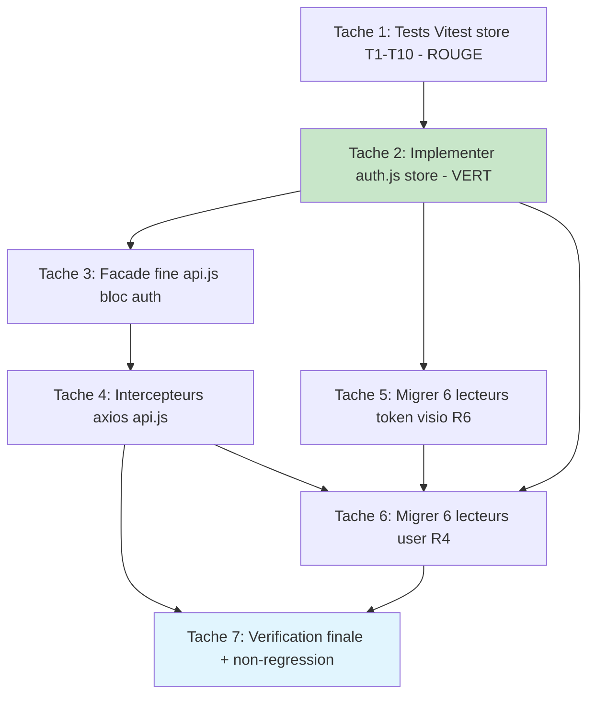

# Plan d'implémentation — Store d'authentification Pinia (`useAuthStore`)

> Issue **#19** (TIER 0 CRITICAL, épique #16). Conforme à `requirements.md` et `design.md` (approuvés).
> Aucune modification backend (R12.3 / NFR-2). Aucune tâche non technique.
> TDD via Vitest (#21) : les tests T1-T10 du store sont écrits AVANT/AVEC l'implémentation (rouge → vert).
>
> **Ordre imposé par le design** (dépendances de fichiers) :
> 1. Tests Vitest du store (rouge) → 2. Store `auth.js` (vert) → 3. Façade `api.js` → 4. Intercepteurs `api.js` → 5. Token visio (R6) → 6. User (R4) → 7. Vérification finale.
>
> **Conflits de fichiers (séquentiel obligatoire)** :
> - `src/services/api.js` : touché par les tâches **3** (façade) puis **4** (intercepteurs) → enchaîner, ne pas paralléliser.
> - `src/stores/visio.js` : touché par les tâches **5** (token l.248) puis **6** (user l.347) → enchaîner.

---

- [x] 1. Écrire les tests Vitest du store (TDD — phase ROUGE)
  - Créer `src/stores/__tests__/auth.spec.js` couvrant les 10 scénarios T1-T10 du design (section Testing Strategy). À ce stade `src/stores/auth.js` n'existe pas encore → la suite DOIT échouer (rouge), prouvant que les tests exercent bien le code à venir.
  - Mise en place de l'isolation : `beforeEach(() => setActivePinia(createPinia()))` ; simuler `sessionStorage` via jsdom (`environment: jsdom`, déjà dans la config Vitest #21) et le réinitialiser entre tests (`sessionStorage.clear()`).
  - Mocker l'instance axios `api` (default export de `@/services/api`) via `vi.mock('@/services/api', ...)` pour contrôler la réponse de `POST /auth/login`, `GET /auth/me`, `GET /institutions/active` sans réseau réel. Mocker `clearAllCache` de `@/services/cache` (`vi.mock`) pour T3.
  - T1 (login réussi, R10.2) : après `login`, le store est peuplé (`user`, `token`, `userRole`, `institutionSlug`, `meta`) ET `sessionStorage` contient les 4 clés (`token`, `user`, `meta`, `institution`).
  - T2 (login échec `success:false`, R5.4) : state inchangé (toujours vide), aucune écriture `sessionStorage`.
  - T3 (logout, R10.3/R8.4) : state + storage entièrement purgés (4 `removeItem`), `clearAllCache` appelé (mock asserté), `isAuthenticated === false`, `currentUser === null`.
  - T4 (getters d'autorisation dérivés de `roles.js`, R10.4/R2.2/R2.5) : alias reconnus (`teacher`→enseignant, `student`→etudiant, `superAdmin`→supradmin) ; rôle inconnu/`null` → tous les getters d'autorisation `false` (fail-secure) ; `isAdmin` vrai pour `admin` ET `supradmin` uniquement.
  - T5 (régression #11, R10.5) : après `login`, `useAuthStore().token` (ce que lit l'intercepteur) est **identique** au token reçu en réponse ; aucun accès `localStorage` simulé n'est requis pour le retrouver.
  - T6 (bug `user`, R10.6/R4.3/R4.4) : après `login`, `currentUser` égale l'utilisateur (jamais `{}`) ; sans login, `currentUser === null`.
  - T7 (hydratation, décision E / R3) : pré-remplir `sessionStorage` (token/user/meta/institution), instancier un nouveau store, appeler `$hydrate` → `isAuthenticated === true`, `currentUser` correct, `institutionSlug` correct.
  - T8 (`setInstitution`, R8.3) : met à jour `institutionSlug` ET `sessionStorage.getItem('institution')`.
  - T9 (réactivité, R9.1/R9.2) : un `computed(() => store.isAuthenticated)` (ou `watch`) reflète `login` puis `logout` sans rechargement.
  - T10 (façade délègue, R5.2/R5.3) : importer la façade `auth` de `@/services/api`, appeler `auth.getUser()` / `auth.getInstitution()` après un `login` du store et vérifier qu'elles renvoient les valeurs du store. (Ce test passera complètement après la tâche 3 ; à l'étape 1 il peut être marqué `it.todo`/`it.skip` documenté, puis activé.)
  - Critère de complétion : `npm run test -- src/stores/__tests__/auth.spec.js` s'exécute et **échoue** (module `auth.js` introuvable / store absent) ; la structure des 10 cas est en place.
  - _Requirements: R10.1, R10.2, R10.3, R10.4, R10.5, R10.6_ ; _Design: Testing Strategy (T1-T10), décisions A/E_

- [x] 2. Implémenter le store `src/stores/auth.js` (TDD — phase VERTE)
  - Créer `src/stores/auth.js` avec `useAuthStore` en `defineStore('auth', () => { ... })` (style composition, cohérent `visio.js:18`, R1.1). Au top-level, importer UNIQUEMENT l'instance axios `default` de `@/services/api` (`import api from '@/services/api'`) et les helpers de `@/constants/roles` + `clearAllCache` de `@/services/cache`. NE PAS appeler `useAuthStore()` au top-level (anti-cycle ESM, décision C/D).
  - **State (R1.2)** : `user` (`ref(null)`), `token` (`ref(null)`), `institution` (`ref(null)`), `institutionName` (`ref(null)`), `meta` (`ref(null)`). `role` n'est PAS un champ d'état dupliqué : il est exposé comme getter dérivé de `user.role` (design Data Models, note §189).
  - **Getters (réactifs, R2.4/R9)** : `isAuthenticated` = `!!token` ; `currentUser` = `user ?? null` (JAMAIS `{}`, R4.4) ; `userRole` = `user?.role ?? null` (brut, R2.1) ; `normalizedRole` = `normalizeRole(user?.role)` (R1.3) ; `isAdmin`/`isSupradmin`/`isTeacher`/`isStudent` dérivés des fonctions homonymes de `@/constants/roles` (R2.2, fail-secure hérité R2.3) ; `institutionSlug` = `meta?.institution ?? institution ?? null` (parité `api.js:137-140`, R8.1/R8.2) ; `institutionDisplayName` = `meta?.institution_name ?? null` (parité `api.js:143-146`).
  - **Actions** : `setSession(data, meta)` peuple `user`/`token` (+ `meta`/`institution`/`institutionName` si `meta`) et écrit `sessionStorage` (clés `token`, `user`, `meta`, `institution`) ; `setInstitution(slug)` met à jour `institution` + `sessionStorage['institution']` (parité `api.js:159-161`, R8.3) ; `login(username, password)` fait `POST /auth/login` via `api`, si `success && data` → `setSession(data, meta)`, retourne la réponse brute (parité `api.js:67-83`, R1.4/R5.2) ; `logout()` purge tout le state + `removeItem` des 4 clés + `clearAllCache()` (R8.4/R8.5/R7.4) ; `me()` = `GET /auth/me` via `api` (parité `api.js:93-95`) ; `fetchActiveInstitutions()` = `GET /institutions/active` (parité `api.js:154-156`) ; `$hydrate()` lit `sessionStorage` et reconstruit le state initial, avec `try/catch` autour des `JSON.parse` (JSON corrompu → state vide, pas de crash au boot — design Error Handling §440).
  - Respecter la limite de taille PRODUCTION_STANDARDS §5 (≤ ~300 l.) ; si débordement, extraire les appels HTTP dans un `authApi.js` injecté (DIP) — sinon conserver inline.
  - Critère de complétion : `npm run test -- src/stores/__tests__/auth.spec.js` passe **tous** les cas T1-T9 au vert (T10 dépend de la tâche 3) ; aucun `useAuthStore()` au top-level (`grep -n "useAuthStore()" src/stores/auth.js` ne retourne que des appels dans le corps des actions, le cas échéant).
  - _Requirements: R1.1, R1.2, R1.3, R1.4, R2.1, R2.2, R2.3, R2.4, R2.5, R3, R4.3, R4.4, R8.1, R8.2, R8.3, R8.4, R8.5, R9_ ; _Design: décisions A/C/E, State, Getters, Actions, Data Models, Error Handling_

- [x] 3. Réécrire le bloc `auth` de `api.js` en façade fine (conflit fichier : avant tâche 4)
  - Modifier `src/services/api.js` : remplacer le bloc `auth` (≈ `api.js:66-162`) par une façade fine. Ajouter au top-level `import { useAuthStore } from '../stores/auth'` (importer la DÉFINITION ne déclenche pas `getActivePinia` — sûr car `auth.js` n'importe PAS la façade, décision B/C, note design §250). Chaque méthode appelle `useAuthStore()` **à la volée** dans son corps.
  - Conserver les **16 méthodes publiques** avec sémantique identique (R5.1) : `login`, `logout`, `me`, `getUser` (→ `currentUser`), `getMeta` (→ `meta`), `isAuthenticated`, `getUserRole` (→ `userRole`), `getInstitution` (→ `institutionSlug`), `getInstitutionName` (→ `institutionDisplayName`), `setInstitution`, `getActiveInstitutions` (→ `fetchActiveInstitutions`), `hasRole`, `isAdmin`, `isTeacher`, `isStudent`, `isSupradmin`. `hasRole(r)` délègue à `roleHasRole(useAuthStore().currentUser, r)` (pas de réimplémentation, R5.3).
  - Supprimer de `api.js` toute logique d'état/storage désormais détenue par le store (écriture/lecture `sessionStorage` du bloc `auth`, gestion de `user`/`meta`/`institution`). La façade NE DOIT PAS dupliquer la logique de rôle ni d'état (R5.3).
  - Critère de complétion : T10 passe au vert (`auth.getUser()`/`auth.getInstitution()` renvoient les valeurs du store) ; `grep -n "sessionStorage" src/services/api.js` ne montre plus d'accès dans le bloc façade `auth` (l'intercepteur est traité en tâche 4) ; les 16 méthodes restent exportées.
  - _Requirements: R5.1, R5.2, R5.3, R8.1_ ; _Design: décision B/C, « façade auth réécrite », T10_

- [x] 4. Réécrire les 2 intercepteurs axios de `api.js` (conflit fichier : après tâche 3)
  - Modifier `src/services/api.js` — intercepteur **requête** (≈ `api.js:26-37`) : lire `const token = useAuthStore().token` **à l'intérieur** de la fonction `(config) => {...}` (jamais au top-level). Si token présent → `config.headers.Authorization = 'Bearer ' + token` ; sinon NE PAS ajouter le header (R7.1/R7.2/R7.3). Supprimer `sessionStorage.getItem('token')` direct (mapping design §483).
  - Intercepteur **réponse 401** (≈ `api.js:49-59`) : appeler `useAuthStore().logout()` (purge state + storage + `clearAllCache`) puis conserver la redirection vers `/login` **hors** page de login (R7.4). Aucune donnée d'auth sensible journalisée (R11.4).
  - Vérifier l'absence de cycle de chargement : `auth.js` n'importe que l'instance axios `default` ; `api.js` n'appelle `useAuthStore()` qu'à la volée dans les corps de fonctions (décision D, règle anti-cycle ESM design §100-119).
  - Critère de complétion : `grep -n "sessionStorage.getItem('token')" src/services/api.js` retourne 0 résultat ; `npm run build` réussit (pas de cycle ESM bloquant) ; un test de fumée (ou T5 déjà vert) confirme token écrit ≡ token lu.
  - _Requirements: R7.1, R7.2, R7.3, R7.4, R11.4, R10.5_ ; _Design: décision D, Processus 3, règle anti-cycle ESM_

- [x] 5. Migrer les 6 lecteurs de token visio vers `useAuthStore().token` (R6) — `visio.js` avant tâche 6
  - `src/stores/visio.js:248` (`sendLeaveVisioBeacon`) : remplacer `localStorage.getItem('token')` par `useAuthStore().token` appelé **à la volée DANS l'action** (jamais au setup du store visio, design §496). Si token `null` → ne PAS envoyer le Beacon, journaliser (`console.warn`), comportement existant (R6.5). Supprime aussi l'incohérence `localStorage`→`sessionStorage` (R3.4).
  - `src/composables/useVisioParticipation.js:223` : remplacer `sessionStorage.getItem('token')` par `useAuthStore().token` (appel dans la fonction).
  - `src/components/visio/ParticipantsModal.vue:429` et `:478` : remplacer les 2 lectures `sessionStorage.getItem('token')` par `useAuthStore().token`.
  - `src/components/visio/VisioManager.vue:398` : remplacer `sessionStorage.getItem('token')` par `useAuthStore().token`.
  - `src/views/attendance/SeanceAttendanceHistory.vue:537` et `:586` : remplacer les 2 lectures `sessionStorage.getItem('token')` par `useAuthStore().token`.
  - Pour chaque composant `<script setup>`, importer `useAuthStore` et l'appeler dans la fonction qui en a besoin (robuste à l'ordre d'init, R6.4).
  - Critère de complétion : `grep -rn "sessionStorage.getItem('token')" src/composables/useVisioParticipation.js src/components/visio/ParticipantsModal.vue src/components/visio/VisioManager.vue src/views/attendance/SeanceAttendanceHistory.vue` → 0 résultat ; `grep -n "localStorage.getItem('token')" src/stores/visio.js` → 0 résultat ; `npm run build` réussit.
  - _Requirements: R6.1, R6.2, R6.3, R6.4, R6.5, R3.4_ ; _Design: Mapping token (R6), décision D, note visio §496_

- [x] 6. Migrer les 6 lecteurs de `localStorage('user')` vers `useAuthStore().currentUser` (R4) — `visio.js` après tâche 5
  - `src/stores/visio.js:347` (`handleTeacherExit`) : remplacer `JSON.parse(localStorage.getItem('user') || '{}')` par `useAuthStore().currentUser` appelé **à la volée dans l'action** (R4.1/R4.2).
  - `src/views/TeacherSeances.vue:357` : remplacer la lecture `localStorage('user')` par `useAuthStore().currentUser`.
  - `src/views/student/StudentSchedule.vue:34` : passer de `ref(JSON.parse(localStorage.getItem('user') || '{}'))` à `computed(() => useAuthStore().currentUser)` pour la réactivité (R9.3, design §491).
  - `src/views/teacher/TeacherSchedule.vue:36` : idem → `computed(() => useAuthStore().currentUser)` (R9.3).
  - `src/views/ForumTopic.vue:199` (Options API) : appeler `useAuthStore()` dans `created`/`setup` et affecter `this.currentUser = useAuthStore().currentUser` (store hors `<script setup>`, design §493).
  - `src/views/coordinateur/SeanceManagement.vue:309` : remplacer la lecture `localStorage('user')` par `useAuthStore().currentUser`.
  - Vérifier qu'aucun de ces emplacements ne traite plus `currentUser` comme `{}` (R4.3) : adapter les usages aval qui supposaient un objet non-null (garde `?.`/valeur par défaut sûre si nécessaire).
  - Critère de complétion : `grep -rn "localStorage.getItem('user')" src/stores/visio.js src/views/TeacherSeances.vue src/views/student/StudentSchedule.vue src/views/teacher/TeacherSchedule.vue src/views/ForumTopic.vue src/views/coordinateur/SeanceManagement.vue` → 0 résultat ; `npm run build` réussit ; StudentSchedule/TeacherSchedule utilisent bien `computed`.
  - _Requirements: R4.1, R4.2, R4.3, R4.4, R9.3_ ; _Design: Mapping user (R4), notes §491/§493/§496_

- [x] 7. Vérification finale et non-régression
  - Exécuter `npm run test` (Vitest) : la suite `src/stores/__tests__/auth.spec.js` (T1-T10) est **entièrement verte**.
  - Exécuter `npm run test:contract` : toujours vert (non-régression du contrat API #17).
  - Exécuter `npm run build` : build de production réussi (aucun cycle ESM, aucune erreur de compilation introduite par les tâches 2-6).
  - Grep de preuve d'éradication du storage direct (doivent tous retourner 0) :
    - `grep -rn "localStorage.getItem('user')"` dans les 6 fichiers migrés (R4) → 0.
    - `grep -rn "sessionStorage.getItem('token')"` dans les 5 fichiers/composants visio migrés + l'intercepteur `api.js` (R6/R7) → 0.
    - `grep -n "localStorage.getItem('token')" src/stores/visio.js` → 0.
  - Confirmer la non-régression de la façade : `grep -rn "auth\." src/` montre que les ~30 autres fichiers consommateurs (88 appels, 32 fichiers) de `auth.*` restent **inchangés** et que les 16 méthodes publiques existent toujours dans `api.js` (vérifier la liste exportée). Aucune modification de comportement pour ces appelants.
  - Confirmer le hors-périmètre intact : `src/views/student/StudentSettings.vue:233/239` (`localStorage('userPreferences')`) NON touché (R13.3) ; aucune migration des comparaisons brutes `role === '...'` hors des 12 fichiers ciblés (R13.2) ; aucune modification backend (R12.3).
  - Critère de complétion : les 3 commandes passent au vert et les 3 catégories de grep retournent 0, prouvant l'élimination des 13 accès directs et la non-régression des 88 appels de façade.
  - _Requirements: R3.3, R3.4, R4.2, R5.1, R5.4, R6, R7, R10, R11.1, R12.3, R13.2, R13.3_ ; _Design: Mapping de migration, Testing Strategy (non-régression), Conformité PRODUCTION_STANDARDS_

---

## Diagramme de dépendances des tâches

> **Notes de parallélisation / séquencement** :
> - `api.js` est touché par T3 puis T4 → **séquentiel obligatoire** (même fichier).
> - `src/stores/visio.js` est touché par T5 (token) puis T6 (user) → **séquentiel obligatoire** (même fichier).
> - T5 (composants visio hors `visio.js`) peut démarrer dès T2 finie ; T6 dépend de T2 et, pour `visio.js`, de T5.
> - T7 ne démarre qu'après T4 ET T6 (toutes les migrations + intercepteurs intégrés).
