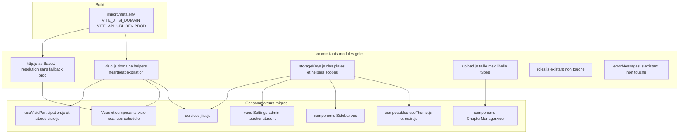
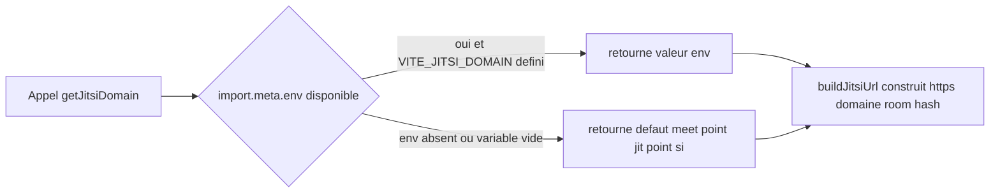
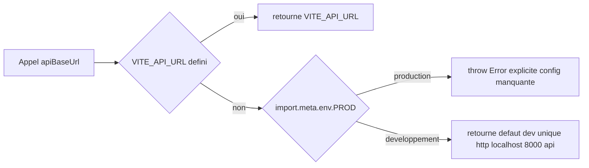
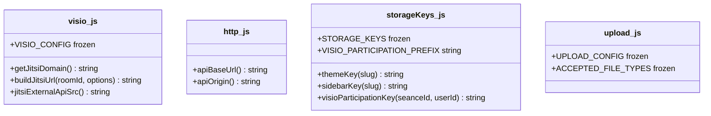
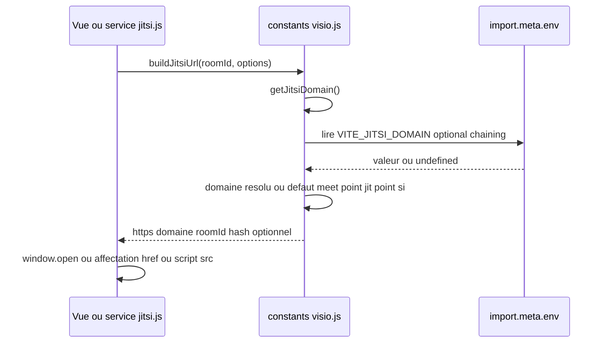
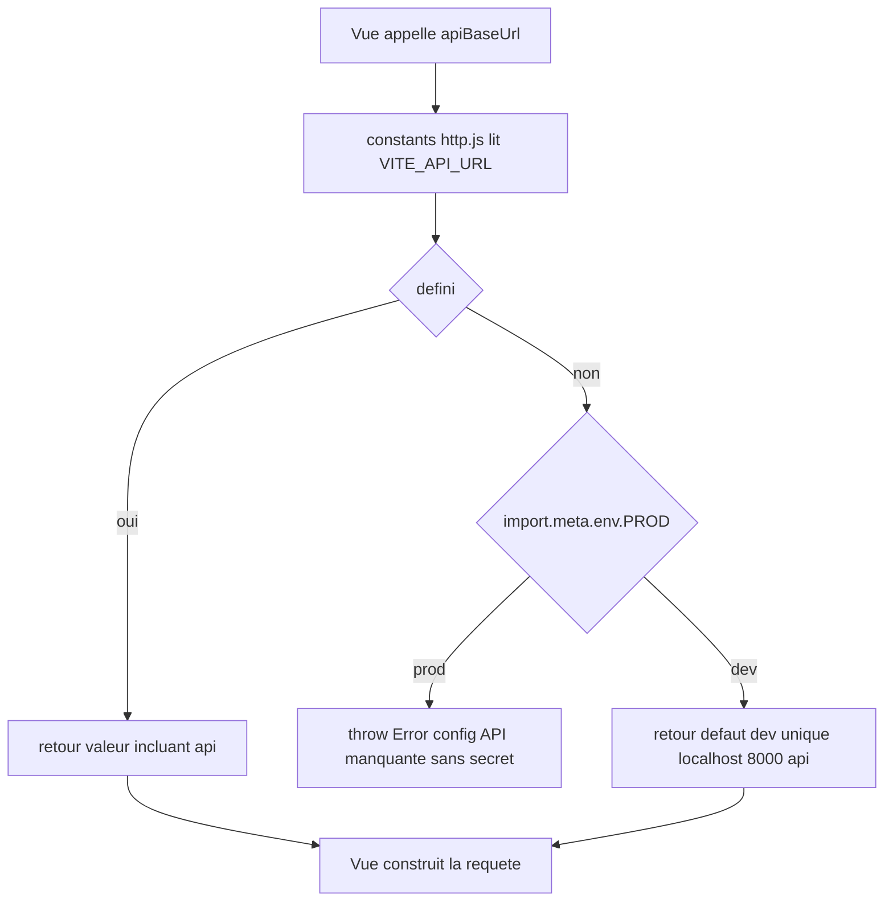
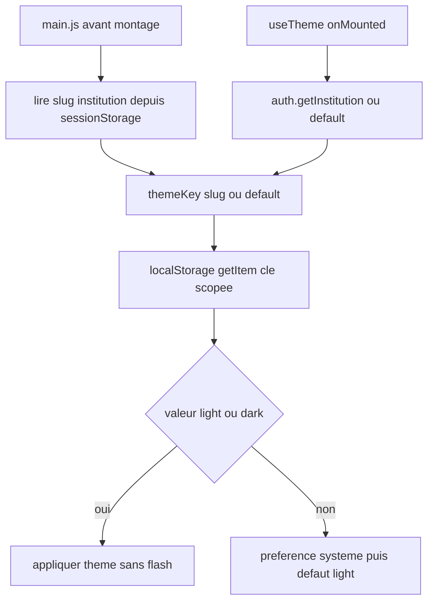

> ⚠️ **DÉCISION SUPERSÉDÉE PAR #327 (04/09/2026).**
> Ce document déclare en §« Gestion d'erreurs » que le repli silencieux vers
> `meet.jit.si` est « un comportement légitime et documenté ». Ce n'est plus la
> décision du projet : le défaut a été **supprimé**, `getJitsiDomain()` lève
> désormais quand `VITE_JITSI_DOMAIN` est absent. Motif : sur un produit qui
> filme des apprenants, une variable d'environnement oubliée envoyait la classe
> chez un opérateur public sans contrat, et aucune promesse de résidence des
> données ne tenait. Le reste du document demeure exact.

# Design Document — Centralisation des constantes et de la configuration (#24)

## Overview

Cette fonctionnalité élimine le hardcoding de valeurs de configuration et de valeurs
« magiques » dispersées dans le frontend Vue 3, en les centralisant dans des modules
**gelés** (`Object.freeze`) sous `src/constants/`, cohérents avec le pattern déjà établi par
`src/constants/roles.js` (#18) et `src/constants/errorMessages.js` (#20).

Périmètre vérifié par grep (2026-06-16) et confirmé par lecture du code réel :

- Domaine Jitsi `meet.jit.si` : **17 occurrences réelles / 10 fichiers** (le grep `meet\.jit\.si`
  renvoie 17, dont 1 commentaire `JitsiMeet.vue:58` et 1 fragment de commentaire `jitsi.js:16`).
  Voir l'arbitrage du delta vs requirements (16) en [Dette tracée](#dette-tracée) #24-NOTE-1.
- Fallback `localhost:8000` : **7 occurrences / 4 fichiers** (5 avec `/api`, 2 bare dans
  `StudentLessonView.vue`).
- Clés de storage non-auth : préférences `admin`/`teacher`/`user`, thème (scopé + incohérence
  `main.js`), sidebar collapse (scopé), participation visio (scopée séance/utilisateur).
- Magic numbers : heartbeat `30000` ms (6 sites), upload `30 * 1024 * 1024` + libellé « 30 MB »,
  expiration participations `7 jours`.

Objectif non-fonctionnel central : **non-régression observable**. Chaque valeur centralisée
préserve exactement la valeur/clé/URL actuelle ; aucune préférence ou participation déjà
stockée n'est invalidée. Hors périmètre strict : store auth `KEYS` (#19), backend, i18n,
couleurs charts, god components (#28).

### Objectifs de conception

1. Source unique gelée par famille de valeurs, importable via l'alias `@/constants/*`.
2. Domaine Jitsi configurable au déploiement via `VITE_JITSI_DOMAIN`, défaut `meet.jit.si`.
3. URL API explicite, **sans fallback `localhost` silencieux en production**.
4. Correction de l'incohérence de clé thème (#24-NOTE-2) sur une clé unique.
5. Couverture Vitest des invariants (gel, résolution env, dérivation de clés).

### Non-objectifs

- Modifier une valeur numérique existante (toute modification de valeur est hors #24).
- Toucher `src/stores/auth.js` `KEYS` ou le backend.
- Migrer le TTL cache (`cache.js:3`, déjà isolé) ou les couleurs de charts.

---

## Architecture

### Diagramme d'architecture système



### Diagramme de flux de données — résolution du domaine Jitsi



### Diagramme de flux de données — résolution de l'URL API



---

## Décisions tranchées

Conformément à la contrainte §6 du requirements, **une seule option par décision**, justifiée.

### Décision A — Découpage des modules

**Tranché : 4 modules thématiques** sous `src/constants/`, par domaine fonctionnel (pas par
type technique) :

| Module | Responsabilité (SRP) |
| --- | --- |
| `src/constants/visio.js` | Domaine Jitsi + helpers d'URL + `HEARTBEAT_INTERVAL_MS` + `PARTICIPATION_EXPIRATION_MS` |
| `src/constants/http.js` | Résolution de l'URL de base API (`apiBaseUrl()`) |
| `src/constants/storageKeys.js` | Clés `localStorage` non-auth (plates + helpers scopés) |
| `src/constants/upload.js` | Taille max upload + libellé dérivé + types acceptés |

**Justification.** Le pattern établi (`roles.js`, `errorMessages.js`) est **un module = un
domaine cohérent**, pas un fourre-tout. Le heartbeat et l'expiration des participations
appartiennent au domaine visio (ils ne servent qu'à la visio) : les colocaliser avec le domaine
Jitsi dans `visio.js` évite un module `http.js`/`timers.js` artificiel qui regrouperait des
valeurs sans cohésion sémantique (violation SRP/ISP — §1.1). `http.js` est réservé à la
résolution d'URL API car c'est une préoccupation transverse distincte (sécurité prod, mode
dev). Découpage retenu plutôt qu'un unique `config.js` god-module (§1.1 : petits fichiers
focalisés) et plutôt qu'un éclatement excessif (un module par constante = ISP poussé à
l'absurde, friction d'import).

### Décision B — Forme du domaine Jitsi : helper fonction `getJitsiDomain()`

**Tranché : helper fonction `getJitsiDomain()`**, pas une constante évaluée au chargement du
module, et un constructeur d'URL `buildJitsiUrl(roomId, options)`.

**Justification.**

1. **Lecture de l'env à l'exécution.** Une constante `export const JITSI_DOMAIN =
   import.meta.env.VITE_JITSI_DOMAIN || 'meet.jit.si'` est figée au chargement du module. Une
   fonction permet aux tests Vitest de **réévaluer** la résolution sous différentes valeurs
   d'env via stub (`vi.stubEnv`), sans dépendre de l'ordre d'import (R6.2/R6.3). C'est le pattern
   testable et substituable (production-grade §1.3).
2. **Chargeabilité hors Vite.** Le helper lit `import.meta.env?.VITE_JITSI_DOMAIN` avec
   **optional chaining**, reproduisant exactement le pattern déjà éprouvé dans `roles.js:179`
   (`import.meta.env?.PROD`). Vérifié : `src/services/jitsi.js` n'est **pas** dans le graphe
   d'import du runner de contrat natif (`tests/contract/api-contract.spec.mjs` n'importe que
   `api`, `evaluation`, `chapter`, `lms`, `klassci`, `chapterProgress`, `notifications`,
   `search`). Le risque est donc faible, mais l'optional chaining garantit la chargeabilité si
   `jitsi.js` (ou `visio.js`) entrait un jour dans un contexte Node natif.
3. **Import par alias `@`.** Comme `jitsi.js` n'est pas dans le graphe du runner natif (qui
   résout des imports relatifs sans extension via `node-resolver.mjs`), `visio.js` peut être
   importé via `@/constants/visio` partout. Les tests Vitest héritent de l'alias `@` (cf.
   `vitest.config.js` → `mergeConfig(viteConfig)`).

**Constructeurs d'URL exposés (vu les 3 formes réelles dans le code).** Le grep révèle trois
formats distincts. `buildJitsiUrl` doit les couvrir sans casser le format actuel :

- Forme « bare » : `https://{domaine}/{roomId}` (VisioManager L337/L462, TeacherSeances L594,
  SeanceManagement L493, TeacherVisioList L119).
- Forme « hash params » : `https://{domaine}/{roomId}#config.prejoinConfig.enabled=false&userInfo.displayName={name}`
  (SeanceManagement L533, TeacherSchedule L49/L63, StudentSchedule L51, SeanceDetails L381/L431).
- Forme « IFrame API » : domaine nu (`domain = 'meet.jit.si'`) + URL script
  `https://{domaine}/external_api.js` (VideoConference L73/L88, JitsiMeet L82/L110).

`visio.js` expose donc : `getJitsiDomain()`, `buildJitsiUrl(roomId, options)`,
`jitsiExternalApiSrc()`. Le service `jitsi.js` (qui construit déjà via `URLSearchParams`)
consomme `getJitsiDomain()` pour son template L47 (forme différente, conservée telle quelle —
on ne reformate pas son URL, on substitue seulement le domaine).

### Décision C — URL API : helper `apiBaseUrl()` sans fallback prod silencieux

**Tranché : helper centralisé `apiBaseUrl()` dans `src/constants/http.js`** qui lit
`import.meta.env.VITE_API_URL`, **sans fallback `localhost` en production**, avec fallback dev
unique confiné à `import.meta.env.DEV`.

**Justification.** L'invariant non négociable (R4.2, contrainte §2) est « aucun fallback
`localhost` silencieux en production ». La suppression pure du fallback casserait le confort dev
(les développeurs s'appuient sur `localhost:8000`). Le confinement au mode dev satisfait les
deux : en prod sans `VITE_API_URL`, l'erreur est **visible et immédiate** (échec au premier
appel) plutôt qu'un build pointant silencieusement sur `localhost` (R4.2/R4.3). Une source
unique remplace l'accès dispersé à `import.meta.env` (R4.4) et rend la politique testable
(R6.5).

**Non-régression des 7 sites (risque maîtrisé).** Deux variantes d'URL coexistent :

- 5 sites utilisent `… || 'http://localhost:8000/api'` (avec `/api`).
- 2 sites (`StudentLessonView.vue:495/503`) utilisent `… || 'http://localhost:8000'` (sans
  `/api`, le `/api` étant ajouté plus loin dans l'URL construite).

`apiBaseUrl()` retourne la **base telle que définie dans `VITE_API_URL`** (qui inclut déjà
`/api` selon `.env.example` : `VITE_API_URL=http://localhost:8000/api`). Pour ne pas modifier le
comportement observable de `StudentLessonView.vue`, ces 2 sites recevront un traitement dédié
documenté dans le [Mapping de migration](#mapping-de-migration) : ils consomment `apiBaseUrl()`
puis dé-suffixent `/api` si présent, OU consomment un second helper `apiOrigin()` dérivant
l'origine. **Tranché : `apiBaseUrl()` (avec `/api`) + `apiOrigin()` (sans `/api`, dérivé par
suppression du suffixe `/api` terminal)**, pour couvrir les deux formes sans réintroduire de
littéral et sans changer les URL finales émises. Le défaut dev de `apiOrigin()` est
`http://localhost:8000` (cohérent avec les 2 sites actuels).

> Risque résiduel tracé : `useVisioParticipation.js:223` construit
> `${import.meta.env.VITE_API_URL}/api/seances/...` (Beacon) **sans fallback** et **ajoute** un
> `/api`. Ce site n'est pas dans les 7 fallbacks mais accède directement à `import.meta.env`. Sa
> migration vers `apiBaseUrl()`/`apiOrigin()` est incluse pour la cohérence R4.4 (voir mapping),
> en préservant l'URL finale exacte.

### Décision D — Clé de thème (#24-NOTE-2) : la clé **scopée par institution gagne**

**Tranché : clé unique scopée par institution**, centralisée dans `storageKeys.js`, et
`main.js:10` corrigé pour utiliser le même helper scopé que `useTheme.js`.

**Justification.** Le LMS est **multi-tenant** : `cache.js` (TTL/clés scopées par institution),
`Sidebar.vue` (`sidebar-collapsed-${institution}`) et `useTheme.js`
(`lms-theme-preference-${institution}`) scopent déjà systématiquement par tenant. Le thème est
une préférence **par-tenant** par cohérence avec ce modèle (un utilisateur multi-institution
peut vouloir un thème distinct par établissement). `main.js:10` (`lms-theme-preference` non
scopé) est donc le **bug réel** à corriger, pas la cible. La clé scopée gagne ; `main.js`
appellera `themeKey(institutionSlug)`.

**Subtilité d'exécution (tracée).** `main.js` s'exécute **avant** le montage de l'app et avant
l'hydratation Pinia, pour appliquer le thème sans flash (FOUC). Or le slug d'institution provient
de `auth.getInstitution()` / store auth (sessionStorage). À ce stade, le slug peut être lu
directement depuis `sessionStorage` (la même source que le store hydrate) via l'helper de scoping
— pas via le store Pinia non encore créé. Le helper `themeKey(slug)` accepte donc un slug en
argument ; `main.js` lit le slug brut (sessionStorage `institution`, fallback `default`) sans
importer le store auth (évite tout cycle et reste cohérent avec l'invariant « ne pas toucher
auth »). Comportement observable : un utilisateur dont la préférence était stockée sous la clé
**non scopée** par l'ancien `main.js` verra cette préférence ignorée une fois — risque mineur
documenté en [Dette tracée](#dette-tracée) #24-NOTE-2-MIG (pas de migration de données : la
préférence se re-crée au premier toggle ; aucune perte de donnée critique).

### Décision E — Périmètre de migration : **complet sur 4 familles, reliquat tracé**

**Tranché : migration complète** de (1) domaine Jitsi via helper, (2) heartbeat, (3) upload,
(4) clés thème + sidebar + préférences + participation visio, et (5) fallback API. Le reliquat
éventuel est tracé en dette #24-FE-1.

**Justification.** Le périmètre est net et entièrement couvert par grep (vérifiable en R5.1–R5.3).
Migrer partiellement laisserait des littéraux résiduels qui contrediraient l'objectif (R5) et
rendraient le grep de validation non concluant. Les seuls éléments explicitement **laissés
hors migration** (et tracés) : le TTL cache (déjà isolé, hors périmètre requirements), les
commentaires contenant `meet.jit.si` (documentation, non exécutable — voir #24-NOTE-1).

---

## Composants et interfaces (API exacte des modules)

Tous les modules sont **gelés** via `Object.freeze` sur tout objet exporté, et documentés en
JSDoc, cohérents avec `roles.js`/`errorMessages.js`.

### `src/constants/visio.js`

```js
/** Domaine par défaut (préserve le comportement actuel). Non gelé seul : interne. */
const DEFAULT_JITSI_DOMAIN = 'meet.jit.si'

/**
 * Domaine du serveur Jitsi, résolu à l'exécution.
 * Lit import.meta.env?.VITE_JITSI_DOMAIN (optional chaining → chargeable hors Vite,
 * pattern roles.js:179). Vide/absent → défaut documenté 'meet.jit.si'.
 * @returns {string}
 */
export function getJitsiDomain()

/**
 * Construit l'URL d'une salle Jitsi : https://{domaine}/{roomId}[#hash].
 * @param {string} roomId
 * @param {{ displayName?: string, prejoinDisabled?: boolean }} [options]
 *   displayName défini ET/OU prejoinDisabled → ajoute le fragment hash
 *   'config.prejoinConfig.enabled=false&userInfo.displayName={encoded}' (format actuel).
 *   Aucune option → forme bare 'https://{domaine}/{roomId}'.
 * @returns {string}
 */
export function buildJitsiUrl(roomId, options = {})

/**
 * URL du script IFrame API : https://{domaine}/external_api.js.
 * @returns {string}
 */
export function jitsiExternalApiSrc()

/** Intervalle de heartbeat visio en millisecondes (valeur actuelle : 30000). */
export const HEARTBEAT_INTERVAL_MS = 30000

/** Expiration des participations visio en localStorage (valeur actuelle : 7 jours en ms). */
export const PARTICIPATION_EXPIRATION_MS = 7 * 24 * 60 * 60 * 1000

// Object.freeze appliqué aux objets exportés (les const primitives sont déjà immuables).
```

Note : `HEARTBEAT_INTERVAL_MS` et `PARTICIPATION_EXPIRATION_MS` sont des `number` primitifs déjà
immuables ; aucun `Object.freeze` requis sur eux (un `number` ne se gèle pas). Le test R6.1 de
gel porte sur les objets exportés (helpers regroupés ou objet de config s'il en existe). Pour
satisfaire R6.1 de façon uniforme et testable, **`visio.js` exporte aussi un objet gelé
`VISIO_CONFIG`** regroupant les valeurs primitives :

```js
export const VISIO_CONFIG = Object.freeze({
  HEARTBEAT_INTERVAL_MS: 30000,
  PARTICIPATION_EXPIRATION_MS: 7 * 24 * 60 * 60 * 1000,
  DEFAULT_JITSI_DOMAIN: 'meet.jit.si',
})
```

Les consommateurs importent soit les helpers, soit `VISIO_CONFIG.HEARTBEAT_INTERVAL_MS`.

### `src/constants/http.js`

```js
/** Défaut de développement UNIQUE (jamais utilisé en production). */
const DEV_API_URL = 'http://localhost:8000/api'

/**
 * URL de base de l'API (inclut le suffixe /api comme VITE_API_URL).
 * - VITE_API_URL défini → retourné tel quel.
 * - absent ET import.meta.env.PROD → throw Error explicite (R4.2). Aucun secret journalisé.
 * - absent ET DEV → DEV_API_URL.
 * @returns {string}
 * @throws {Error} si VITE_API_URL manquant en production.
 */
export function apiBaseUrl()

/**
 * Origine de l'API (apiBaseUrl sans le suffixe '/api' terminal).
 * Pour les sites construisant des chemins incluant déjà '/api' (StudentLessonView,
 * Beacon useVisioParticipation). Défaut dev dérivé : 'http://localhost:8000'.
 * @returns {string}
 */
export function apiOrigin()
```

### `src/constants/storageKeys.js`

```js
/**
 * Clés localStorage NON gérées par le store auth (#19).
 * EXCLUT explicitement token/user/meta/institution (KEYS de auth.js — ne pas dupliquer).
 * Gelé.
 */
export const STORAGE_KEYS = Object.freeze({
  ADMIN_PREFERENCES: 'adminPreferences',
  TEACHER_PREFERENCES: 'teacherPreferences',
  USER_PREFERENCES: 'userPreferences',
})

/** Préfixe des clés de participation visio (cohérent avec jitsi.js). */
export const VISIO_PARTICIPATION_PREFIX = 'visio_participation_'

/**
 * Clé thème scopée par institution.
 * Reproduit EXACTEMENT 'lms-theme-preference-{slug}' (useTheme.js:13).
 * @param {string|null|undefined} institutionSlug — slug ; absent → 'default'.
 * @returns {string}
 */
export function themeKey(institutionSlug)

/**
 * Clé sidebar collapse scopée par institution.
 * Reproduit EXACTEMENT 'sidebar-collapsed-{slug}' (Sidebar.vue:396).
 * @param {string|null|undefined} institutionSlug
 * @returns {string}
 */
export function sidebarKey(institutionSlug)

/**
 * Clé de participation visio scopée séance + utilisateur.
 * Reproduit EXACTEMENT 'visio_participation_{seanceId}_{userId}' (jitsi.js:126).
 * @param {number|string} seanceId
 * @param {number|string} userId
 * @returns {string}
 */
export function visioParticipationKey(seanceId, userId)
```

Le fallback `'default'` des helpers scopés reproduit `auth.getInstitution() || 'default'`
(R2.4) — la résolution du slug reste à la charge de l'appelant (qui passe
`auth.getInstitution()`), le helper n'applique le `'default'` que si l'argument est vide.

### `src/constants/upload.js`

```js
/** Configuration d'upload de fichiers (chapitres). Gelé. */
export const UPLOAD_CONFIG = Object.freeze({
  /** Taille max en octets — valeur actuelle 30 * 1024 * 1024 (30 MiB). */
  MAX_FILE_SIZE_BYTES: 30 * 1024 * 1024,
  /** Libellé dérivé, source unique du texte affiché (R3.3). */
  MAX_FILE_SIZE_LABEL: '30 MB',
})

/** Types de fichiers acceptés par type de contenu (centralise getAcceptedFileTypes). */
export const ACCEPTED_FILE_TYPES = Object.freeze({
  powerpoint: '.pptx,.ppt',
  word: '.docx,.doc',
  // … (recopie EXACTE du mapping actuel de ChapterManager.vue:481+)
})
```

> NB conception : `MAX_FILE_SIZE_LABEL = '30 MB'` est conservé comme **libellé littéral unique**
> plutôt que dérivé arithmétiquement de `MAX_FILE_SIZE_BYTES`. Justification : `30 * 1024 * 1024`
> vaut 30 **MiB**, dont le libellé exact actuel est « 30 MB » (imprécision binaire/décimale). Un
> dérivateur `bytes → label` réintroduirait soit « 28.6 MB » (faux vs actuel), soit la même
> constante texte. Le couple `{ BYTES, LABEL }` gelé garantit la source unique (R3.3) sans
> dérive ; la cohérence des deux est vérifiée par test (un test asserte que le LABEL correspond
> bien à `BYTES / 1024 / 1024 + ' MB'`).

---

## Data Models

### Structures de données centrales (TypeScript-like, à titre de contrat)

```ts
// visio.js
function getJitsiDomain(): string
function buildJitsiUrl(roomId: string, options?: {
  displayName?: string
  prejoinDisabled?: boolean
}): string
function jitsiExternalApiSrc(): string
const VISIO_CONFIG: Readonly<{
  HEARTBEAT_INTERVAL_MS: number          // 30000
  PARTICIPATION_EXPIRATION_MS: number    // 604800000
  DEFAULT_JITSI_DOMAIN: string           // 'meet.jit.si'
}>

// http.js
function apiBaseUrl(): string   // throws en PROD si VITE_API_URL absent
function apiOrigin(): string

// storageKeys.js
const STORAGE_KEYS: Readonly<{
  ADMIN_PREFERENCES: 'adminPreferences'
  TEACHER_PREFERENCES: 'teacherPreferences'
  USER_PREFERENCES: 'userPreferences'
}>
const VISIO_PARTICIPATION_PREFIX: 'visio_participation_'
function themeKey(institutionSlug?: string | null): string
function sidebarKey(institutionSlug?: string | null): string
function visioParticipationKey(seanceId: number | string, userId: number | string): string

// upload.js
const UPLOAD_CONFIG: Readonly<{
  MAX_FILE_SIZE_BYTES: number    // 31457280
  MAX_FILE_SIZE_LABEL: string    // '30 MB'
}>
const ACCEPTED_FILE_TYPES: Readonly<Record<string, string>>
```

### Diagramme du modèle de constantes



### Pattern de gel (immuabilité)

Identique à `roles.js`/`errorMessages.js` : tout **objet** exporté est enveloppé dans
`Object.freeze(...)` au point de définition. Les **fonctions** (helpers) ne sont pas gelables en
tant que telles ; leur immuabilité comportementale est garantie par leur pureté (pas d'état
mutable interne) et testée par valeur de retour. Les **valeurs primitives** (`number`, `string`)
sont déjà immuables ; elles sont regroupées dans un objet gelé (`VISIO_CONFIG`, `UPLOAD_CONFIG`)
pour satisfaire R6.1 (`Object.isFrozen` vérifiable) de façon uniforme.

---

## Business Process

### Processus 1 : génération d'un lien Jitsi (vue → helper)



### Processus 2 : résolution de l'URL API à l'appel (échec visible en prod)



### Processus 3 : dérivation et lecture d'une clé scopée (thème, multi-tenant)



---

## Error Handling

| Cas | Stratégie | Référence |
| --- | --- | --- |
| `VITE_API_URL` absent en **production** | `apiBaseUrl()`/`apiOrigin()` lèvent une `Error` explicite (message orienté config, **sans valeur secrète** — les `VITE_*` sont publiques, donc rien de sensible à fuiter, mais on ne journalise pas la valeur). Échec visible au premier appel. | R4.2, R4.5 |
| `VITE_API_URL` absent en **dev** | Fallback dev unique (`http://localhost:8000/api` / `http://localhost:8000`). Jamais embarqué en build prod (gardé derrière `import.meta.env.DEV`). | R4.3 |
| `VITE_JITSI_DOMAIN` absent | Défaut silencieux `meet.jit.si` (préservation comportement, R1.2) — **différent** du cas API car le défaut public Jitsi est un comportement légitime et documenté, pas une mauvaise configuration. | R1.2 |
| `import.meta.env` indisponible (Node natif) | Optional chaining (`import.meta.env?.…`) → traité comme « absent » → défaut. Pas d'exception au chargement. | Décision B |
| Slug d'institution vide | Helpers de clé scopée → suffixe `'default'` (R2.4). | R2.4 |
| Mutation tentée sur un module gelé | En mode strict (modules ESM le sont), l'affectation lève `TypeError` ; sinon échoue silencieusement. Test R6.1 garantit `Object.isFrozen === true`. | R6.1 |

Principe transverse (production-grade §1.5, §1.6) : **pas de silent failure** sur la
configuration critique (API en prod) ; les défauts ne sont tolérés que là où ils reproduisent un
comportement légitime documenté (domaine Jitsi public, slug `default`).

---

## Testing Strategy

Tests Vitest dans `src/constants/__tests__/` (cohérent avec le pattern
`src/stores/__tests__/auth.test.js`, `src/services/__tests__/`). Alias `@` hérité via
`vitest.config.js`. Stub d'environnement via `vi.stubEnv` / `vi.unstubAllEnvs` (Vitest gère
`import.meta.env`). Conforme PRODUCTION_STANDARDS §1.3 (tests d'abord, unitaires isolés, cas
limites).

### `visio.test.js`

| ID | Cas | Assertion |
| --- | --- | --- |
| V1 | `VISIO_CONFIG` gelé | `Object.isFrozen(VISIO_CONFIG) === true` (R6.1) |
| V2 | `VITE_JITSI_DOMAIN` défini | `getJitsiDomain()` retourne cette valeur (R6.2) |
| V3 | `VITE_JITSI_DOMAIN` absent/vide | `getJitsiDomain() === 'meet.jit.si'` (R6.3) |
| V4 | `buildJitsiUrl(roomId)` sans options | `=== 'https://meet.jit.si/{roomId}'` (forme bare) |
| V5 | `buildJitsiUrl(roomId, { displayName, prejoinDisabled })` | hash exact `#config.prejoinConfig.enabled=false&userInfo.displayName={encoded}` |
| V6 | `buildJitsiUrl` avec domaine custom | utilise le domaine env, schéma `https` (R1.4) |
| V7 | `jitsiExternalApiSrc()` | `=== 'https://{domaine}/external_api.js'` |
| V8 | `HEARTBEAT_INTERVAL_MS` / `PARTICIPATION_EXPIRATION_MS` | valeurs exactes `30000` / `604800000` (R3.6) |

### `http.test.js`

| ID | Cas | Assertion |
| --- | --- | --- |
| H1 | `VITE_API_URL` défini | `apiBaseUrl()` retourne la valeur ; `apiOrigin()` retourne sans `/api` |
| H2 | absent + `PROD` | `apiBaseUrl()` **throw** (R6.5) ; le message ne contient aucune valeur env |
| H3 | absent + `DEV` | `apiBaseUrl() === 'http://localhost:8000/api'`, `apiOrigin() === 'http://localhost:8000'` |
| H4 | `VITE_API_URL` sans `/api` terminal | `apiOrigin()` n'altère pas une base déjà sans `/api` |

### `storageKeys.test.js`

| ID | Cas | Assertion |
| --- | --- | --- |
| S1 | `STORAGE_KEYS` gelé | `Object.isFrozen(STORAGE_KEYS) === true` (R6.1) |
| S2 | `themeKey('esi')` | `=== 'lms-theme-preference-esi'` (R6.4) |
| S3 | `themeKey(null)` | `=== 'lms-theme-preference-default'` (R6.4 fallback) |
| S4 | `sidebarKey('esi')` / `sidebarKey()` | `'sidebar-collapsed-esi'` / `'sidebar-collapsed-default'` |
| S5 | `visioParticipationKey(12, 7)` | `=== 'visio_participation_12_7'` (R3 non-régression clé) |
| S6 | valeurs plates | `STORAGE_KEYS.ADMIN_PREFERENCES === 'adminPreferences'` etc. (R5.4) |

### `upload.test.js`

| ID | Cas | Assertion |
| --- | --- | --- |
| U1 | `UPLOAD_CONFIG` / `ACCEPTED_FILE_TYPES` gelés | `Object.isFrozen === true` (R6.1) |
| U2 | `MAX_FILE_SIZE_BYTES` | `=== 31457280` (R3.2 non-régression) |
| U3 | cohérence libellé | `MAX_FILE_SIZE_LABEL === (MAX_FILE_SIZE_BYTES / 1024 / 1024) + ' MB'` (R3.3) |

Stratégie d'isolation : chaque suite réinitialise l'env (`vi.unstubAllEnvs()` en `afterEach`)
pour éviter la fuite d'état entre tests (cas limite : V2 ne doit pas polluer V3).

---

## Mapping de migration

Périmètre **migré intégralement** (Décision E). Grep de validation post-migration (R5.1–R5.3) :
plus aucun littéral `meet.jit.si`, `|| 'http://localhost:8000'`, `30000` (heartbeat) ou
`30 * 1024 * 1024` dans le code exécutable de `src/`.

### Jitsi (17 occurrences / 10 fichiers)

| Fichier:ligne | Forme actuelle | Migration |
| --- | --- | --- |
| `services/jitsi.js:15` | `const JITSI_DOMAIN = 'meet.jit.si'` | supprimé ; L47 utilise `getJitsiDomain()` |
| `services/jitsi.js:16` | commentaire `meet.jit.si` | commentaire reformulé (#24-NOTE-1) |
| `components/visio/VisioManager.vue:337,462` | `https://meet.jit.si/${roomId}` | `buildJitsiUrl(roomId)` |
| `components/visio/JitsiMeet.vue:58` | commentaire | conservé/reformulé (doc, #24-NOTE-1) |
| `components/visio/JitsiMeet.vue:82` | `external_api.js` src | `jitsiExternalApiSrc()` |
| `components/visio/JitsiMeet.vue:110` | `domain = 'meet.jit.si'` | `domain = getJitsiDomain()` |
| `views/VideoConference.vue:73` | `external_api.js` src | `jitsiExternalApiSrc()` |
| `views/VideoConference.vue:88` | `domain = 'meet.jit.si'` | `domain = getJitsiDomain()` |
| `views/TeacherSeances.vue:594` | bare | `buildJitsiUrl(roomId)` |
| `views/coordinateur/SeanceManagement.vue:493` | bare | `buildJitsiUrl(roomId)` |
| `views/coordinateur/SeanceManagement.vue:533` | hash params | `buildJitsiUrl(roomId, { displayName, prejoinDisabled: true })` |
| `views/seances/SeanceDetails.vue:381,431` | hash params | `buildJitsiUrl(roomId, { displayName, prejoinDisabled: true })` |
| `views/teacher/TeacherSchedule.vue:49,63` | hash params | `buildJitsiUrl(roomId, { displayName, prejoinDisabled: true })` |
| `views/teacher/TeacherVisioList.vue:119` | bare (`:href`) | `buildJitsiUrl(seance.visio.room_id)` |
| `views/student/StudentSchedule.vue:51` | hash params | `buildJitsiUrl(roomId, { displayName, prejoinDisabled: true })` |

### Fallback API (7 occurrences + 1 accès direct lié)

| Fichier:ligne | Actuel | Migration |
| --- | --- | --- |
| `components/visio/VisioManager.vue:400` | `… \|\| 'http://localhost:8000/api'` | `apiBaseUrl()` |
| `components/visio/ParticipantsModal.vue:431,480` | idem | `apiBaseUrl()` |
| `views/attendance/SeanceAttendanceHistory.vue:537,586` | idem | `apiBaseUrl()` |
| `views/student/StudentLessonView.vue:495,503` | `… \|\| 'http://localhost:8000'` (sans `/api`) | `apiOrigin()` |
| `composables/useVisioParticipation.js:223` | `${VITE_API_URL}/api/...` (accès direct, pas de fallback) | `apiOrigin()` + `/api/...` (URL finale identique) — cohérence R4.4 |

### Magic numbers

| Fichier:ligne | Actuel | Migration |
| --- | --- | --- |
| `composables/useVisioParticipation.js:56,82` | `30000` | `VISIO_CONFIG.HEARTBEAT_INTERVAL_MS` |
| `stores/visio.js:66,92` | `30000` | `VISIO_CONFIG.HEARTBEAT_INTERVAL_MS` |
| `components/visio/VisioManager.vue:243` | `30000` | `VISIO_CONFIG.HEARTBEAT_INTERVAL_MS` |
| `components/visio/JitsiMeet.vue:253` | `30000` | `VISIO_CONFIG.HEARTBEAT_INTERVAL_MS` |
| `services/jitsi.js:325` | `7 * 24 * 60 * 60 * 1000` | `VISIO_CONFIG.PARTICIPATION_EXPIRATION_MS` |
| `components/lessons/ChapterManager.vue:472` | `30 * 1024 * 1024` | `UPLOAD_CONFIG.MAX_FILE_SIZE_BYTES` |
| `components/lessons/ChapterManager.vue:105,473` | `'30 MB'` | `UPLOAD_CONFIG.MAX_FILE_SIZE_LABEL` |
| `components/lessons/ChapterManager.vue:481+` | mapping types | `ACCEPTED_FILE_TYPES` |

### Clés de storage

| Fichier:ligne | Actuel | Migration |
| --- | --- | --- |
| `main.js:10` | `'lms-theme-preference'` (NON scopé — bug) | `themeKey(slug)` lu depuis sessionStorage (Décision D) |
| `composables/useTheme.js:13` | `lms-theme-preference-${institution}` | `themeKey(auth.getInstitution())` |
| `components/layout/Sidebar.vue:396` | `sidebar-collapsed-${…}` | `sidebarKey(auth.getInstitution())` |
| `views/admin/AdminSettings.vue:254,260` | `'adminPreferences'` | `STORAGE_KEYS.ADMIN_PREFERENCES` |
| `views/teacher/TeacherSettings.vue:233,239` | `'teacherPreferences'` | `STORAGE_KEYS.TEACHER_PREFERENCES` |
| `views/student/StudentSettings.vue:233,239` | `'userPreferences'` | `STORAGE_KEYS.USER_PREFERENCES` |
| `services/jitsi.js:126,168` + préfixe L269,308,331 | `visio_participation_${…}` | `visioParticipationKey(...)` + `VISIO_PARTICIPATION_PREFIX` |

### Documentation env (R7)

- `.env.example` : ajouter `VITE_JITSI_DOMAIN=meet.jit.si` + commentaire exemple auto-hébergé +
  note « aucune valeur secrète (bundle public) ».
- `.env.production.example` : ajouter `VITE_JITSI_DOMAIN`, rappeler `VITE_API_URL` **obligatoire**
  (aucun fallback localhost), note secrets.
- **Ne pas toucher** `.env` / `.env.production` réels (R7.4).

---

## Dette tracée

| Référence | Description | Justification / plan |
| --- | --- | --- |
| **#24-NOTE-1** | Le brief annonçait 17 puis 16 occurrences ; le grep `meet\.jit\.si` du 2026-06-16 en renvoie **17** (dont 2 lignes de commentaire : `JitsiMeet.vue:58`, `jitsi.js:16`). | Les commentaires sont de la **documentation non exécutable** : ils sont reformulés (mention « domaine configurable via `VITE_JITSI_DOMAIN` ») mais ne comptent pas comme hardcoding. Le grep de validation R5.1 cible le code exécutable ; les 15 occurrences exécutables sont migrées. |
| **#24-NOTE-2-MIG** | Correction de la clé thème : les préférences éventuellement stockées sous l'ancienne clé non scopée de `main.js` (`lms-theme-preference`) ne sont pas migrées vers la clé scopée. | Aucune migration de données : la préférence se recrée au premier toggle. Perte = au pire un re-choix de thème ; aucune donnée critique. Migration de données jugée disproportionnée. |
| **#24-FE-1** | Reliquat éventuel de hardcoding hors périmètre explicite (TTL cache `cache.js:3` déjà isolé ; toute occurrence non listée découverte en implémentation). | Tracé, non masqué. À traiter dans un lot ultérieur si besoin. Le TTL cache est hors périmètre requirements (déjà centralisé localement). |

---

## Conformité PRODUCTION_STANDARDS

- **§1.1 (tailles fichiers/fonctions, SRP).** 4 modules petits et focalisés par domaine ; aucun
  god-module `config.js`. Helpers purs à responsabilité unique. Découpage justifié (Décision A).
- **§1.3 (tests d'abord, unitaires isolés, cas limites).** Suites Vitest spécifiées **avant**
  implémentation, couvrant gel, résolution env (avec/sans variable), dérivation de clés (slug +
  `default`), échec prod API. Isolation par `vi.unstubAllEnvs`. Pattern existant respecté.
- **§1.6 (durcissement prod, pas de silent failure critique).** API en prod échoue de façon
  visible ; défauts tolérés uniquement pour comportements légitimes documentés (Jitsi public,
  slug `default`). Aucun secret journalisé (`VITE_*` publiques par conception).
- **DIP/LSP.** Les helpers (`getJitsiDomain`, `apiBaseUrl`) sont des points d'indirection
  substituables (stubbables en test) là où le comportement varie (env), conformément au principe
  « ajouter l'abstraction là où la logique varie ».
- **Honnêteté/traçabilité.** Delta du compte d'occurrences, incohérence thème et reliquat
  explicitement tracés en dette, jamais masqués.

---

## Traçabilité design → requirements

| Requirement | Couvert par |
| --- | --- |
| R1 — Jitsi configurable/centralisé | Décision B ; `visio.js` (`getJitsiDomain`, `buildJitsiUrl`, `jitsiExternalApiSrc`) ; mapping Jitsi ; tests V2–V7 |
| R2 — Clés storage centralisées (hors auth) | Décision D ; `storageKeys.js` (helpers scopés + `STORAGE_KEYS`) ; exclusion explicite de `KEYS` auth ; tests S1–S6 |
| R3 — Magic numbers nommés | `VISIO_CONFIG`, `UPLOAD_CONFIG` ; mapping magic numbers ; tests V8, U2, U3 |
| R4 — API explicite sans fallback localhost prod | Décision C ; `http.js` (`apiBaseUrl`/`apiOrigin`) ; Error Handling ; tests H1–H4 |
| R5 — Migration sans régression | Décision E ; Mapping de migration complet ; dette tracée #24-FE-1 ; non-régression clés/valeurs (S5, U2, V8) |
| R6 — Tests Vitest | Testing Strategy (4 suites, IDs alignés R6.1–R6.6) |
| R7 — Documentation env | Section Documentation env du mapping ; Error Handling (secrets) |
| Contraintes §1–§6 | Conformité PRODUCTION_STANDARDS ; Décisions A–E (une option chacune, §6) |

---

Le design est-il satisfaisant ? Si oui, nous pourrons passer au plan d'implémentation (tasks).
```