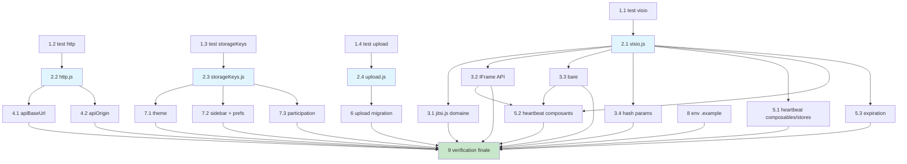

# Implementation Plan — Centralisation des constantes (#24)

> Convention de tests (#21) : le runner Vitest inclut `src/**/*.test.{js,mjs}` (jamais
> `.spec.`). Tous les tests de constantes vont donc dans `src/constants/__tests__/*.test.js`.
> Alias `@` hérité via `vitest.config.js` (`mergeConfig(viteConfig)`). Stub d'env via
> `vi.stubEnv` / `vi.unstubAllEnvs` en `afterEach`.
>
> Chaque tâche cite ses `_Requirements:_`, la décision design (A–E), les fichiers touchés et un
> critère de complétion (test ou grep) vérifiable. Toute migration préserve le comportement
> observable exact (valeurs, clés, URL finales).

## Phase 1 — Tests d'abord (rouge)

- [ ] 1. Écrire les suites Vitest des 4 modules de constantes (TDD, doivent échouer en rouge)
- [ ] 1.1 Suite `visio.test.js`
  - Créer `src/constants/__tests__/visio.test.js` important `@/constants/visio`.
  - Couvrir : V1 `Object.isFrozen(VISIO_CONFIG) === true` ; V2 `getJitsiDomain()` retourne la
    valeur de `VITE_JITSI_DOMAIN` (stub) ; V3 absente/vide → `'meet.jit.si'` ; V4
    `buildJitsiUrl(roomId)` (bare) `=== 'https://meet.jit.si/{roomId}'` ; V5
    `buildJitsiUrl(roomId, { displayName, prejoinDisabled: true })` → hash exact
    `#config.prejoinConfig.enabled=false&userInfo.displayName={encoded}` ; V6 domaine custom +
    schéma `https` ; V7 `jitsiExternalApiSrc() === 'https://{domaine}/external_api.js'` ; V8
    `VISIO_CONFIG.HEARTBEAT_INTERVAL_MS === 30000` et `PARTICIPATION_EXPIRATION_MS === 604800000`.
  - `afterEach(() => vi.unstubAllEnvs())` pour isoler V2/V3.
  - _Requirements: 6.1, 6.2, 6.3, 1.2, 1.4, 3.6_  · Décision B · Critère : `npm run test -- src/constants/__tests__/visio.test.js` échoue (module absent).
- [ ] 1.2 Suite `http.test.js`
  - Créer `src/constants/__tests__/http.test.js` important `@/constants/http`.
  - Couvrir : H1 `VITE_API_URL` défini → `apiBaseUrl()` retourne la valeur, `apiOrigin()` sans
    `/api` terminal ; H2 absent + `PROD` → `apiBaseUrl()` **throw** et le message ne contient
    aucune valeur d'env ; H3 absent + `DEV` → `apiBaseUrl() === 'http://localhost:8000/api'`,
    `apiOrigin() === 'http://localhost:8000'` ; H4 `VITE_API_URL` sans `/api` → `apiOrigin()`
    n'altère pas la base.
  - Stub de `PROD`/`DEV` via `vi.stubEnv` ; `afterEach(vi.unstubAllEnvs)`.
  - _Requirements: 6.5, 4.2, 4.3, 4.4_  · Décision C · Critère : suite rouge (module absent).
- [ ] 1.3 Suite `storageKeys.test.js`
  - Créer `src/constants/__tests__/storageKeys.test.js` important `@/constants/storageKeys`.
  - Couvrir : S1 `Object.isFrozen(STORAGE_KEYS) === true` ; S2 `themeKey('esi') ===
    'lms-theme-preference-esi'` ; S3 `themeKey(null) === 'lms-theme-preference-default'` ; S4
    `sidebarKey('esi')`/`sidebarKey()` → `'sidebar-collapsed-esi'`/`'sidebar-collapsed-default'` ;
    S5 `visioParticipationKey(12, 7) === 'visio_participation_12_7'` ; S6 valeurs plates
    (`STORAGE_KEYS.ADMIN_PREFERENCES === 'adminPreferences'`, etc.) et
    `VISIO_PARTICIPATION_PREFIX === 'visio_participation_'`.
  - _Requirements: 6.1, 6.4, 2.3, 2.4, 5.4_  · Décision D · Critère : suite rouge (module absent).
- [ ] 1.4 Suite `upload.test.js`
  - Créer `src/constants/__tests__/upload.test.js` important `@/constants/upload`.
  - Couvrir : U1 `Object.isFrozen(UPLOAD_CONFIG)` et `Object.isFrozen(ACCEPTED_FILE_TYPES)` ; U2
    `MAX_FILE_SIZE_BYTES === 31457280` ; U3 cohérence libellé
    `MAX_FILE_SIZE_LABEL === (MAX_FILE_SIZE_BYTES / 1024 / 1024) + ' MB'`.
  - _Requirements: 6.1, 3.2, 3.3_  · Décisions A, E · Critère : suite rouge (module absent).

## Phase 2 — Implémenter les 4 modules gelés (vert)

- [ ] 2. Implémenter les modules de constantes pour faire passer la Phase 1 au vert
- [ ] 2.1 Module `src/constants/visio.js`
  - Créer le module avec JSDoc (pattern `roles.js`/`errorMessages.js`).
  - `getJitsiDomain()` lit `import.meta.env?.VITE_JITSI_DOMAIN` (optional chaining, pattern
    `roles.js:179`) ; vide/absent → `'meet.jit.si'`.
  - `buildJitsiUrl(roomId, options = {})` : forme bare `https://{domaine}/{roomId}` sans options ;
    avec `displayName`/`prejoinDisabled` → fragment hash exact
    `#config.prejoinConfig.enabled=false&userInfo.displayName={encodeURIComponent(name)}`.
  - `jitsiExternalApiSrc()` → `https://{domaine}/external_api.js`.
  - Exporter `HEARTBEAT_INTERVAL_MS = 30000`, `PARTICIPATION_EXPIRATION_MS = 7*24*60*60*1000`, et
    l'objet gelé `VISIO_CONFIG = Object.freeze({ HEARTBEAT_INTERVAL_MS, PARTICIPATION_EXPIRATION_MS, DEFAULT_JITSI_DOMAIN })`.
  - _Requirements: 1.1, 1.2, 1.3, 1.4, 1.5, 3.1, 3.4, 3.5_  · Décisions A, B · Critère : `visio.test.js` vert.
- [ ] 2.2 Module `src/constants/http.js`
  - `apiBaseUrl()` : `VITE_API_URL` défini → retourné tel quel ; absent + `import.meta.env?.PROD`
    → `throw new Error(...)` explicite **sans** journaliser la valeur env ; absent + `DEV` →
    `DEV_API_URL = 'http://localhost:8000/api'` (constante interne).
  - `apiOrigin()` : dérive de `apiBaseUrl()` en supprimant le suffixe `/api` terminal ; défaut dev
    `'http://localhost:8000'`.
  - _Requirements: 4.1, 4.2, 4.3, 4.4, 4.5_  · Décision C · Critère : `http.test.js` vert.
- [ ] 2.3 Module `src/constants/storageKeys.js`
  - `STORAGE_KEYS = Object.freeze({ ADMIN_PREFERENCES, TEACHER_PREFERENCES, USER_PREFERENCES })`
    avec valeurs `'adminPreferences'`/`'teacherPreferences'`/`'userPreferences'`.
  - `VISIO_PARTICIPATION_PREFIX = 'visio_participation_'`.
  - Helpers scopés `themeKey(slug)` → `lms-theme-preference-{slug||'default'}`, `sidebarKey(slug)`
    → `sidebar-collapsed-{slug||'default'}`, `visioParticipationKey(seanceId, userId)` →
    `visio_participation_{seanceId}_{userId}`. Le `'default'` n'est appliqué que si l'argument est
    vide (la résolution du slug reste à la charge de l'appelant). NE PAS importer/dupliquer `KEYS`
    de `src/stores/auth.js`.
  - _Requirements: 2.1, 2.2, 2.3, 2.4, 2.5, 2.6_  · Décision D · Critère : `storageKeys.test.js` vert.
- [ ] 2.4 Module `src/constants/upload.js`
  - `UPLOAD_CONFIG = Object.freeze({ MAX_FILE_SIZE_BYTES: 30*1024*1024, MAX_FILE_SIZE_LABEL: '30 MB' })`.
  - `ACCEPTED_FILE_TYPES = Object.freeze({...})` : recopie EXACTE du mapping actuel de
    `ChapterManager.vue:481+` (lire le fichier source avant de figer pour ne rien altérer).
  - _Requirements: 3.2, 3.3, 3.5_  · Décisions A, E · Critère : `upload.test.js` vert ; `npm run test` global vert.

## Phase 3 — Migration des sites codés en dur (Décision E, sans régression)

> Séquencer par fichier pour les fichiers touchés par plusieurs familles (`VisioManager.vue`,
> `SeanceDetails.vue`, `TeacherSchedule.vue`, `StudentSchedule.vue` : Jitsi ET/OU heartbeat).
> Préserver l'URL/clé/valeur finale exacte. Si un fichier migré entre dans le graphe du runner de
> contrat natif, utiliser un **import relatif** (sinon alias `@/constants/*`).

- [x] 3. Migration Jitsi — 15 occurrences exécutables / 10 fichiers (2 commentaires #24-NOTE-1 exclus)
- [x] 3.1 Service `src/services/jitsi.js`
  - Supprimer la constante locale `JITSI_DOMAIN` (L15) ; substituer `getJitsiDomain()` dans le
    template L47 (conserver la construction `URLSearchParams` existante, on ne reformate pas
    l'URL). Reformuler le commentaire L16 (mention « configurable via `VITE_JITSI_DOMAIN` »).
  - Import `@/constants/visio` (vérifié hors graphe runner natif).
  - _Requirements: 1.1, 1.3, 5.1_  · Décision B · Critère : grep `meet\.jit\.si` → 0 hit exécutable dans `jitsi.js`.
- [x] 3.2 Composants visio IFrame API (`JitsiMeet.vue`, `VideoConference.vue`)
  - `JitsiMeet.vue:82` et `VideoConference.vue:73` → `jitsiExternalApiSrc()` pour le src du
    script ; `JitsiMeet.vue:110` et `VideoConference.vue:88` (`domain = 'meet.jit.si'`) →
    `domain = getJitsiDomain()`. Reformuler le commentaire `JitsiMeet.vue:58` (#24-NOTE-1).
  - _Requirements: 1.1, 1.3, 1.4, 5.1_  · Décision B · Critère : grep `meet\.jit\.si` → 0 hit exécutable dans ces 2 fichiers.
- [x] 3.3 Sites « bare » (`VisioManager.vue` 337/462, `TeacherSeances.vue` 594, `SeanceManagement.vue` 493, `TeacherVisioList.vue` 119)
  - Remplacer `https://meet.jit.si/${roomId}` par `buildJitsiUrl(roomId)` (forme sans options) ;
    `TeacherVisioList.vue:119` → `buildJitsiUrl(seance.visio.room_id)`.
  - _Requirements: 1.3, 1.4, 5.1, 5.7_  · Décision B · Critère : grep `meet\.jit\.si` → 0 hit dans ces fichiers (hors heartbeat de VisioManager, traité 5.x).
- [x] 3.4 Sites « hash params » (`SeanceManagement.vue` 533, `SeanceDetails.vue` 381/431, `TeacherSchedule.vue` 49/63, `StudentSchedule.vue` 51)
  - Remplacer par `buildJitsiUrl(roomId, { displayName, prejoinDisabled: true })` ; vérifier que
    l'URL produite est byte-identique au littéral actuel (encodage `displayName` inclus).
  - _Requirements: 1.3, 1.4, 5.1, 5.7_  · Décision B · Critère : grep `meet\.jit\.si` → 0 hit dans ces fichiers ; comportement visio inchangé.

- [x] 4. Migration fallback API — 7 sites + 1 accès direct lié
- [x] 4.1 Sites avec `/api` → `apiBaseUrl()`
  - `VisioManager.vue:400`, `ParticipantsModal.vue:431/480`, `SeanceAttendanceHistory.vue:537/586`
    : remplacer `import.meta.env.VITE_API_URL || 'http://localhost:8000/api'` par `apiBaseUrl()`.
  - _Requirements: 4.1, 4.4, 5.2, 5.7_  · Décision C · Critère : grep `localhost:8000` → 0 hit dans ces fichiers.
- [x] 4.2 Sites sans `/api` → `apiOrigin()`
  - `StudentLessonView.vue:495/503` : remplacer `... || 'http://localhost:8000'` par
    `apiOrigin()` (préserver le `/api` ajouté plus loin → URL finale identique).
  - `useVisioParticipation.js:223` (Beacon, accès direct sans fallback) → `apiOrigin()` + `/api/...`
    pour cohérence R4.4 en gardant l'URL finale exacte.
  - _Requirements: 4.1, 4.4, 5.2, 5.7_  · Décision C · Critère : grep `localhost:8000` → 0 hit ; URL Beacon inchangée.

- [x] 5. Migration heartbeat `30000` — 6 sites visio (exclure l'auto-save `TakeEvaluation.vue:348`)
- [x] 5.1 Composables/stores heartbeat (`useVisioParticipation.js` 56/82, `stores/visio.js` 66/92)
  - Remplacer `30000` par `VISIO_CONFIG.HEARTBEAT_INTERVAL_MS`.
  - _Requirements: 3.1, 5.3, 5.7_  · Décisions A, E · Critère : grep `30000` → 0 hit dans ces fichiers.
- [x] 5.2 Composants heartbeat (`VisioManager.vue:243`, `JitsiMeet.vue:253`)
  - Remplacer `30000` par `VISIO_CONFIG.HEARTBEAT_INTERVAL_MS` (séquencer après 3.2/3.3 sur ces
    mêmes fichiers).
  - _Requirements: 3.1, 5.3, 5.7_  · Décisions A, E · Critère : grep `30000` heartbeat → 0 hit ; `TakeEvaluation.vue:348` intact.
- [x] 5.3 Expiration participations (`services/jitsi.js:325`)
  - Remplacer `7 * 24 * 60 * 60 * 1000` par `VISIO_CONFIG.PARTICIPATION_EXPIRATION_MS`.
  - _Requirements: 3.4, 5.3, 5.7_  · Décisions A, E · Critère : grep dans `jitsi.js` → littéral absent.

- [x] 6. Migration upload (`components/lessons/ChapterManager.vue`)
  - L472 `30 * 1024 * 1024` → `UPLOAD_CONFIG.MAX_FILE_SIZE_BYTES` ; L105/L473 `'30 MB'` →
    `UPLOAD_CONFIG.MAX_FILE_SIZE_LABEL` ; mapping types L481+ → `ACCEPTED_FILE_TYPES`.
  - _Requirements: 3.2, 3.3, 5.3, 5.7_  · Décisions A, E · Critère : grep `30 \* 1024 \* 1024` et `'30 MB'` → 0 hit dans le fichier.

- [x] 7. Migration clés de storage (thème scopé corrige le bug #24-NOTE-2)
- [x] 7.1 Clé thème alignée (`main.js:10` + `composables/useTheme.js:13`)
  - `useTheme.js` → `themeKey(auth.getInstitution())` ; `main.js:10` lit le slug brut depuis
    `sessionStorage` (clé `institution`, fallback `default`) **sans importer le store auth** puis
    appelle `themeKey(slug)`. Aligne les deux usages sur la clé scopée unique (corrige le bug
    non-scopé). Ne pas migrer les données existantes (#24-NOTE-2-MIG).
  - _Requirements: 2.2, 2.3, 2.4, 5.4, 5.6, 5.7_  · Décision D · Critère : grep `lms-theme-preference` littéral → 0 hit hors `storageKeys.js`.
- [x] 7.2 Clé sidebar + clés de préférences (`Sidebar.vue:396`, `Admin/Teacher/StudentSettings.vue`)
  - `Sidebar.vue:396` → `sidebarKey(auth.getInstitution())` ; `AdminSettings.vue:254/260` →
    `STORAGE_KEYS.ADMIN_PREFERENCES` ; `TeacherSettings.vue:233/239` →
    `STORAGE_KEYS.TEACHER_PREFERENCES` ; `StudentSettings.vue:233/239` →
    `STORAGE_KEYS.USER_PREFERENCES`.
  - _Requirements: 2.1, 2.2, 2.3, 5.4, 5.7_  · Décision D · Critère : grep des littéraux concernés → 0 hit hors `storageKeys.js`.
- [x] 7.3 Clés de participation visio (`services/jitsi.js`)
  - L126/L168 → `visioParticipationKey(seanceId, userId)` ; préfixe L269/L308/L331 →
    `VISIO_PARTICIPATION_PREFIX`. Clés produites byte-identiques (non-régression données).
  - _Requirements: 2.1, 2.2, 2.3, 5.4, 5.7_  · Décision D · Critère : grep `visio_participation_` littéral → 0 hit hors `storageKeys.js`.

## Phase 4 — Documentation environnement (R7)

- [x] 8. Documenter les variables d'environnement dans les fichiers `.example`
  - `.env.example` : ajouter `VITE_JITSI_DOMAIN=meet.jit.si` + commentaire exemple auto-hébergé +
    note « aucune valeur secrète (bundle public) ».
  - `.env.production.example` : ajouter `VITE_JITSI_DOMAIN` + rappel `VITE_API_URL` **obligatoire**
    (aucun fallback localhost) + note secrets.
  - NE PAS toucher `.env` / `.env.production` réels.
  - _Requirements: 7.1, 7.2, 7.3, 7.4_  · Décision C · Critère : `VITE_JITSI_DOMAIN` présent dans les 2 `.example` ; `.env`/`.env.production` inchangés (`git status`).

## Phase 5 — Vérification finale

- [ ] 9. Vérification globale (tests, build, grep de non-régression)
  - `npm run test` : suites constantes vertes + total ≥ avant migration.
  - `npm run test:contract` : toujours vert (vérifier qu'aucun fichier migré dans le graphe du
    runner natif ne casse ; basculer en import relatif si nécessaire).
  - `npm run build` : réussi.
  - Grep de preuve : 0 `meet.jit.si` exécutable hors `src/constants/visio.js` ; 0
    `localhost:8000` hors `src/constants/` ; 0 `30000` heartbeat et `30 * 1024 * 1024` hors
    constants. Mettre à jour le compteur de reliquat #24-FE-1 (toute occurrence non listée
    découverte = dette tracée, non masquée).
  - _Requirements: 5.1, 5.2, 5.3, 5.5, 6.6_  · Décision E · Critère : tous les commandes ci-dessus passent ; grep prouve 0 reliquat exécutable.

---

## Tasks Dependency Diagram

> Note conflits de fichiers : les 4 modules (Phase 2) sont disjoints → parallélisables. En
> Phase 3, `VisioManager.vue` est touché par 3.3 (Jitsi) **et** 5.2 (heartbeat) ; `JitsiMeet.vue`
> par 3.2 **et** 5.2 ; `services/jitsi.js` par 3.1, 5.3, 7.3 → ces fichiers doivent être traités
> séquentiellement par fichier (pas d'édition concurrente). Les autres sites de migration sont en
> grande partie disjoints.
