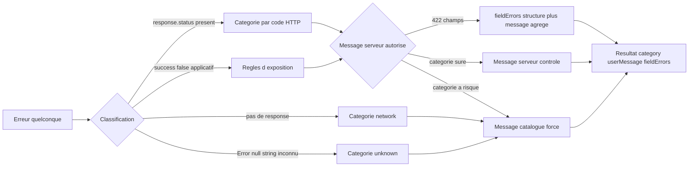
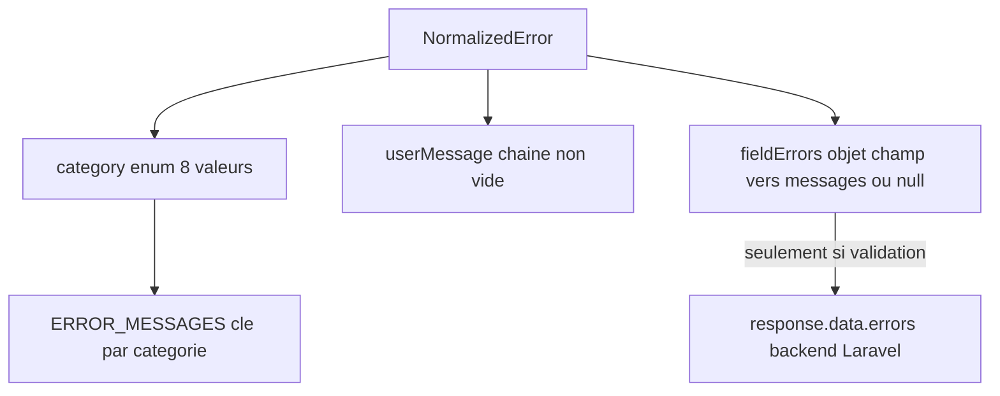
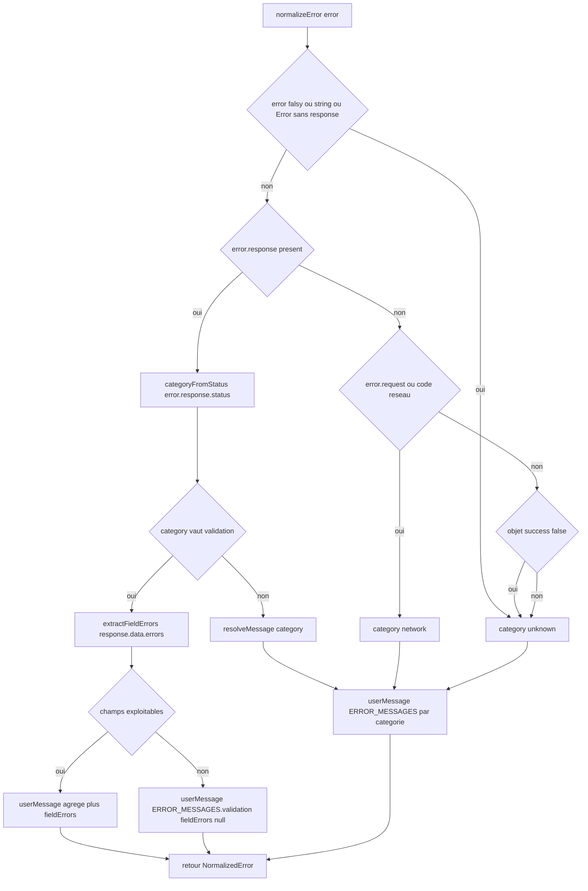
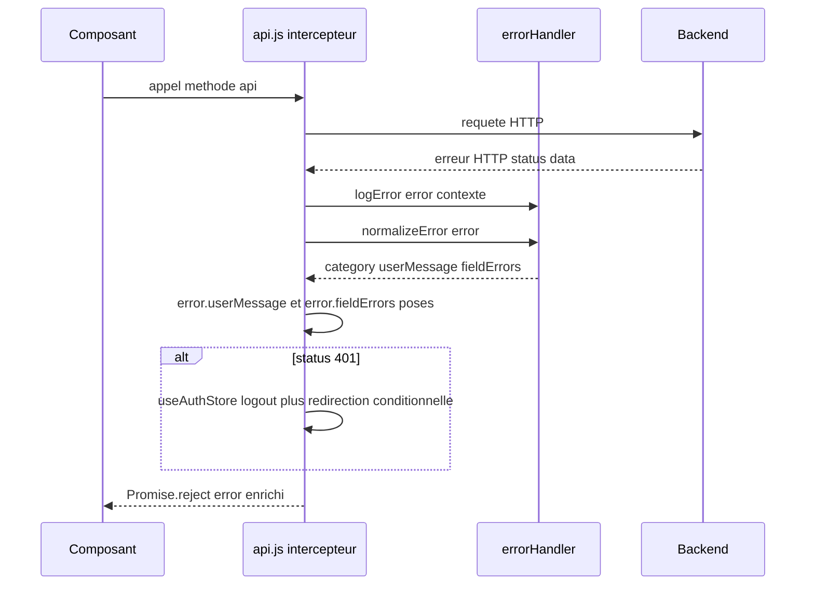
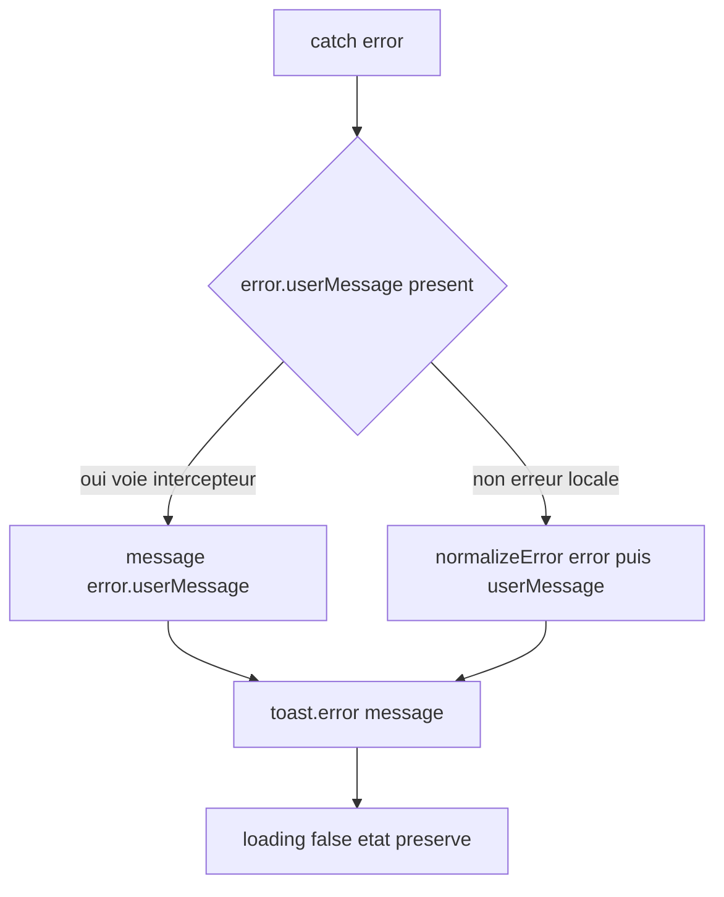

# Design Document — Gestion centralisée des erreurs côté client (error-handler)

> Issue GitHub **#20** (TIER 0 CRITICAL, épique d'audit #16). Équivalent frontend de `PRODUCTION_STANDARDS §1.2` (« Aucun `$e->getMessage()` exposé au client »). Aucune modification backend.

## Overview

### Objectif

Garantir, de façon **vérifiable par test**, qu'aucun détail technique d'infrastructure (message SQL/SQLSTATE, stack trace, chemin de fichier, nom de classe d'exception, message d'exception axios) ne puisse atteindre l'utilisateur final, tout en offrant des messages d'erreur français cohérents, actionnables et prêts pour l'i18n.

La pièce centrale est une **fonction pure de normalisation** qui transforme n'importe quelle erreur (erreur axios, réponse applicative `{success:false}`, `Error` native, `null`, chaîne, objet inattendu) en un résultat sûr `{ category, userMessage, fieldErrors }`. Cette fonction est appelée à deux endroits cohérents par construction (même fonction pure) :

1. dans l'**intercepteur de réponse** de `src/services/api.js`, qui attache `error.userMessage` (et `error.fieldErrors` pour 422) avant `Promise.reject(error)` ;
2. directement dans les **composants** qui n'ont pas reçu une erreur passée par l'intercepteur (erreur applicative `{success:false}` levée localement, `Error` native).

### Scope de CE design (vs dette)

| Inclus dans cette itération | Tracé en dette |
|---|---|
| Module pur `src/services/errorHandler.js` (`normalizeError`, `logError`) | Migration des ~80 expositions `.message` restantes (vagues 2+) → **#20-FE-1** |
| Catalogue gelé `src/constants/errorMessages.js` | Intégration APM/Sentry (déféré TIER 2 backend) |
| Tests Vitest exhaustifs de `normalizeError` | i18n complet (le catalogue le prépare seulement) |
| Branchement intercepteur (`userMessage` + `fieldErrors`) | Migration comparaisons de rôle (#18-FE-2) |
| Migration des **21 `alert()` d'erreur** (vague 1) | Refonte god components (#28) |

### Briques réutilisées (lues, vérifiées le 2026-06-15)

- `src/services/toast.js` : singleton `toast.success/error/warning/info(message, title)`. Cible d'affichage.
- `src/services/api.js` : intercepteur réponse (#19) — `console.error('❌ API Error:', url, status)` puis `return Promise.reject(error)` ; logout 401 via `useAuthStore().logout()` + redirection conditionnelle.
- `src/constants/roles.js` (#18) : pattern `logRoleDecision` (journal sans donnée sensible, `if (import.meta.env?.PROD) return`), `Object.freeze`, `normalizeRole` (fonction pure fail-soft). Modèles à reproduire.
- Format d'erreur backend 422 confirmé : `error.response.data.errors = { champ: [messages] }` (Laravel), vérifié à `src/views/admin/AdminInstitutions.vue:427-428`.

## Architecture

### Diagramme d'architecture système

```mermaid
graph TB
    subgraph Composants
        C1[Composant Vue]
    end
    subgraph CoucheServices
        API[api.js intercepteur reponse]
        EH[errorHandler.js normalizeError logError]
        TOAST[toast.js]
    end
    subgraph Donnees
        CAT[errorMessages.js catalogue gele]
    end
    subgraph Backend
        BE[API Laravel lecture seule]
    end

    C1 -->|appel methode api| API
    API -->|requete HTTP| BE
    BE -->|erreur HTTP| API
    API -->|normalizeError error| EH
    EH -->|lit messages| CAT
    EH -->|userMessage fieldErrors| API
    API -->|reject error enrichi| C1
    C1 -->|toast.error error.userMessage| TOAST
    C1 -.erreur locale non axios.->|normalizeError error| EH
    API -->|logError error contexte| EH
```

### Diagramme de flux de données



## Décisions tranchées

Conformément à `PRODUCTION_STANDARDS §6` (« UNE seule solution, jamais A ou B »), chaque point ouvert du requirements est tranché en une option unique, justifiée par lecture de code.

### (a) Forme du module → **service pur** `src/services/errorHandler.js`

**Décision : module service exportant la fonction pure `normalizeError(error)`. PAS de composable.**

Justification par preuve :
- La normalisation n'a **aucun état réactif** : elle prend une erreur en entrée et retourne un objet. Un composable (`useErrorHandler`) n'apporterait de valeur que s'il exposait un `ref`/`reactive` ou un cycle de vie ; ici il n'y en a aucun.
- Le **même code doit être appelé hors d'un composant Vue** : l'intercepteur de `api.js` n'est pas un composant et ne peut pas appeler un composable (`useXxx` exige un contexte de setup). Une fonction pure importable partout est la seule forme qui satisfait à la fois l'intercepteur (Requirement 5) et les composants (Requirement 5.5).
- Le requirement 1.6 impose explicitement une **fonction pure sans effet de bord**, testable en isolation (Requirement 8.6, `§1.3`). C'est exactement le contrat d'une fonction de service, pas d'un composable.
- Cohérence avec l'existant : `roles.js` est un module de fonctions pures (`normalizeRole`, `hasRole`, `canActivate`) consommé indistinctement par le router (hors composant) et par les composants. On reproduit ce pattern éprouvé.

### (b) Catalogue → `src/constants/errorMessages.js`, séparé du module (SRP)

**Décision : catalogue de données dans `src/constants/errorMessages.js`, gelé `Object.freeze`, distinct du module de logique.**

Justification par preuve :
- **SRP (`§1.6`)** : la donnée (messages) et la logique (classification) ont deux raisons de changer distinctes — ajouter/reformuler un message vs changer une règle de classification. Les séparer respecte la responsabilité unique exigée par Requirement 1.8 et 9 (NFR SOLID).
- **Cohérence d'emplacement** : `src/constants/` héberge déjà `roles.js`, lui-même un catalogue gelé (`ROLES`, `ALIAS`, `DISPLAY_NAMES` via `Object.freeze`). Requirement 2.6 impose explicitement le même pattern `Object.freeze`.
- **Préparation i18n (Requirement 2.3, NFR 6)** : un objet plat `catégorie → message` est trivialement transformable en `catégorie → clé i18n` plus tard, sans toucher aux sites appelants ni à la logique de `normalizeError` (qui lit toujours `ERROR_MESSAGES[category]`).

### (c) Migration → **incrémentale priorisée**, vague 1 dans CE design

**Décision : module + catalogue + branchement intercepteur + migration des 21 `alert()` d'erreur. Le reliquat (~80 expositions `.message`) est tracé en dette #20-FE-1.**

Justification par preuve :
- Un big-bang sur ~135 sites recensés (114 `alert`, 80 expositions, recoupements inclus) sur 37 emplacements serait une PR ingérable, non revue sérieusement, à fort risque de régression — l'opposé de la qualité exigée. Requirement 6.4 autorise et recommande explicitement l'incrémental priorisé avec dette tracée.
- La vague 1 attaque les sites à la fois les **plus risqués sécurité ET les plus visibles UX** : les 21 `alert()` contenant une variable d'erreur concatènent `error.response?.data?.message || error.message` (ex. `VisioManager.vue:285`) — c'est exactement le vecteur de fuite §1.2.
- Le branchement intercepteur fait baisser le risque résiduel **immédiatement sur tous les sites non encore migrés** : dès que `error.userMessage` est disponible, un site migré ultérieurement n'a qu'à lire ce champ.

**Périmètre exact de CE design :**

| Élément | Vague 1 (ce design) | Dette #20-FE-1 |
|---|---|---|
| `src/services/errorHandler.js` | ✅ créé + testé | — |
| `src/constants/errorMessages.js` | ✅ créé | — |
| Branchement `api.js` | ✅ `userMessage` + `fieldErrors` | — |
| 21 `alert(... error ...)` | ✅ migrés en `toast.error(...)` | — |
| ~80 expositions `.message` (`this.error =`, `error.value =`) | sites déjà touchés par les 21 alerts uniquement | reste migré par vagues |
| Sites `*.vue.bak` | exclus (Requirement 6.5) | exclus |

### (d) Branchement → intercepteur attache `error.userMessage` ; composants lisent en priorité ce champ, sinon appellent `normalizeError`

**Décision : l'intercepteur attache `error.userMessage` (et `error.fieldErrors` pour 422) ; les sites consomment `error.userMessage ?? normalizeError(error).userMessage`.**

Justification par preuve :
- **Point unique de normalisation** (Requirement 5.1) : toute erreur HTTP traverse l'intercepteur, donc tout site recevant une erreur axios dispose gratuitement de `userMessage` sans dupliquer la logique.
- **Cohérence garantie par construction** (Requirement 5.5) : les deux voies appellent **la même fonction pure** `normalizeError`. Il n'existe pas deux implémentations à maintenir synchrones.
- **Cas non couverts par l'intercepteur** : certaines erreurs sont des `new Error(response?.message || ...)` levées **localement** dans les composants (ex. `VisioManager.vue:281`, `ParticipantsModal.vue:380`) — elles ne passent jamais par l'intercepteur. Le fallback `?? normalizeError(error)` les couvre. D'où l'opérateur de coalescence : `error.userMessage` s'il existe, sinon normalisation directe.

## Composants et interfaces

### `src/services/errorHandler.js`

Module de fonctions pures. Responsabilité unique : **normaliser** et **journaliser** ; jamais afficher (pas d'import de `toast`), jamais naviguer, jamais muter d'état global.

```js
/**
 * @typedef {'auth'|'forbidden'|'notFound'|'validation'|'rateLimit'|'server'|'network'|'unknown'} ErrorCategory
 *
 * @typedef {Object} NormalizedError
 * @property {ErrorCategory} category   Catégorie classifiée.
 * @property {string}        userMessage Chaîne SÛRE, non vide, issue du catalogue (jamais un détail technique brut sauf cas contrôlés 422/403/404).
 * @property {Object.<string,string[]>|null} fieldErrors Messages par champ pour 422, sinon null.
 */

/**
 * Transforme n'importe quelle erreur en résultat sûr. PURE, déterministe, sans effet de bord.
 * @param {unknown} error
 * @returns {NormalizedError}
 */
export function normalizeError(error) { /* ... */ }

/**
 * Journalisation sûre (catégorie, status, url) — JAMAIS token/email/mot de passe.
 * Désactivée en production. Modèle logRoleDecision.
 * @param {unknown} error
 * @param {string} [context] Étiquette d'origine non sensible (ex. '[api.js]').
 * @returns {void}
 */
export function logError(error, context = '') { /* ... */ }
```

#### Logique de classification de `normalizeError`

Ordre de décision (premier cas vrai gagne) :

1. **`error` falsy, ou typeof string, ou `Error` native sans `response`** → `category = 'unknown'`, `userMessage = ERROR_MESSAGES.unknown`, `fieldErrors = null`. (Couvre `null`, `undefined`, `'oops'`, `new Error('boom')`.)
2. **`error.response` présent** (erreur axios avec réponse HTTP) → classer par `error.response.status` via `categoryFromStatus(status)` :
   - `401 → 'auth'`, `403 → 'forbidden'`, `404 → 'notFound'`, `422 → 'validation'`, `429 → 'rateLimit'`, `>= 500 → 'server'`, autre → `'unknown'`.
3. **`error.response` absent MAIS `error.request` présent OU `error.isAxiosError`/code réseau** (timeout, coupure, CORS) → `category = 'network'`.
4. **Objet applicatif `{ success:false, message }`** sans enveloppe axios (erreur levée localement) → `category = 'unknown'` par défaut (pas de status pour qualifier le risque) ; le `message` applicatif n'est **jamais** exposé tel quel (règle d'exposition §1.2) → on retourne `ERROR_MESSAGES.unknown`.
5. **Fallback final** → `'unknown'`.

Construction de `userMessage` après classification, via `resolveMessage(category, error)` :

| Catégorie | Source du message utilisateur | Message serveur autorisé ? |
|---|---|---|
| `validation` (422) | message agrégé des champs si exploitables, sinon `ERROR_MESSAGES.validation` | **Oui**, champs (libellés validation Laravel, non sensibles) |
| `forbidden` (403) | `ERROR_MESSAGES.forbidden` (catalogue) | Non — message catalogue forcé (prudence : un 403 contrôlé pourrait l'autoriser, voir note) |
| `notFound` (404) | `ERROR_MESSAGES.notFound` (catalogue) | Non — message catalogue forcé |
| `auth` (401) | `ERROR_MESSAGES.auth` | Non |
| `rateLimit` (429) | `ERROR_MESSAGES.rateLimit` | Non |
| `server` (5xx) | `ERROR_MESSAGES.server` | **Jamais** (Requirement 4.1, 4.5) |
| `network` | `ERROR_MESSAGES.network` | **Jamais** (Requirement 4.4) |
| `unknown` | `ERROR_MESSAGES.unknown` | **Jamais** |

> **Note de décision sur 403/404** : bien que Requirement 4.3 cite 403/404 comme « éventuellement contrôlés », on **force le message catalogue** pour 403/404 dans cette itération. Raison vérifiée : le backend Laravel renvoie pour ces codes des messages potentiellement variables (`Unauthenticated.`, messages d'exception de policy) dont la sûreté n'est pas garantie sans audit backend — interdit ici. Seul 422 ouvre la porte aux messages serveur, car son format `errors:{champ:[...]}` est structurellement des libellés de validation destinés à l'utilisateur. C'est le choix fail-secure (cohérent avec `roles.js` fail-secure). Évolution possible (dette potentielle) si le backend garantit des messages 403/404 sûrs.

#### Traitement structuré du 422 (`extractFieldErrors`)

- Lit `error.response.data.errors` (format Laravel confirmé `AdminInstitutions.vue:427`).
- Si c'est un objet non vide `{ champ: [msg, ...] }` → `fieldErrors = ce_objet` ; `userMessage` = agrégation des messages (ex. join des premières valeurs, ou `ERROR_MESSAGES.validation` en préfixe) → satisfait Requirement 3.4 (message agrégé pour appelants non structurés).
- Si absent / vide / forme inattendue → `fieldErrors = null`, `userMessage = ERROR_MESSAGES.validation` (Requirement 3.2).
- `fieldErrors` ne contient **que** ce que le backend a mis dans `errors` (libellés de validation) ; aucun ajout de détail technique (Requirement 3.3).

#### `logError(error, context)`

- `if (import.meta.env?.PROD) return` (modèle `logRoleDecision`, Requirement 7.2 ; optional chaining identique à `roles.js`/`api.js` pour les exécutions hors Vite).
- Construit un contexte **non sensible** : `{ category, status: error?.response?.status ?? null, url: error?.config?.url ?? null }`. Jamais `headers.Authorization`, jamais le corps de requête, jamais email/token (Requirement 7.1).
- `console.warn(\`[errorHandler] ${context}\`, safeContext)` (cohérent `[roles]`).
- Si aucune info exploitable → journalise au minimum `{ category: 'unknown' }` sans échouer (Requirement 7.4).

### `src/services/api.js` — branchement intercepteur

Modification **chirurgicale** du handler d'erreur de `interceptors.response.use`, en préservant le flux #19 (logout 401, `Promise.reject`).

```js
import { normalizeError, logError } from './errorHandler'
// (import relatif, cohérent avec '../constants/roles' déjà importé en relatif #19)

api.interceptors.response.use(
  (response) => response.data,
  (error) => {
    // #19 préservé : journal d'origine remplacé par logError (sûr, désactivé en prod)
    logError(error, '[api.js] response interceptor')

    // #20 : attacher le message normalisé AVANT toute autre branche
    const normalized = normalizeError(error)
    error.userMessage = normalized.userMessage
    error.fieldErrors = normalized.fieldErrors   // null hors 422

    // #19 INCHANGÉ : logout 401 via le store + redirection conditionnelle
    if (error.response?.status === 401) {
      useAuthStore().logout()
      if (!window.location.pathname.includes('/login')) {
        window.location.href = '/login'
      }
    }

    return Promise.reject(error)   // flux de rejet préservé (Requirement 5.2)
  }
)
```

Points garantis :
- L'attachement se fait **avant** la branche 401 et le `reject` (Requirement 5.1).
- La promesse reste **rejetée avec l'objet erreur** (jamais résolue/avalée — Requirement 5.2).
- Le comportement 401 est **identique** au code #19 (Requirement 5.3).
- `error.fieldErrors` est posé pour le 422 (Requirement 5.4).
- `console.error('❌ API Error:', ...)` est remplacé par `logError` qui journalise les **mêmes** informations non sensibles (url, status) mais ajoute la désactivation prod ; aucune perte de diagnostic en dev.

## Data Models

### Définitions des structures de données

```js
// Catalogue — src/constants/errorMessages.js (gelé, cohérent roles.js)
export const ERROR_MESSAGES = Object.freeze({
  auth:       "Votre session a expiré. Veuillez vous reconnecter.",
  forbidden:  "Vous n'avez pas les droits nécessaires pour cette action.",
  notFound:   "La ressource demandée est introuvable.",
  validation: "Certains champs sont invalides. Veuillez vérifier votre saisie.",
  rateLimit:  "Trop de requêtes. Veuillez patienter un instant avant de réessayer.",
  server:     "Une erreur est survenue côté serveur. Veuillez réessayer plus tard.",
  network:    "Connexion impossible. Vérifiez votre connexion internet et réessayez.",
  unknown:    "Une erreur inattendue est survenue. Veuillez réessayer.",
})
```

> Les clés correspondent 1:1 aux valeurs de `ErrorCategory`. La résolution est toujours `ERROR_MESSAGES[category] ?? ERROR_MESSAGES.unknown` (Requirement 2.2 : repli sur `unknown` si clé manquante).

### Forme du résultat de normalisation

```js
// Cas réseau (axios sans response)
{ category: 'network',    userMessage: ERROR_MESSAGES.network, fieldErrors: null }

// Cas 5xx avec message SQL brut côté serveur — le message brut N'EST JAMAIS exposé
{ category: 'server',     userMessage: ERROR_MESSAGES.server,  fieldErrors: null }

// Cas 422 avec erreurs de champ
{
  category: 'validation',
  userMessage: "Certains champs sont invalides. Veuillez vérifier votre saisie.",
  fieldErrors: { email: ["L'adresse e-mail est déjà utilisée."], nom: ['Le nom est requis.'] }
}

// Entrée invalide (null, undefined, string, Error native)
{ category: 'unknown',    userMessage: ERROR_MESSAGES.unknown, fieldErrors: null }
```

### Diagramme du modèle de données



## Business Process

### Processus 1 : Normalisation d'une erreur



### Processus 2 : Branchement intercepteur (point unique)



### Processus 3 : Affichage dans un site migré



### Pattern de migration d'un site type

Exemple `VisioManager.vue:283-285` (avant) :

```js
} catch (error) {
  console.error('[VisioManager] Erreur programmation visio:', error)
  alert('Erreur lors de la programmation de la visio: ' + (error.response?.data?.message || error.message))
}
```

Après (Requirement 6.1, 6.3, 6.6 — seule la source du message change, branches inchangées) :

```js
import { toast } from '@/services/toast'
import { normalizeError } from '@/services/errorHandler'
// ...
} catch (error) {
  toast.error(error.userMessage ?? normalizeError(error).userMessage)
}
```

> Le `console.error` local part au profit du journal centralisé (`logError` dans l'intercepteur pour les erreurs HTTP ; les erreurs locales `new Error(...)` n'ont pas de détail sensible). `error.userMessage` est présent pour les erreurs axios (posé par l'intercepteur) ; le `?? normalizeError(error)` couvre les `new Error(response?.message || ...)` levées localement (`VisioManager.vue:281`). `loading`/état finally inchangés (Requirement 6.6).

Exemple affectation d'état `ParticipantsModal.vue:384` (avant `this.error = error.response?.data?.message || error.message || 'Erreur inconnue'`) → après `this.error = error.userMessage ?? normalizeError(error).userMessage`.

## Error Handling

- **Sûreté absolue par défaut** : toute catégorie à risque (`server`, `network`, `unknown`) force le message catalogue ; il n'existe **aucun chemin** par lequel `error.message`/`error.response.data.message` d'un 5xx ou réseau atteint `userMessage` (Requirement 4.5, prouvé par test).
- **`normalizeError` ne lève jamais** : toute branche aboutit à un `NormalizedError` valide, y compris pour `null`/`undefined`/objets exotiques (Requirement 1.5). Accès défensif (`error?.response?.status`, `?? null`).
- **Séparation stricte affichage / journal** (Requirement 7.3) : le détail technique ne vit que dans `logError` (dev uniquement), jamais dans `userMessage`.
- **Le flux #19 n'est pas dégradé** : logout 401 et `Promise.reject` préservés ; un éventuel throw dans `normalizeError` serait fatal pour l'intercepteur — d'où la garantie « ne lève jamais » testée.

## Testing Strategy

Tests Vitest (#21), TDD (`§1.3`), fichier `src/services/errorHandler.test.js`. La fonction étant pure, les tests sont déterministes et sans mock réseau.

| Test | Vérifie | Requirement |
|---|---|---|
| 401/403/404/429 par status | `category` correcte + `userMessage === ERROR_MESSAGES[cat]` | 8.1 |
| 5xx avec `data.message = "SQLSTATE[23000] FK constraint..."` | `userMessage === ERROR_MESSAGES.server` ET `userMessage` **ne contient pas** la sous-chaîne `SQLSTATE` | 8.2, 4.1, 9.1 |
| 422 avec `data.errors = {email:[...], nom:[...]}` | `fieldErrors` égal à l'objet, `category === 'validation'`, `userMessage` non vide | 8.3, 3.1 |
| 422 sans `errors` exploitable | `fieldErrors === null`, `userMessage === ERROR_MESSAGES.validation` | 3.2 |
| Réseau (axios `{request}` sans `response`, `code:'ECONNREFUSED'`) | `category === 'network'`, `userMessage === ERROR_MESSAGES.network`, ne contient pas `ECONNREFUSED` | 8.5, 4.4 |
| Entrées `null`, `undefined`, `'string'`, `{}`, `new Error('boom')` | retour `unknown`, **aucune exception levée** (`expect(() => normalizeError(x)).not.toThrow()`) | 8.4, 1.5 |
| Déterminisme | deux appels sur la même entrée → résultats `toEqual` | 8.6, 1.7 |
| Pureté | aucun spy `toast`/navigation déclenché ; entrée non mutée | 8.6, 1.6 |
| `logError` en prod simulé (`import.meta.env.PROD = true`) | `console.warn` non appelé | 7.2 |
| `logError` contexte | n'inclut jamais `Authorization`/token/email | 7.1 |

Preuve d'équivalence sécurité (Requirement 9) : le test « 5xx SQL brut » et le test « réseau ECONNREFUSED » constituent la preuve mesurable qu'aucun détail technique ne fuit par la normalisation — l'équivalent frontend du grep backend `getMessage()` = 0.

## Mapping de migration (vague 1)

Les 21 `alert()` contenant une variable d'erreur, transformés en `toast.error(error.userMessage ?? normalizeError(error).userMessage)`. Sites types confirmés par lecture :

| Fichier | Ligne (avant) | Forme actuelle | Action |
|---|---|---|---|
| `src/components/visio/VisioManager.vue` | 285 | `alert('...' + (error.response?.data?.message || error.message))` | `toast.error(...)` |
| `src/components/visio/ParticipantsModal.vue` | 384 | `this.error = error.response?.data?.message || error.message || 'Erreur inconnue'` | `this.error = error.userMessage ?? normalizeError(error).userMessage` |
| `src/components/modals/GenerateReportModal.vue` | 210-211 | `error.value = err.response?.data?.message || '...'` puis `toast.error(error.value)` | `error.value = err.userMessage ?? normalizeError(err).userMessage` |
| `src/views/admin/AdminEnseignants.vue` | 455 | `error.value = err.message || '...'` | `error.value = err.userMessage ?? normalizeError(err).userMessage` |

> Les autres occurrences `alert(... error ...)` (les 12 de `VisioManager.vue`, etc.) suivent strictement le même pattern. L'inventaire exhaustif des 21 sera figé au début de l'implémentation par grep (`alert\([^)]*\b(error|err|e)\b`) pour éviter toute dérive de compte.

## Dette tracée

**#20-FE-1 — Migration du reliquat des expositions de message brut.**
- **Quoi** : les ~80 expositions `.message` restantes (`this.error =`, `error.value =`, `error.response?.data?.message`) hors des sites de la vague 1, sur les ~37 emplacements recensés, ainsi que les `alert()` non porteurs d'erreur (UX) non couverts ici.
- **Pourquoi différé** : un big-bang sur ~135 sites serait non revoyable et risqué (cf. décision c). L'intercepteur réduit déjà le risque résiduel sur tous les sites (chaque erreur axios porte `error.userMessage`).
- **Risque résiduel** : un site non migré affichant encore `error.response.data.message` peut exposer un message serveur ; mitigé car les 5xx backend conformes `§1.2` ne renvoient déjà pas de détail. Risque concentré sur les `alert()` concaténant `error.message` non encore traités hors vague 1.
- **Quand** : par vagues successives, priorisées par fréquence d'affichage et sensibilité, après livraison de cette itération.
- **Mesure** : compteur exact à recalculer par grep en fin de vague 1 (point de départ : 80 expositions / 37 emplacements au 2026-06-15).

**Note 403/404** : message serveur non exposé pour ces codes (message catalogue forcé) faute de garantie backend auditable ici ; à rouvrir si le backend garantit des messages 403/404 sûrs.

## Conformité PRODUCTION_STANDARDS

| Section | Application |
|---|---|
| **§1.2 Sécurité Absolue** | Équivalence `getMessage()` = 0 côté client : 5xx/network/unknown forcent le message catalogue ; preuve par test (« SQL brut jamais exposé »). `logError` ne journalise jamais token/email. |
| **§1.3 Tests Obligatoires** | `normalizeError` unit-testée en isolation, TDD, happy path + edge cases (chaque catégorie + entrées invalides) ; déterminisme et pureté prouvés. |
| **§1.6 SOLID** | **S** : `errorHandler.js` ne fait que normaliser/journaliser ; `errorMessages.js` ne porte que la donnée ; `toast.js` n'affiche. **O** : nouvelle catégorie = nouvelle clé catalogue + nouveau cas `categoryFromStatus`, sans réécrire les sites. **L** : fonction pure substituable par un fake trivial en test. **I** : API minimale (`normalizeError`, `logError`). **D** : les sites dépendent de l'abstraction « message sûr », pas du format d'erreur axios. |
| **§5 Standards par type** | Module et fonctions de taille maîtrisée (fonctions ≤ ~40 lignes, fichier bien < 300 lignes) ; découpage en helpers (`categoryFromStatus`, `resolveMessage`, `extractFieldErrors`). |
| **§6 Une seule solution** | Chaque décision (a/b/c/d) tranchée en une option justifiée par lecture de code, sans « A ou B ». |

## Traçabilité design → requirements

| Requirement | Section(s) du design |
|---|---|
| 1 — Module de normalisation pur | Décision (a), Composants/`errorHandler.js`, Processus 1 |
| 2 — Catalogue centralisé | Décision (b), Data Models/`ERROR_MESSAGES` |
| 3 — Validation 422 structurée | `extractFieldErrors`, Data Models (forme 422), Tests 422 |
| 4 — Non-divulgation §1.2 | Tableau d'exposition, Error Handling, Tests 5xx/réseau |
| 5 — Branchement intercepteur | Décision (d), `api.js`, Processus 2 |
| 6 — Migration des sites | Décision (c), Pattern de migration, Mapping, Dette |
| 7 — Journalisation sûre | `logError`, Error Handling, Tests `logError` |
| 8 — Couverture Vitest | Testing Strategy (toutes lignes) |
| 9 — Équivalence sécurité backend | Conformité §1.2, preuve par test, Dette (compteur d'écart) |
