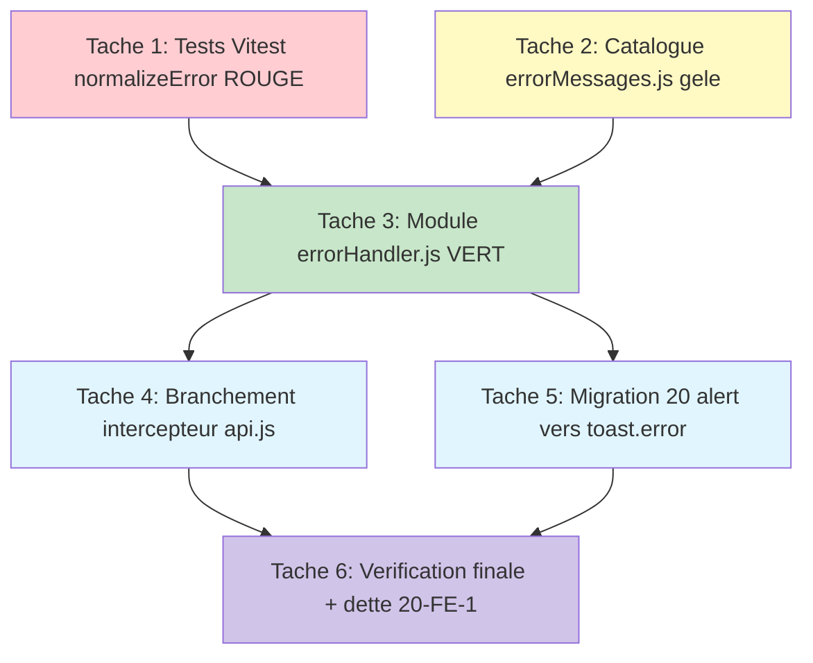

# Plan d'implémentation — Gestion centralisée des erreurs côté client (error-handler)

> Issue GitHub **#20** (TIER 0 CRITICAL, épique d'audit #16). Équivalent frontend de `PRODUCTION_STANDARDS §1.2`. Aucune modification backend.
>
> Documents de contexte (disponibles à l'implémentation) :
> - `.claude/specs/error-handler/requirements.md`
> - `.claude/specs/error-handler/design.md`
>
> **Approche TDD (Vitest #21)** : les tests de `normalizeError` sont écrits AVANT l'implémentation (rouge → vert).
> **ATTENTION include Vitest** (vérifié `vitest.config.js:19`) : le motif est `src/**/*.test.{js,mjs}` — il ne matche QUE `*.test.{js,mjs}`, **jamais** `.spec.`. Le fichier de test DOIT donc s'appeler `…errorHandler.test.js`.
> **Inventaire migration figé par grep** (`alert\([^)]*\b(error|err|e)\b`, 2026-06-15, `src/**/*.vue`) : 21 lignes brutes, dont **1 commentée** à `views/lessons/TeacherLessons.vue:482` (exclue) → **20 alert() actifs à migrer**.

---

## Liste des tâches

- [x] 1. Écrire les tests Vitest de `normalizeError` (rouge) — TDD avant implémentation
  - Décision design : (a) service pur ; (d) fonction unique appelée par intercepteur ET composants. Tests pilotent le contrat `normalizeError(error) -> {category, userMessage, fieldErrors}`.
  - Fichier créé : `src/services/__tests__/errorHandler.test.js` (matché par l'include `src/**/*.test.{js,mjs}` ; NE PAS utiliser `.spec.`).
  - Importer le catalogue attendu (`ERROR_MESSAGES` depuis `../../constants/errorMessages`) pour asserter `userMessage === ERROR_MESSAGES[cat]` (les tâches 2 et 3 rendront ces imports résolvables).
  - Couvrir une assertion par catégorie via `error.response.status` : `401 → 'auth'`, `403 → 'forbidden'`, `404 → 'notFound'`, `422 → 'validation'`, `429 → 'rateLimit'`, `500 → 'server'`, axios sans `response` (`{ request:{}, code:'ECONNREFUSED' }`) → `'network'`.
  - Preuve sécurité §1.2 : cas `5xx` avec `response.data.message = "SQLSTATE[23000] FK constraint..."` → `category === 'server'`, `userMessage === ERROR_MESSAGES.server`, ET `expect(userMessage).not.toContain('SQLSTATE')`.
  - Preuve réseau : cas réseau avec `code:'ECONNREFUSED'` → `userMessage === ERROR_MESSAGES.network` ET `expect(userMessage).not.toContain('ECONNREFUSED')`.
  - Cas `422` structuré : `response.data.errors = { email:['...'], nom:['...'] }` → `category === 'validation'`, `fieldErrors` `toEqual` cet objet, `userMessage` chaîne non vide (message agrégé).
  - Cas `422` sans détail exploitable (`errors` absent / `{}` / forme inattendue) → `fieldErrors === null`, `userMessage === ERROR_MESSAGES.validation`.
  - Entrées invalides `null`, `undefined`, `'oops'`, `{}`, `new Error('boom')` → `category === 'unknown'`, `userMessage === ERROR_MESSAGES.unknown`, ET `expect(() => normalizeError(x)).not.toThrow()`.
  - Déterminisme : deux appels sur la même entrée → résultats `toEqual`.
  - Pureté : l'entrée passée n'est pas mutée (`toEqual` sur une copie figée de l'entrée après appel) ; aucun import de `toast` dans le module testé (vérifié en tâche 6).
  - Critère de complétion : `npm run test` exécute ce fichier et il **échoue** (rouge), faute de `src/services/errorHandler.js` et `src/constants/errorMessages.js` ; aucune autre suite cassée (`test:contract` non concerné).
  - _Requirements: 8.1, 8.2, 8.3, 8.4, 8.5, 8.6, 1.5, 1.7, 1.6, 3.1, 3.2, 4.1, 4.4, 4.5, 9.1_

- [x] 2. Créer le catalogue gelé `src/constants/errorMessages.js`
  - Décision design : (b) catalogue de données séparé du module (SRP §1.6), gelé `Object.freeze` (cohérent `src/constants/roles.js:20`).
  - Fichier créé : `src/constants/errorMessages.js`.
  - Exporter `export const ERROR_MESSAGES = Object.freeze({ ... })` avec les 8 clés 1:1 des catégories : `auth`, `forbidden`, `notFound`, `validation`, `rateLimit`, `server`, `network`, `unknown` ; messages FR orientés utilisateur, actionnables, sans jargon (valeurs exactes du design, section Data Models).
  - Structure plate `catégorie → message` (préparation i18n : transformable en `catégorie → clé i18n` sans toucher les appelants ni `normalizeError`).
  - Critère de complétion : `grep -c "Object.freeze" src/constants/errorMessages.js` ≥ 1 et les 8 clés présentes (`grep -E "auth|forbidden|notFound|validation|rateLimit|server|network|unknown"`).
  - _Requirements: 2.1, 2.3, 2.4, 2.6_

- [x] 3. Implémenter le module pur `src/services/errorHandler.js` (vert)
  - Décision design : (a) service pur exportant `normalizeError` (fonction pure, sans effet de bord) + `logError` (journal sûr). Aucun import de `toast`, aucune navigation, aucune mutation d'état global.
  - Fichier créé : `src/services/errorHandler.js`. Importer `ERROR_MESSAGES` depuis `../constants/errorMessages` (chemin relatif, cohérent avec les imports relatifs de `api.js`).
  - Helper `categoryFromStatus(status)` : `401→'auth'`, `403→'forbidden'`, `404→'notFound'`, `422→'validation'`, `429→'rateLimit'`, `>=500→'server'`, autre→`'unknown'`.
  - Helper `extractFieldErrors(error)` : lit `error.response.data.errors` (format Laravel `{champ:[msgs]}`) ; objet non vide → renvoie cet objet ; sinon `null`.
  - Helper `resolveMessage(category, error)` : applique le tableau d'exposition du design — seul `validation` (422) peut agréger les messages serveur (champs) ; `forbidden`/`notFound`/`auth`/`rateLimit`/`server`/`network`/`unknown` forcent `ERROR_MESSAGES[category]` (fail-secure ; **dette potentielle 403/404** notée dans le design, message catalogue forcé faute de garantie backend auditable ici). Résolution toujours `ERROR_MESSAGES[category] ?? ERROR_MESSAGES.unknown`.
  - `normalizeError(error)` : ordre de décision du design (1. falsy/string/`Error` sans `response` → `unknown` ; 2. `error.response` présent → `categoryFromStatus` ; 3. pas de `response` mais `error.request`/code réseau → `network` ; 4. objet `{success:false}` local → `unknown` sans exposer `message` ; 5. fallback `unknown`). Accès défensifs (`error?.response?.status`, `?? null`). **Ne lève jamais** ; retourne toujours un `{category, userMessage, fieldErrors}` valide (`fieldErrors` non null seulement en 422 exploitable).
  - `logError(error, context = '')` : modèle `logRoleDecision` (`src/constants/roles.js:178-181`) — `if (import.meta.env?.PROD) return` puis `console.warn(\`[errorHandler] ${context}\`, safeContext)` où `safeContext = { category, status: error?.response?.status ?? null, url: error?.config?.url ?? null }`. JAMAIS de token/email/mot de passe/headers/corps. Si rien d'exploitable → journalise au moins `{ category: 'unknown' }` sans échouer.
  - Tailles §5 : fonctions ≤ ~40 lignes, fichier < 300 lignes, découpé en helpers ci-dessus.
  - Critère de complétion : `npm run test` → la suite de la tâche 1 passe **au vert** (toutes assertions), `test:contract` toujours vert.
  - _Requirements: 1.1, 1.2, 1.3, 1.4, 1.5, 1.6, 1.7, 1.8, 2.2, 2.5, 3.1, 3.2, 3.3, 3.4, 4.1, 4.2, 4.3, 4.4, 4.5, 7.1, 7.2, 7.3, 7.4_

- [x] 4. Brancher l'intercepteur de réponse dans `src/services/api.js`
  - Décision design : (d) l'intercepteur attache `error.userMessage` (+ `error.fieldErrors` pour 422) via `normalizeError`, AVANT la branche 401 et le `Promise.reject` ; `console.error` brut remplacé par `logError`.
  - Fichier modifié : `src/services/api.js` (handler d'erreur de `interceptors.response.use`, lignes 46-60 actuelles).
  - Ajouter l'import relatif : `import { normalizeError, logError } from './errorHandler'` (cohérent avec `'../constants/roles'`).
  - Remplacer `console.error('❌ API Error:', error.config?.url, error.response?.status)` (ligne 47) par `logError(error, '[api.js] response interceptor')` (mêmes infos non sensibles, + désactivation prod).
  - Avant la branche 401 : `const normalized = normalizeError(error); error.userMessage = normalized.userMessage; error.fieldErrors = normalized.fieldErrors`.
  - **Préserver INTÉGRALEMENT le flux #19** : la branche `if (error.response?.status === 401) { useAuthStore().logout(); … window.location.href = '/login' }` reste identique (lignes 50-57), et `return Promise.reject(error)` (ligne 59) inchangé — la promesse reste rejetée avec l'objet erreur enrichi (jamais résolue/avalée).
  - Critère de complétion : `npm run test:contract` toujours vert (api.js reste chargeable hors Vite) ; `grep -n "console.error" src/services/api.js` ne renvoie plus la ligne du handler de réponse ; `grep -n "userMessage\|fieldErrors\|logError" src/services/api.js` confirme l'attachement.
  - _Requirements: 5.1, 5.2, 5.3, 5.4, 5.5, 7.2_

- [x] 5. Migrer les 20 `alert()` d'erreur actifs → `toast.error(...)`
  - Décision design : (c) migration incrémentale priorisée — vague 1 = les `alert()` d'erreur ; (d) consommation `toast.error(error.userMessage ?? normalizeError(error).userMessage)` (fallback couvrant les `new Error(...)` levées localement, hors intercepteur).
  - Dans chaque fichier touché : ajouter `import { toast } from '@/services/toast'` et `import { normalizeError } from '@/services/errorHandler'` (toast est un export nommé, vérifié `toast.js:72`).
  - Ne changer QUE la source du message affiché : branches succès/échec, `loading`, état `finally` inchangés (Requirement 6.6). Pour les `alert(err.response?.data?.message || 'texte')`, remplacer par `toast.error(err.userMessage ?? normalizeError(err).userMessage)` (le message catalogue remplace le littéral dupliqué et la fuite `.message`).
  - Fichiers et lignes (inventaire grep figé 2026-06-15) :
    - `src/components/visio/VisioManager.vue` : lignes 285, 311, 347, 384, 432
    - `src/components/visio/ParticipantsModal.vue` : lignes 462, 511
    - `src/components/lessons/ChapterManager.vue` : lignes 413, 442, 463, 579
    - `src/views/coordinateur/SeanceManagement.vue` : ligne 501
    - `src/views/TeacherSeances.vue` : ligne 603
    - `src/views/seances/SeanceDetails.vue` : ligne 517
    - `src/views/Quizzes.vue` : ligne 105
    - `src/views/lessons/LessonChapters.vue` : ligne 180
    - `src/views/lessons/LessonEditor.vue` : lignes 569, 591
    - `src/views/lessons/StudentLessonView.vue` : ligne 496
    - `src/views/admin/AdminInstitutions.vue` : ligne 453
  - **EXCLU** : `src/views/lessons/TeacherLessons.vue:482` (ligne **commentée** `// alert(...)`, hors périmètre).
  - Conflits de fichiers : ces 12 fichiers sont **disjoints** de `src/services/api.js` (tâche 4) et des fichiers des tâches 1-3 ; aucune collision. Les sites sont aussi disjoints entre eux.
  - Critère de complétion : `grep -rnE "alert\([^)]*\b(error|err|e)\b" src/**/*.vue` ne renvoie plus que la ligne commentée de `TeacherLessons.vue`. `npm run build` réussit (imports résolus, pas de référence cassée).
  - _Requirements: 6.1, 6.2, 6.3, 6.5, 6.6_

- [x] 6. Vérification finale et traçage de la dette #20-FE-1
  - Aucune écriture de code fonctionnel : exécution des vérifications + ajout/mise à jour de la note de dette dans le design (`## Dette tracée`) avec le compteur recalculé.
  - Tests : `npm run test` → suite `errorHandler.test.js` entièrement verte ; `npm run test:contract` → vert ; `npm run build` → succès.
  - Preuve sécurité (équivalence backend §1.2) : confirmer via la suite Vitest que le test « 5xx SQL brut » et le test « réseau ECONNREFUSED » passent (aucune fuite par `normalizeError`).
  - Preuve pureté : `grep -n "toast" src/services/errorHandler.js` ne renvoie rien (le module n'affiche jamais).
  - Preuve migration : `grep -rnE "alert\([^)]*\b(error|err|e)\b" src` ne renvoie que la ligne commentée ; `grep -rnE "(error|err)\.(response\?\.data\?\.message|message)" <12 fichiers migrés>` ne renvoie plus d'exposition directe dans une UI (les `.message` restants y sont remplacés par `userMessage ?? normalizeError(...)`).
  - Dette #20-FE-1 : recompter par grep le reliquat d'expositions `.message` hors vague 1 (`this.error =`, `error.value =`, `error.response?.data?.message`) et le consigner dans le design comme dette tracée (point de départ : 80 expositions / 37 emplacements au 2026-06-15). NE PAS migrer ce reliquat dans cette itération.
  - Critère de complétion : les 3 commandes ci-dessus réussissent, le compteur de dette est inscrit, et le grep prouve 0 `alert(...error...)` actif et 0 exposition `.message` directe dans les 12 fichiers migrés.
  - _Requirements: 6.4, 9.1, 9.2, 9.3, 4.5, 1.6_

---

## Diagramme de dépendances des tâches

> Parallélisme possible : les tâches 4 et 5 sont indépendantes une fois la tâche 3 livrée (api.js vs 12 fichiers .vue disjoints) et peuvent être menées en parallèle, puis convergent en tâche 6.
