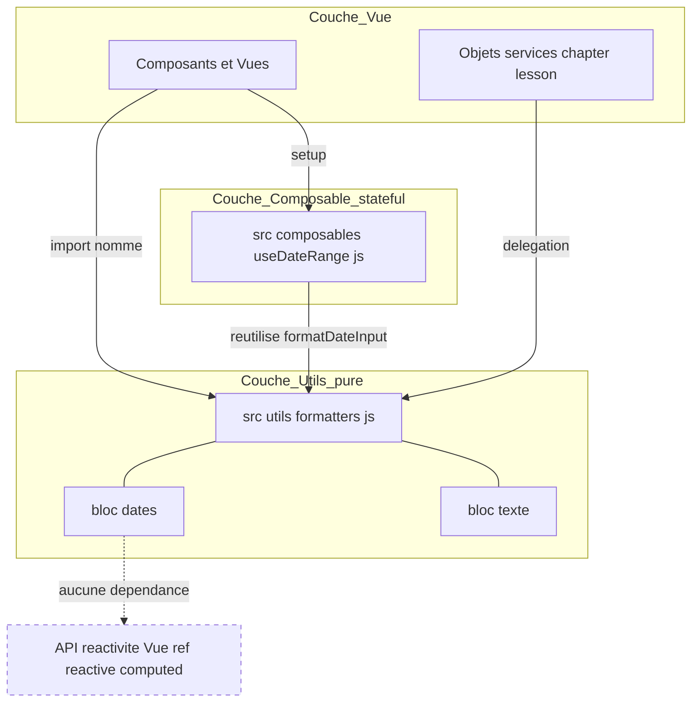
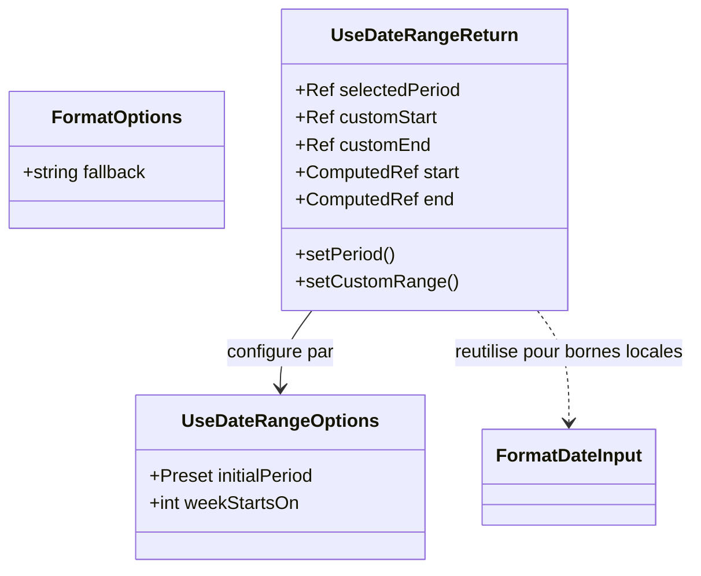
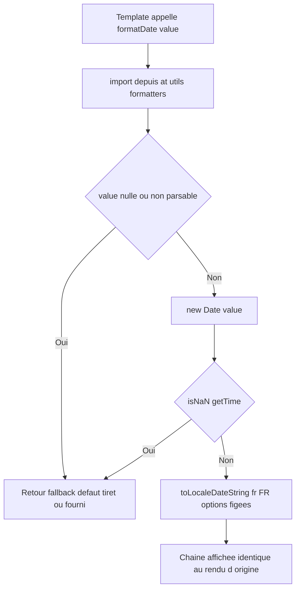
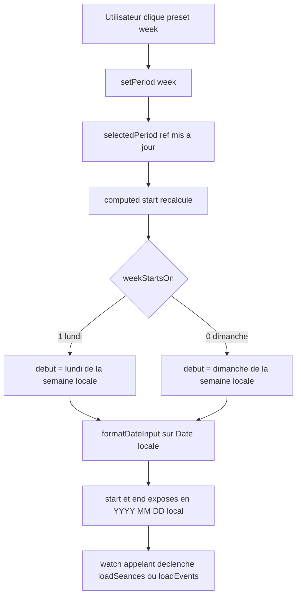
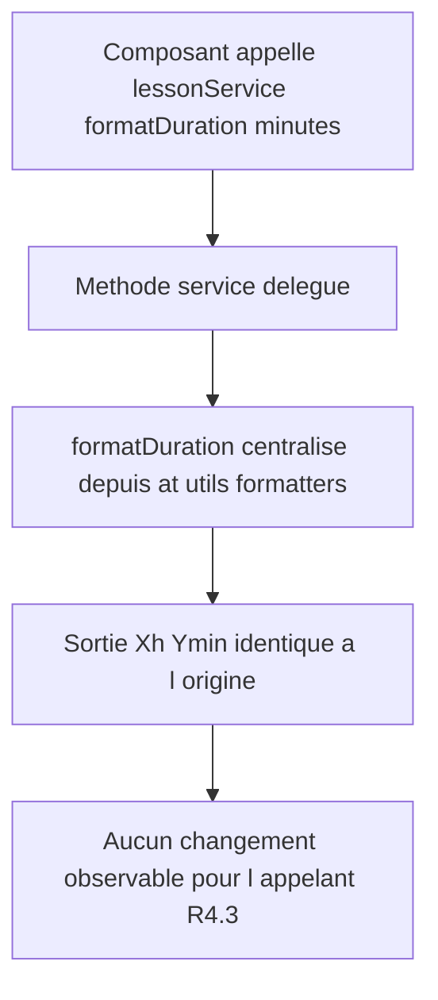

# Design Document — Centralisation des formatters et de la logique de plage de dates

> Spec : `.claude/specs/formatters/` · Issue #23 (TIER 1, épique #16) · Frontend Vue 3 `lms-frontend`
> Requirements approuvés : `.claude/specs/formatters/requirements.md`
> Conformité : `PRODUCTION_STANDARDS.md` (§1.1 tailles, §1.3 tests, §5 hardening, DRY/Q5, « UNE seule solution »), `CONTRIBUTING.md`.
> Toutes les décisions ci-dessous sont **tranchées** (une seule option, justifiée par lecture du code réel, per requirements §6).

---

## Overview

### Objectif

Éliminer la duplication massive (DRY) de fonctions de formatage et de logique de plage de dates,
mesurée dans le code réel le 2026-06-15 :

| Symbole | Définitions locales réelles | Preuve de lecture |
|---|---|---|
| `formatDate` | **80 occurrences sur 32 fichiers** (grep `src/`) | `SeanceAttendanceHistory.vue:639`, `AdminSeances.vue:291`, `TeacherEvaluations.vue:742`, `AdminInstitutions.vue:477`, `SeanceDetails.vue:493`, `LessonCard.vue:156` |
| `formatTime` (heure du jour) | ~17 | `SeanceAttendanceHistory.vue:644`, `AdminSeances.vue:301`, `SeanceDetails.vue:523` |
| `formatTime` (durée `mm:ss`) | minuteurs | `QuizTake.vue:178` |
| `formatDuration` | 5 (2 services + 3 composants) | `services/chapter.js:135`, `services/lesson.js:256`, `SeanceAttendanceHistory.vue:659`, `LessonCard.vue:153` |
| `getInitials` | 6 (chaîne + objet) | `SeanceAttendanceHistory.vue:674`, `AdminEnseignants.vue:347`, `AdminUsers.vue:376` |
| `truncate` / `truncateText` | 1 avéré | `StudentCourses.vue:235` |
| Plage de dates stateful | 2 implémentations divergentes | `SeanceAttendanceHistory.vue:408`, `UniversalCalendar.vue:555` |

### Scope

**Dans le périmètre** : création de `src/utils/formatters.js` (fonctions pures) et
`src/composables/useDateRange.js` (logique stateful), leurs tests Vitest, et la migration
d'un **lot vérifié** d'appelants (cf. *Mapping de migration*).

**Hors périmètre** (per requirements, intro + R6.4) : `getStatusColor`/`getStatusBadgeClass`
(logique de statut métier), god components (#28), comparaisons de rôle (#18-FE-2),
`src/constants/roles.js` et `errorMessages.js` (gelés). **Aucune modification backend.**

### Principe directeur (paradigme Vue, R6)

Séparation stricte **pur → utils / stateful → composable**, conforme à
`vuejs.org/guide/reusability/composables.html` : une transformation déterministe sans état
relève d'un utilitaire JS pur (testable en isolation, zéro dépendance à la réactivité Vue) ;
une logique avec état réactif relève d'un composable `use*`.

---

## Architecture

### Diagramme d'architecture système



Lecture du diagramme : les utils purs **n'importent jamais** l'API de réactivité Vue (R6.3,
flèche en pointillés barrée). Le composable, lui, **réutilise** la primitive pure
`formatDateInput` pour produire des bornes locales sans réimplémenter le formatage (DRY).

### Diagramme de flux de données — formatage pur


### Diagramme de flux de données — plage de dates stateful


---

## Décisions tranchées

> Règle PRODUCTION_STANDARDS « UNE seule solution, jamais A ou B ». Chaque décision retient
> **une** option, justifiée par la lecture du code.

### Décision A — Emplacement des modules

**Tranché** :
- Fonctions **pures** → `src/utils/formatters.js`.
- Logique **stateful** → `src/composables/useDateRange.js`.

**Justification** :
1. *Paradigme Vue (R6)* : `formatDate`/`formatTime`/`formatDuration`/`getInitials`/`truncate`
   sont déterministes et sans état ; elles ne doivent contenir aucun `ref`/`reactive`/`computed`
   (R6.1, R6.3). La plage de dates manipule un état réactif (`selectedPeriod` + bornes dérivées),
   ce qui est la définition même d'un composable (R6.2).
2. *Couverture déjà configurée* : `vitest.config.js:24` inclut **déjà** `src/utils/**`,
   `src/composables/**` et `src/services/**` dans la couverture. Aucun changement de config requis.
3. *Cohérence d'arborescence* : `src/utils/` ne contient aujourd'hui aucun module métier
   (le module rôles a migré en `src/constants/` lors de #18) ; `src/composables/` contient déjà
   `useNotifications`, `useTheme`, `useVisioParticipation` — `useDateRange` y est cohérent.

### Décision B — API des formatters

#### B.1 — `formatDate` : fonctions nommées plutôt qu'un format paramétrable géant

**Tranché** : **quelques fonctions nommées dédiées**, chacune mappant une variante réelle,
plutôt qu'un unique `formatDate(value, options)` exposant tout l'objet `Intl.DateTimeFormatOptions`.

**Justification** :
- Les variantes réelles forment un **ensemble fermé et petit** (5 formes constatées à la lecture),
  pas un espace ouvert d'options. Des fonctions nommées documentent l'intention au site d'appel
  (`formatDateLong(d)` est plus lisible que `formatDate(d, { weekday:'long', ... })`) et restent
  testables unitairement (PRODUCTION_STANDARDS §1.1 : une responsabilité par fonction).
- Un `options` brut rouvrirait la porte à la divergence qu'on élimine (chaque appelant
  recomposerait son objet). Les fonctions nommées **figent** les 5 formes canoniques.
- `formatDate` conserve un **paramètre `fallback` optionnel** pour la non-régression (R2.4).

#### B.2 — Repli unique harmonisé + override par appelant

**Tranché** : repli **par défaut `'—'`** (tiret cadratin), **surchargeable** via paramètre.
Tous les formatters de date/heure/durée/initiales acceptent un repli optionnel.

**Justification** :
- Les replis actuels divergent (`'-'`, `'N/A'`, `'Aucune'`, `'Non définie'`, `'Non défini'` —
  constatés respectivement `SeanceAttendanceHistory:640`, `AdminSeances:292`, `AdminInstitutions:478`,
  `TeacherEvaluations:743`, `SeanceDetails:494`). On **harmonise** sur `'—'` par défaut (R2.4)…
- …mais on **préserve la non-régression** en autorisant `formatDate(v, { fallback: 'Non définie' })`
  pour les appelants dont le repli spécifique est visible et attendu par l'utilisateur (R4.6).
- Les replis textuels métier qui doivent rester (`'Non définie'` pour une échéance d'évaluation)
  sont **tracés en dette** (cf. *Dette tracée* #23-FE-1) : à la migration, soit on conserve le repli
  d'origine via paramètre, soit on l'aligne après validation produit.

#### B.3 — `formatTime` (heure) vs durée : deux fonctions distinctes, nommage non ambigu

**Tranché** (R2.5) :
- `formatTime(value, options?)` → **heure de la journée** `HH:mm` locale (`fr-FR`).
- `formatElapsed(seconds, options?)` → **durée écoulée `mm:ss`** pour les minuteurs.
- `formatDuration(minutes, options?)` → **durée longue `Xh Ymin`** pour leçons/chapitres.

**Justification** :
- Trois sémantiques réellement distinctes dans le code : heure extraite d'une date
  (`SeanceAttendanceHistory:644`), compte à rebours secondes→`mm:ss` (`QuizTake:178`),
  durée en minutes→`Xh Ymin` (`services/lesson.js:256`). Les fusionner créerait une fonction
  surchargée ambiguë (anti-pattern, viole §1.1 « une responsabilité »).
- Le nommage `formatElapsed` (et non un second `formatTime`) **lève toute ambiguïté** d'import :
  un appelant ne peut pas confondre l'heure du jour et un chrono.

#### B.4 — `getInitials(input)` : signature unifiée polymorphe, fail-safe `'?'`

**Tranché** (R2.6) : `getInitials(input)` accepte **soit** une chaîne `name`, **soit** un objet
`{ prenom, nom, name }`. Normalisation interne, repli `'?'` sur entrée vide/invalide.

**Justification** :
- Les deux signatures réelles (`SeanceAttendanceHistory:674` chaîne ; `AdminEnseignants:347` et
  `AdminUsers:376` objet) couvrent des données hétérogènes. Une fonction unique polymorphe évite
  deux exports quasi identiques (DRY) tout en couvrant les deux usages sans perte (R2.6).
- Précédence de résolution documentée : objet `{prenom, nom}` → `prenom[0]+nom[0]` ;
  objet `{name}` ou chaîne → split sur espaces, `parts[0][0]+parts[last][0]`, sinon 2 premiers car.
  Repli `'?'` strict (jamais d'exception, jamais `undefined`).

#### B.5 — `truncate(text, maxLength, options?)` + alias `truncateText`

**Tranché** : `truncate(text, maxLength)` est la fonction canonique ; `truncateText` est exporté
comme **alias** pour migrer `StudentCourses.vue:235` sans renommer le site d'appel.

**Justification** : R1.2 nomme `truncate` ; le seul appelant réel utilise `truncateText`.
L'alias permet une migration sans diff inutile, puis convergence ultérieure (dette mineure tracée).

### Décision C — `useDateRange` : réconciliation des divergences

**Tranché** :
- **Début de semaine = lundi** par défaut (ISO 8601), **surchargeable** via option `weekStartsOn`.
- **Bornes calculées en heure locale** via `formatDateInput` (réutilisée depuis `formatters.js`),
  **jamais** `toISOString()` (corrige le bug UTC, R3.4/R3.5).
- **Presets = union** des deux ensembles : `today`, `week`, `month`, `7days`, `30days`, `90days`,
  `custom`.

**Justification** :
- *Lundi par défaut* : ISO 8601 et convention FR (le calendrier `UniversalCalendar.vue:562` utilise
  déjà lundi). `SeanceAttendanceHistory.vue:419` utilise dimanche (`getDay()` sans `+1`) — on
  réconcilie sur lundi mais on **expose `weekStartsOn`** pour permettre à cet appelant un override
  explicite et tracé si une régression visuelle apparaît (R3.4).
- *Heure locale obligatoire* : `UniversalCalendar.vue:559` fait `now.toISOString().split('T')[0]`,
  qui convertit en UTC avant découpe — pour un utilisateur en UTC+1 après ~23h, la borne **glisse
  d'un jour** (bug latent constaté, présent dans 7 fichiers via grep `toISOString().split('T')[0]`).
  `SeanceAttendanceHistory.vue:652` (`formatDateInput`) construit `YYYY-MM-DD` à partir des getters
  **locaux** (`getFullYear`/`getMonth`/`getDate`) : c'est la version correcte, **retenue** (R3.5).
- *Union des presets* : aucune perte de fonctionnalité ; `custom` couvre `SeanceAttendanceHistory`,
  les presets relatifs (`7days`/`30days`/`90days`) couvrent `UniversalCalendar` (R3.4.c).

### Décision D — Stratégie de migration : incrémentale priorisée

**Tranché** : migration **incrémentale priorisée** (PAS big-bang sur les 32 fichiers).

**Justification** : avec 80 occurrences sur 32 fichiers et des replis divergents visibles,
un big-bang maximise le risque de régression visuelle et rend la PR inrevyable. PRODUCTION_STANDARDS
autorise l'incrémental dès lors que la dette résiduelle est **explicitement tracée** (R4.4).
On crée modules + tests d'abord (TDD), puis on migre un **lot vérifié** à faible risque, et on trace
le reliquat en #23-FE-1. Le périmètre exact est figé en *Mapping de migration*.

---

## Composants et Interfaces

### `src/utils/formatters.js` — API exacte

> Note §1.1 : si le fichier dépasse le seuil de taille raisonnable, il SHALL être scindé en
> sous-modules cohérents (`formatters/dates.js`, `formatters/text.js`) **ré-exportés** par
> `formatters.js` (barrel), sans changer la surface d'import publique. Décision de scission prise
> à l'implémentation selon la taille mesurée (R1.5).

```js
/**
 * @typedef {Object} FormatOptions
 * @property {string} [fallback='—'] Chaîne retournée pour entrée nulle/invalide (R2.4).
 */

// — Dates (locale fr-FR, R2.7) —

/** Date courte : "15/06/2026". Variante par défaut. */
export function formatDate(value, options?: FormatOptions): string

/** Date + heure : "15/06/2026 14:30" (TeacherEvaluations.vue:744). */
export function formatDateTime(value, options?: FormatOptions): string

/** Date littérale longue : "15 juin 2026" (AdminSeances.vue:294). */
export function formatDateLong(value, options?: FormatOptions): string

/** Date avec jour de semaine : "lundi 15 juin 2026" (SeanceDetails.vue:495). */
export function formatDateWeekday(value, options?: FormatOptions): string

/** Date courte abrégée : "15 juin 2026" / "15 juin. 2026" 2-digit+short (AdminInstitutions.vue:480, LessonCard.vue:159). */
export function formatDateShort(value, options?: FormatOptions): string

/** Heure du jour : "14:30" (SeanceAttendanceHistory.vue:644). */
export function formatTime(value, options?: FormatOptions): string

/** Borne locale YYYY-MM-DD sans décalage UTC (réutilisée par useDateRange). */
export function formatDateInput(date: Date): string

// — Durées —

/** Durée longue minutes → "2h 30min" / "45min" (services/lesson.js:256). */
export function formatDuration(minutes, options?: FormatOptions): string

/** Durée écoulée secondes → "mm:ss", padding secondes "0:05" (QuizTake.vue:178). */
export function formatElapsed(seconds, options?: FormatOptions): string

// — Texte —

/** Initiales depuis chaîne OU objet {prenom,nom,name}, repli '?' (R2.6). */
export function getInitials(input): string

/** Tronque avec "…", retourne '' si vide. */
export function truncate(text, maxLength): string

/** Alias de truncate pour StudentCourses.vue:235. */
export { truncate as truncateText }
```

**Dépendances** : aucune (zéro import Vue, R6.3). `Intl`/`Date` natifs uniquement.
**Responsabilités** : transformation pure déterministe (R1.3), fail-safe systématique (R2.3).

### `src/composables/useDateRange.js` — API exacte

```js
/**
 * @param {Object} [options]
 * @param {string} [options.initialPeriod='month'] Preset initial.
 * @param {0|1} [options.weekStartsOn=1] 1=lundi (ISO, défaut), 0=dimanche (override).
 * @returns {{
 *   selectedPeriod: Ref<string>,        // preset réactif
 *   customStart: Ref<string|null>,      // borne custom (YYYY-MM-DD)
 *   customEnd: Ref<string|null>,
 *   start: ComputedRef<string>,         // borne début dérivée (locale)
 *   end: ComputedRef<string>,           // borne fin dérivée (locale)
 *   presets: readonly string[],         // ['today','week','month','7days','30days','90days','custom']
 *   setPeriod: (period: string) => void,
 *   setCustomRange: (from: string, to: string) => void
 * }}
 */
export function useDateRange(options?): UseDateRangeReturn
```

**Responsabilités** : encapsuler l'état réactif de période + dériver `start`/`end` via `computed`
(recalcul automatique sans appel impératif, R3.3). **Dépendances** : `ref`, `computed` de `vue` ;
`formatDateInput` de `@/utils/formatters` (DRY — pas de réimplémentation locale).
**Cycle de vie** : ce composable n'alloue **aucun** timer/watcher persistant (les `computed` sont
nettoyés avec le scope), donc R3.7 est satisfait par construction ; aucun `onScopeDispose` requis.
Si un `watch` est ajouté côté appelant pour déclencher un chargement, c'est le scope du composant
appelant qui le nettoie.

### Adoption par les appelants (sans régression)

- **`SeanceAttendanceHistory.vue`** (Options API) : remplace `getPeriodDates`/`selectPeriod`/
  `formatDateInput` locaux par `useDateRange`. Comme le composant est en Options API,
  l'intégration passe par `setup()` exposant `start`/`end`/`setPeriod`, consommés par le template
  et `loadSeances`. Override `weekStartsOn: 0` **si** une régression visuelle dimanche apparaît
  (sinon on aligne sur lundi). Bornes désormais locales (déjà le cas ici → non-régression).
- **`UniversalCalendar.vue`** (Composition API) : remplace `getDateRangeStart`/`getDateRangeEnd`
  par `useDateRange` (presets `7days`/`30days`/`90days` couverts). Gain : **correction du bug UTC**
  (R3.5). L'état de navigation propre au calendrier (`currentDate`, `currentView`, `calendarRef`)
  reste dans le composant — **hors périmètre** de `useDateRange` (séparation des responsabilités).

---

## Data Models

### Structures de données cœur (TypeScript-like, documentation)

```ts
interface FormatOptions {
  fallback?: string; // défaut '—' (Décision B.2)
}

// Entrée polymorphe de getInitials (Décision B.4)
type InitialsInput =
  | string
  | { prenom?: string; nom?: string; name?: string }
  | null
  | undefined;

type Preset = 'today' | 'week' | 'month' | '7days' | '30days' | '90days' | 'custom';

interface UseDateRangeOptions {
  initialPeriod?: Preset;   // défaut 'month'
  weekStartsOn?: 0 | 1;     // défaut 1 (lundi ISO)
}

interface UseDateRangeReturn {
  selectedPeriod: Ref<Preset>;
  customStart: Ref<string | null>;
  customEnd: Ref<string | null>;
  start: ComputedRef<string>; // 'YYYY-MM-DD' local
  end: ComputedRef<string>;   // 'YYYY-MM-DD' local
  presets: readonly Preset[];
  setPeriod: (p: Preset) => void;
  setCustomRange: (from: string, to: string) => void;
}
```

### Diagramme du modèle de données



### Mapping des variantes de format (recensement R2.1, sans perte R2.2)

| Fonction cible | Forme `Intl` / sortie | Source lue |
|---|---|---|
| `formatDate` | `toLocaleDateString('fr-FR')` → `15/06/2026` | `SeanceAttendanceHistory.vue:641` |
| `formatDateTime` | `2-digit/2-digit/numeric` + `hour/minute` | `TeacherEvaluations.vue:744` |
| `formatDateLong` | `day:numeric, month:long, year:numeric` | `AdminSeances.vue:294` |
| `formatDateWeekday` | `weekday:long, ...long` | `SeanceDetails.vue:495` |
| `formatDateShort` | `2-digit/short/numeric` | `AdminInstitutions.vue:480`, `LessonCard.vue:159` |
| `formatTime` | `hour:2-digit, minute:2-digit` | `SeanceAttendanceHistory.vue:644`, `AdminSeances.vue:304` |
| `formatElapsed` | `m:ss` padStart secondes | `QuizTake.vue:178` |
| `formatDuration` | `Xh Ymin` / `Ymin` | `services/lesson.js:256`, `services/chapter.js:135` |

---

## Business Process

### Process 1 : Formatage d'une date par un composant migré



### Process 2 : Sélection d'une période via useDateRange



### Process 3 : Délégation des services à formatDuration centralisé



---

## Error Handling

Tous les formatters appliquent une stratégie **fail-safe sans exception** (R2.3, PRODUCTION_STANDARDS §5) :

| Cas d'entrée | Comportement | Exigence |
|---|---|---|
| `null` / `undefined` | retourne `fallback` (`'—'` ou fourni) | R2.3, R2.4 |
| Date invalide / chaîne non parsable | `new Date(v)` puis garde `isNaN(getTime())` → `fallback` ; **jamais** `"Invalid Date"` | R2.3 |
| `NaN` en durée | garde numérique → `fallback` ; **jamais** `"NaN"` | R2.3 |
| `getInitials` entrée vide/objet sans champ | retourne `'?'` (jamais d'exception) | R2.6 |
| `truncate` texte vide | retourne `''` | R5.1 |
| `formatElapsed` secondes négatives/NaN | repli sûr (`'0:00'` ou `fallback`), pas de `NaN:NaN` | R2.3, R5.2 |

**Principes** :
- **Aucune** exception levée par un formatter pur (un formatter ne doit jamais casser un rendu).
- **Aucune** fuite de valeur technique (`Invalid Date`, `NaN`) à l'écran (§5 hardening UI).
- `useDateRange` : `custom` sans bornes fournies → `start`/`end` retombent sur un défaut sûr
  (preset `month`) plutôt que `undefined`, pour ne jamais envoyer une requête malformée au backend.
- Pas de `console.error` bruyant dans les formatters (chemin chaud de rendu) ; la validation
  d'entrée est silencieuse et déterministe.

---

## Testing Strategy

> Convention figée par `tests/unit/roles.test.js` et `vitest.config.js:19` :
> fichiers `*.test.{js,mjs}`, `import { describe, it, expect } from 'vitest'`, imports applicatifs
> via l'alias `@/`. TDD : tests écrits **avant** l'implémentation (PRODUCTION_STANDARDS §1.3).

### Emplacement des tests

- `src/utils/__tests__/formatters.test.js`
- `src/composables/__tests__/useDateRange.test.js`

(Collectés par `include: ['src/**/*.test.{js,mjs}']` ; couverts par `coverage.include`
`src/utils/**` + `src/composables/**` déjà présents — `vitest.config.js:24`.)

### `formatters.test.js` — par fonction : happy + null/invalide + variantes (R5.1)

- **`formatDate` & variantes** : entrée valide → sortie `fr-FR` attendue (forme figée par variante) ;
  `null`/`undefined` → `'—'` ; surcharge `{ fallback: 'Non définie' }` → repli préservé (R2.4) ;
  chaîne non parsable (`'pas-une-date'`) → `fallback`, **jamais** `"Invalid Date"`.
- **`formatTime`** : `'14:30'` pour une date valide ; repli sur invalide.
- **`formatElapsed`** : `65` → `'1:05'` ; **`5` → `'0:05'`** (padding secondes, R5.2) ; `0` → `'0:00'` ;
  négatif/`NaN` → repli sûr.
- **`formatDuration`** : `150` → `'2h 30min'` ; `45` → `'45min'` ; `120` → `'2h'` ; `0`/`null` → `fallback`.
- **`getInitials`** (R5.3) : chaîne `'Jean Dupont'` → `'JD'` ; nom unique `'Jean'` → `'JE'` ;
  objet `{prenom:'Jean', nom:'Dupont'}` → `'JD'` ; objet `{name:'Marie Curie'}` → `'MC'` ;
  vide `''`/`null`/`{}` → `'?'`.
- **`truncate`** : texte plus long → tronqué + `'…'` ; texte ≤ `maxLength` → inchangé ;
  vide → `''` ; alias `truncateText` se comporte à l'identique.
- **Déterminisme (R1.3)** : double appel même entrée non horloge → résultat identique.

### `useDateRange.test.js` — presets, bornes locales, anti-décalage, réactivité (R5.4/R5.5)

- **Chaque preset → bornes correctes** : `today`, `week` (lundi par défaut), `month`, `7days`,
  `30days`, `90days`, `custom` ; vérifier `start`/`end` au format `YYYY-MM-DD`.
- **Anti-décalage de jour (R5.5)** : avec une date proche de minuit dans un fuseau ≠ UTC, asserter
  que `start`/`end` correspondent au **jour local** et **non** au résultat `toISOString()` (test du
  bug corrigé). Mock de l'horloge via `vi.useFakeTimers()` / `vi.setSystemTime`.
- **Override `weekStartsOn: 0`** : `week` démarre dimanche.
- **Réactivité (R5.4)** : `setPeriod('week')` puis `setPeriod('month')` → `start`/`end` se
  recalculent automatiquement (lire `.value` du `computed`, aucun appel impératif).
- **`custom`** : `setCustomRange('2026-06-01','2026-06-15')` → `start/end` reflètent les bornes ;
  `custom` sans bornes → repli sûr (défaut `month`).
- **Pureté préservée** : importer `formatters.test` séparément garantit qu'aucun util n'importe Vue
  (un test peut asserter que `formatters.js` ne référence pas `ref`/`reactive` — vérif statique légère).

### Critère de sortie (R5.7)

`npm run test` (Vitest) **vert** sur la nouvelle suite **et** sur `tests/unit/roles.test.js`
existante (aucune régression).

---

## Mapping de migration

> Décision D : incrémentale priorisée. **Périmètre migré dans CETTE itération** vs **dette tracée**.

### Lot migré (faible risque, vérifié à la lecture)

| Fichier | Symbole(s) | Action | Repli préservé |
|---|---|---|---|
| `src/views/attendance/SeanceAttendanceHistory.vue` | `formatDate`, `formatTime`, `formatDuration`, `getInitials`, `formatDateInput`, plage de dates | import formatters + `useDateRange` ; suppression défs locales | `'-'` via `{ fallback: '-' }` puis revue |
| `src/components/calendar/UniversalCalendar.vue` | plage de dates | `useDateRange` (corrige bug UTC) | — |
| `src/services/chapter.js` | `formatDuration` | déléguer à formatters centralisé | `'Non définie'` via fallback |
| `src/services/lesson.js` | `formatDuration` | déléguer à formatters centralisé | `'N/A'` via fallback |
| `src/components/lessons/LessonCard.vue` | `formatDuration`, `formatDate` | import (déjà délégué pour duration) | `'N/A'` |
| `src/views/admin/AdminEnseignants.vue` | `getInitials` (objet `{prenom,nom}`) | import polymorphe | `'?'` |
| `src/views/admin/AdminUsers.vue` | `getInitials` (objet `{name}`) | import polymorphe | `'?'` |
| `src/views/QuizTake.vue` | `formatTime` (mm:ss) → `formatElapsed` | import + renommage site d'appel | — |
| `src/views/student/StudentCourses.vue` | `truncateText` | import alias | `''` |

**Critère de non-régression (R4.2, R4.5)** : pour chaque fichier migré, **aucune** définition locale
du symbole ne subsiste (vérifiable par grep) ET le rendu d'une même entrée est identique.

### Reliquat tracé en dette (#23-FE-1)

Les **~23 fichiers restants** contenant des définitions locales de `formatDate`/`formatTime`
(parmi les 32 recensés par grep, ex. `Forum.vue`, `ClasseDetails.vue`, `TeacherProfile.vue`,
`StudentGrades.vue`, `MatiereDetails*.vue`, `Dashboard.vue`, etc.) sont migrés dans une itération
ultérieure, par lots homogènes (mêmes variantes), pour garder des PR revues unitairement.
**Aussi tracé** : les 5 autres fichiers utilisant `toISOString().split('T')[0]` hors plage de dates
(`ParticipantsModal.vue`, `VisioManager.vue`, `services/jitsi.js`, `GenerateReportModal.vue`,
`AttendanceHistory.vue`) — à auditer (certains sont des noms de fichiers d'export, pas des bornes UI).

---

## Dette tracée

> Per PRODUCTION_STANDARDS : tout raccourci est déclaré explicitement (quoi / pourquoi / risque /
> échéance), jamais masqué.

| ID | Dette | Pourquoi | Risque | Échéance |
|---|---|---|---|---|
| **#23-FE-1** | ~23 fichiers `formatDate`/`formatTime` non migrés cette itération | Volume (80 occ./32 fichiers) + risque de régression visuelle ⇒ migration big-bang inrevyable | Duplication subsiste temporairement (DRY partiel) | Itérations suivantes par lots homogènes |
| **#23-FE-2** | Replis spécifiques (`'Non définie'`, `'N/A'`, `'Aucune'`) conservés via paramètre au lieu d'être harmonisés sur `'—'` | Non-régression visuelle immédiate prioritaire | Incohérence d'affichage résiduelle des replis | Revue produit pour aligner sur `'—'` |
| **#23-FE-3** | Alias `truncateText` maintenu en plus de `truncate` | Éviter un diff de renommage au site d'appel unique | Deux noms pour une fonction | Converger vers `truncate` à la prochaine touche de `StudentCourses.vue` |
| **#23-FE-4** | `weekStartsOn: 0` laissé disponible pour `SeanceAttendanceHistory` | Le code d'origine utilisait dimanche ; override évite une régression non validée | Deux conventions de semaine coexistent via option | Trancher lundi unique après validation produit |
| **#23-FE-5** | 5 fichiers `toISOString().split('T')[0]` hors plage non audités | Certains sont des noms de fichiers d'export (pas un bug UI) | Bug de fuseau latent possible sur certains | Audit ciblé séparé |

---

## Conformité PRODUCTION_STANDARDS

| Exigence | Application dans ce design |
|---|---|
| **§1.1 Zero God Code / tailles** | `formatters.js` scindable en `dates.js`/`text.js` ré-exportés si seuil dépassé ; une responsabilité par fonction (`formatTime` ≠ `formatElapsed` ≠ `formatDuration`). |
| **§1.3 Tests obligatoires (TDD)** | Tests Vitest écrits **avant** l'implémentation ; happy + cas limites + anti-décalage ; critère de sortie vert. |
| **§5 Hardening** | Fail-safe systématique, aucune fuite `Invalid Date`/`NaN`, validation d'entrée silencieuse, pas de requête malformée depuis `custom`. |
| **DRY / Q5** | Source unique de vérité ; `useDateRange` réutilise `formatDateInput` (pas de réimplémentation) ; services délèguent. |
| **SOLID (SRP)** | Séparation pur/stateful stricte ; navigation calendrier reste hors `useDateRange`. |
| **« UNE seule solution »** | Chaque décision A–D tranche **une** option justifiée par lecture, jamais « A ou B ». |
| **Honnêteté / dette** | 5 dettes déclarées explicitement (quoi/pourquoi/risque/échéance), aucun raccourci masqué. |
| **No backend** | Aucune modification backend (R intro). |

---

## Traçabilité design → requirements

| Section design | Exigences couvertes |
|---|---|
| Décision A (emplacement) | R1.1, R3.1, R6.1, R6.2 |
| API formatters (Décision B, Composants) | R1.2, R2.1, R2.2, R2.5, R2.6, R2.7 |
| Repli harmonisé + override (B.2) | R2.3, R2.4, R4.6 |
| `formatElapsed` distinct (B.3) | R2.5 |
| `getInitials` polymorphe (B.4) | R2.6 |
| `useDateRange` (Décision C, Composants) | R3.1–R3.7 |
| Réconciliation semaine/UTC/presets (C) | R3.4, R3.5 |
| Pureté sans Vue (Architecture, Data Models) | R6.3, R1.4 |
| Délégation services (Process 3, Mapping) | R4.1, R4.3 |
| Mapping de migration | R4.1, R4.2, R4.4, R4.5 |
| Error Handling | R2.3, R2.4 |
| Testing Strategy | R5.1–R5.7 |
| Dette tracée | R4.4, intro Conformité |
| Hors périmètre (statut, god comp., rôles) | R6.4 |
| §1.1 scission éventuelle | R1.5 |

---

**Question** : Le design vous convient-il ? Si oui, nous pouvons passer au plan d'implémentation (tasks).
Sinon, indiquez les points à ajuster — notamment sur les décisions tranchées (lundi vs dimanche par défaut,
ampleur du lot de migration, harmonisation des replis) — et je réviserai le document avant approbation.
