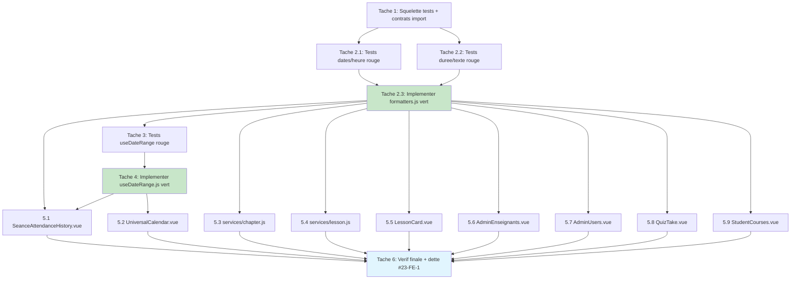

# Implementation Plan — Centralisation des formatters et de la logique de plage de dates

> Spec : `.claude/specs/formatters/` · Issue #23 (TIER 1, épique #16) · Frontend Vue 3 `lms-frontend`
> Requirements approuvés : `.claude/specs/formatters/requirements.md`
> Design approuvé : `.claude/specs/formatters/design.md`
> Convention de test (gelée par `vitest.config.js` et `tests/unit/roles.test.js`) :
> - Fichiers collectés : `src/**/*.test.{js,mjs}` (JAMAIS `.spec.`) → `src/utils/__tests__/formatters.test.js`, `src/composables/__tests__/useDateRange.test.js`.
> - `import { describe, it, expect } from 'vitest'` ; imports applicatifs via alias `@/`.
> - TDD strict (PRODUCTION_STANDARDS §1.3) : tests AVANT/AVEC l'implémentation.
> - Scripts : `npm run test` (= `vitest run`), `npm run test:contract`, `npm run build`.
>
> **Conflits de fichiers** : les modules sont créés en tâches 2 et 4 (disjoints). Les 9 fichiers
> de migration de la tâche 5 sont **disjoints entre eux** → parallélisables. Les tâches 5.x dépendent
> toutes de 2 ET 4 (modules verts). Voir le **diagramme de dépendances** en fin de document.

---

- [x] 1. Préparer l'arborescence de test et figer les contrats d'import (squelette TDD)
  - Créer les dossiers `src/utils/__tests__/` et `src/composables/__tests__/` s'ils n'existent pas.
  - Créer `src/utils/__tests__/formatters.test.js` minimal qui `import { ... } from '@/utils/formatters'` (module pas encore créé) pour figer la surface publique attendue : `formatDate`, `formatDateTime`, `formatDateLong`, `formatDateWeekday`, `formatDateShort`, `formatTime`, `formatDateInput`, `formatDuration`, `formatElapsed`, `getInitials`, `truncate`, `truncateText`.
  - Aucune logique métier à ce stade : la cible est un rouge propre (module introuvable), preuve que la suite est collectée par Vitest.
  - _Decision design : A (emplacement utils/composables), Testing Strategy (emplacement des tests)._
  - Fichiers touchés : `src/utils/__tests__/formatters.test.js` (créé).
  - Critère de complétion : `npm run test` collecte le fichier et échoue sur l'import manquant (rouge attendu). `grep -rE "\.spec\." src/` ne retourne aucun nouveau fichier de test.
  - _Requirements: 5.6, 1.2, 1.1_

- [x] 2. TDD du module `formatters.js` (fonctions pures)
- [x] 2.1 Écrire les tests Vitest des formatters de DATE/HEURE (rouge)
  - Dans `src/utils/__tests__/formatters.test.js`, couvrir chaque fonction nommée du design avec happy path + cas limites :
    - `formatDate` : date valide → `'15/06/2026'` (`fr-FR`) ; `null`/`undefined` → repli unique `'—'` ; surcharge `{ fallback: 'Non définie' }` → repli préservé ; `'pas-une-date'` → repli, JAMAIS `'Invalid Date'`.
    - `formatDateTime` : date valide → `JJ/MM/AAAA HH:mm` ; invalide → repli.
    - `formatDateLong` : `'15 juin 2026'` (`day:numeric, month:long, year:numeric`) ; invalide → repli.
    - `formatDateWeekday` : `'lundi 15 juin 2026'` (`weekday:long`) ; invalide → repli.
    - `formatDateShort` : `2-digit/short/numeric` ; invalide → repli.
    - `formatTime` : date valide → `'14:30'` (`hour:2-digit, minute:2-digit`) ; invalide → repli.
    - `formatDateInput` : `Date` locale → `'YYYY-MM-DD'` construit via getters locaux (PAS `toISOString`).
    - Déterminisme (R1.3) : double appel même entrée non horloge → résultat identique.
  - _Decision design : B.1 (fonctions nommées), B.2 (repli `'—'` surchargeable), Mapping des variantes de format._
  - Fichiers touchés : `src/utils/__tests__/formatters.test.js`.
  - Critère de complétion : tests écrits et rouges (module ou fonctions absents).
  - _Requirements: 5.1, 2.1, 2.2, 2.3, 2.4, 2.7, 1.3_

- [x] 2.2 Écrire les tests Vitest des formatters de DURÉE et de TEXTE (rouge)
  - Compléter `formatters.test.js` :
    - `formatDuration(minutes)` : `150 → '2h 30min'` ; `45 → '45min'` ; `120 → '2h'` ; `0`/`null`/`NaN` → repli (JAMAIS `'NaN'`).
    - `formatElapsed(seconds)` : `65 → '1:05'` ; **`5 → '0:05'`** (padding secondes) ; `0 → '0:00'` ; négatif/`NaN` → repli sûr (pas de `'NaN:NaN'`).
    - `getInitials` polymorphe : chaîne `'Jean Dupont' → 'JD'` ; nom unique `'Jean' → 'JE'` ; objet `{prenom:'Jean', nom:'Dupont'} → 'JD'` ; objet `{name:'Marie Curie'} → 'MC'` ; vide `''`/`null`/`{}` → `'?'`.
    - `truncate(text, maxLength)` : texte > maxLength → tronqué + `'…'` ; texte ≤ maxLength → inchangé ; vide → `''`. `truncateText` (alias) se comporte à l'identique.
  - _Decision design : B.3 (3 fonctions de durée distinctes), B.4 (getInitials polymorphe, repli `'?'`), B.5 (truncate + alias)._
  - Fichiers touchés : `src/utils/__tests__/formatters.test.js`.
  - Critère de complétion : tous les cas ci-dessus présents et rouges. `grep -nE "5 → '0:05'|0:05" src/utils/__tests__/formatters.test.js` retourne le cas de padding.
  - _Requirements: 5.1, 5.2, 5.3, 2.5, 2.6_

- [x] 2.3 Implémenter `src/utils/formatters.js` pour faire passer 2.1 et 2.2 (vert)
  - Créer `src/utils/formatters.js` : fonctions PURES, déterministes, **zéro import Vue** (`ref`/`reactive`/`computed`/cycle de vie interdits). `Intl`/`Date` natifs uniquement.
  - Implémenter chaque fonction du design avec garde fail-safe systématique : `null`/`undefined`/date invalide → `options.fallback ?? '—'` ; jamais d'exception, jamais `'Invalid Date'`/`'NaN'`.
  - `getInitials` : précédence `{prenom,nom}` → `prenom[0]+nom[0]` ; `{name}` ou chaîne → split espaces `parts[0][0]+parts[last][0]`, sinon 2 premiers car. ; repli `'?'`.
  - `formatDateInput(date)` : `YYYY-MM-DD` via `getFullYear`/`getMonth`/`getDate` locaux (corrige le bug UTC ; sera réutilisé par `useDateRange`).
  - `formatElapsed` : `mm:ss` avec `padStart(2,'0')` sur les secondes.
  - `truncateText` exporté comme alias de `truncate` (`export { truncate as truncateText }`).
  - Respecter PRODUCTION_STANDARDS §1.1 : une responsabilité par fonction ; SI le fichier dépasse le seuil raisonnable, scinder en `formatters/dates.js` + `formatters/text.js` ré-exportés par `formatters.js` (barrel) sans changer la surface d'import.
  - _Decision design : A, B.1, B.2, B.3, B.4, B.5, Error Handling._
  - Fichiers touchés : `src/utils/formatters.js` (créé ; éventuellement `src/utils/formatters/dates.js` + `text.js`).
  - Critère de complétion : `npm run test` → suite `formatters.test.js` 100% verte. `grep -nE "from ['\"]vue['\"]|\\bref\\(|\\breactive\\(|\\bcomputed\\(" src/utils/formatters.js` ne retourne RIEN (pureté R6.3).
  - _Requirements: 1.1, 1.2, 1.3, 1.4, 1.5, 2.2, 2.3, 2.4, 2.5, 2.6, 2.7, 6.1, 6.3, 5.7_

- [x] 3. TDD du composable `useDateRange.js` — tests (rouge)
  - Créer `src/composables/__tests__/useDateRange.test.js` (`import { describe, it, expect, vi } from 'vitest'`, `import { useDateRange } from '@/composables/useDateRange'`).
  - Couvrir :
    - **Chaque preset → bornes LOCALES correctes** : `today`, `week` (lundi par défaut), `month`, `7days`, `30days`, `90days`, `custom` ; asserter `start.value`/`end.value` au format `YYYY-MM-DD`. Utiliser `vi.useFakeTimers()` + `vi.setSystemTime(...)` pour une horloge déterministe.
    - **Anti-décalage de jour (R3.5/R5.5)** : avec une date proche de minuit (ex. `23h30` heure locale), asserter que `start`/`end` correspondent au JOUR LOCAL et NON au résultat `toISOString().split('T')[0]` (test du bug UTC corrigé).
    - **Override `weekStartsOn: 0`** : `week` démarre dimanche.
    - **Réactivité (R5.4)** : `setPeriod('week')` puis `setPeriod('month')` → `start`/`end` se recalculent automatiquement (lecture `.value` du `computed`, aucun appel impératif).
    - **`custom`** : `setCustomRange('2026-06-01','2026-06-15')` → bornes reflétées ; `custom` sans bornes → repli sûr (défaut `month`, jamais `undefined`).
    - Restaurer l'horloge en fin de suite (`vi.useRealTimers()`).
  - _Decision design : C (lundi par défaut + override, bornes locales, union des presets), Error Handling (custom sans bornes → month)._
  - Fichiers touchés : `src/composables/__tests__/useDateRange.test.js` (créé).
  - Critère de complétion : tests écrits et rouges (composable absent). `grep -n "setSystemTime" src/composables/__tests__/useDateRange.test.js` confirme le test anti-décalage.
  - _Requirements: 5.4, 5.5, 5.6, 3.4, 3.5, 3.6_

- [x] 4. Implémenter `src/composables/useDateRange.js` (vert)
  - Créer `src/composables/useDateRange.js` : état réactif `selectedPeriod` (`ref`), `customStart`/`customEnd` (`ref`), bornes dérivées `start`/`end` (`computed`) recalculées automatiquement (aucun appel impératif).
  - Options : `initialPeriod='month'`, `weekStartsOn=1` (lundi ISO, override `0`=dimanche).
  - Bornes calculées en heure LOCALE via `formatDateInput` importée de `@/utils/formatters` (DRY — pas de réimplémentation, pas de `toISOString()`).
  - Presets = union : `['today','week','month','7days','30days','90days','custom']` exposés en `presets` (readonly). API : `setPeriod`, `setCustomRange`.
  - `custom` sans bornes → repli sûr sur `month` (jamais `undefined`, pas de requête malformée).
  - Aucun timer/watcher persistant alloué (les `computed` sont nettoyés avec le scope → R3.7 satisfait par construction, pas de `onScopeDispose`).
  - _Decision design : A, C, Composants `useDateRange`, Error Handling._
  - Fichiers touchés : `src/composables/useDateRange.js` (créé).
  - Critère de complétion : `npm run test` → suite `useDateRange.test.js` 100% verte ; suite `formatters.test.js` toujours verte. Import de `formatDateInput` présent : `grep -n "formatDateInput" src/composables/useDateRange.js`.
  - _Requirements: 3.1, 3.2, 3.3, 3.4, 3.5, 3.6, 3.7, 6.2, 5.7_

- [ ] 5. Migration du LOT vérifié (9 fichiers disjoints — parallélisables) — non-régression R4
  > Chaque sous-tâche : remplacer la définition locale par un import de `@/utils/formatters`
  > (ou `@/composables/useDateRange`), PRÉSERVER le repli spécifique via le paramètre surchargeable
  > quand le fichier utilisait un repli divergent (R4.6), même rendu pour mêmes entrées (R4.2).
  > Dépend de 2.3 ET 4 (modules verts). Les 5.x sont disjoints entre eux.

- [~] 5.1 (DIFFÉRÉ #28) Migrer `src/views/attendance/SeanceAttendanceHistory.vue`
  - Remplacer les définitions locales `formatDate`, `formatTime`, `formatDuration`, `getInitials`, `formatDateInput` (l.~639/644/659/674/652) par des imports de `@/utils/formatters`.
  - Remplacer `getPeriodDates`/`selectPeriod`/`formatDateInput` (plage de dates, l.~408/437) par `useDateRange` ; le composant étant en Options API, exposer `start`/`end`/`setPeriod` via `setup()`, consommés par le template et `loadSeances`.
  - Préserver le repli `'-'` via `{ fallback: '-' }` (dette #23-FE-2). Override `weekStartsOn: 0` UNIQUEMENT si une régression visuelle dimanche apparaît (sinon aligner sur lundi).
  - _Decision design : B.2 (repli surchargeable), C (useDateRange), Mapping de migration (ligne 1)._
  - Fichiers touchés : `src/views/attendance/SeanceAttendanceHistory.vue`.
  - Critère de complétion : `grep -nE "(const|function)\s+(formatDate|formatTime|getInitials|formatDuration|formatDateInput)\b" src/views/attendance/SeanceAttendanceHistory.vue` ne retourne RIEN ; le fichier importe `@/utils/formatters` ET `@/composables/useDateRange`. `npm run build` réussit.
  - _Requirements: 4.1, 4.2, 4.5, 4.6, 3.1_

- [~] 5.2 (DIFFÉRÉ #28) Migrer `src/components/calendar/UniversalCalendar.vue` (corrige bug UTC)
  - Remplacer `getDateRangeStart`/`getDateRangeEnd` (l.~555/571, `toISOString().split('T')[0]`) par `useDateRange` (Composition API, presets `7days`/`30days`/`90days` couverts).
  - Laisser l'état de navigation propre au calendrier (`currentDate`, `currentView`, `calendarRef`) DANS le composant (hors périmètre `useDateRange`).
  - _Decision design : C (bornes locales, correction UTC R3.5), Composants (adoption UniversalCalendar)._
  - Fichiers touchés : `src/components/calendar/UniversalCalendar.vue`.
  - Critère de complétion : `grep -n "toISOString().split" src/components/calendar/UniversalCalendar.vue` ne retourne plus de borne de plage ; le fichier importe `@/composables/useDateRange`. `npm run build` réussit.
  - _Requirements: 4.1, 4.2, 4.5, 3.5_

- [x] 5.3 Migrer `src/services/chapter.js` (délégation `formatDuration`)
  - Faire déléguer la méthode `formatDuration` (l.~135) à la fonction centralisée de `@/utils/formatters`, sans changer la sortie observable des appelants. Préserver le repli `'Non définie'` via `{ fallback: 'Non définie' }`.
  - _Decision design : B.2, Process 3 (délégation services), Mapping de migration._
  - Fichiers touchés : `src/services/chapter.js`.
  - Critère de complétion : `grep -n "formatDuration" src/services/chapter.js` montre une délégation (import + appel), aucune réimplémentation du calcul `Xh Ymin`. `npm run build` réussit.
  - _Requirements: 4.1, 4.3, 4.6_

- [x] 5.4 Migrer `src/services/lesson.js` (délégation `formatDuration`)
  - Faire déléguer la méthode `formatDuration` (l.~256) à `@/utils/formatters`, sortie identique. Préserver le repli `'N/A'` via `{ fallback: 'N/A' }`.
  - _Decision design : B.2, Process 3, Mapping de migration._
  - Fichiers touchés : `src/services/lesson.js`.
  - Critère de complétion : `grep -n "formatDuration" src/services/lesson.js` montre une délégation, aucune réimplémentation locale. `npm run build` réussit.
  - _Requirements: 4.1, 4.3, 4.6_

- [x] 5.5 Migrer `src/components/lessons/LessonCard.vue` (`formatDuration`, `formatDate`)
  - Importer `formatDuration` et `formatDate`/`formatDateShort` depuis `@/utils/formatters` (l.~153/156/159) ; supprimer toute définition locale. Préserver le repli `'N/A'` via paramètre.
  - _Decision design : B.1 (formatDateShort `2-digit/short/numeric`), B.2, Mapping de migration._
  - Fichiers touchés : `src/components/lessons/LessonCard.vue`.
  - Critère de complétion : `grep -nE "(const|function)\s+(formatDate|formatDuration)\b" src/components/lessons/LessonCard.vue` ne retourne RIEN ; le fichier importe `@/utils/formatters`. `npm run build` réussit.
  - _Requirements: 4.1, 4.2, 4.5, 4.6_

- [x] 5.6 Migrer `src/views/admin/AdminEnseignants.vue` (`getInitials` objet)
  - Remplacer la définition locale `getInitials` (l.~347, signature objet `{prenom,nom}`) par l'import polymorphe de `@/utils/formatters`. Repli `'?'`.
  - _Decision design : B.4 (getInitials polymorphe), Mapping de migration._
  - Fichiers touchés : `src/views/admin/AdminEnseignants.vue`.
  - Critère de complétion : `grep -nE "(const|function)\s+getInitials\b" src/views/admin/AdminEnseignants.vue` ne retourne RIEN ; le fichier importe `@/utils/formatters`. `npm run build` réussit.
  - _Requirements: 4.1, 4.2, 4.5_

- [x] 5.7 Migrer `src/views/admin/AdminUsers.vue` (`getInitials` objet `{name}`)
  - Remplacer la définition locale `getInitials` (l.~376, signature objet `{name}`) par l'import polymorphe. Repli `'?'`.
  - _Decision design : B.4, Mapping de migration._
  - Fichiers touchés : `src/views/admin/AdminUsers.vue`.
  - Critère de complétion : `grep -nE "(const|function)\s+getInitials\b" src/views/admin/AdminUsers.vue` ne retourne RIEN ; le fichier importe `@/utils/formatters`. `npm run build` réussit.
  - _Requirements: 4.1, 4.2, 4.5_

- [x] 5.8 Migrer `src/views/QuizTake.vue` (`formatTime` mm:ss → `formatElapsed`)
  - Remplacer la définition locale `formatTime` (l.~178, durée écoulée `mm:ss`) par un import de `formatElapsed` depuis `@/utils/formatters` ; RENOMMER le site d'appel `formatTime(...)` → `formatElapsed(...)` (sémantique chrono, pas heure du jour).
  - _Decision design : B.3 (formatElapsed distinct de formatTime), Mapping de migration._
  - Fichiers touchés : `src/views/QuizTake.vue`.
  - Critère de complétion : `grep -nE "(const|function)\s+formatTime\b" src/views/QuizTake.vue` ne retourne RIEN ; le fichier importe `formatElapsed`. `npm run build` réussit.
  - _Requirements: 4.1, 4.2, 4.5, 2.5_

- [x] 5.9 Migrer `src/views/student/StudentCourses.vue` (`truncateText`)
  - Remplacer la définition locale `truncateText` (l.~235) par l'import alias depuis `@/utils/formatters` ; le site d'appel reste inchangé. Repli `''`.
  - _Decision design : B.5 (alias truncateText), Mapping de migration._
  - Fichiers touchés : `src/views/student/StudentCourses.vue`.
  - Critère de complétion : `grep -nE "(const|function)\s+truncateText\b" src/views/student/StudentCourses.vue` ne retourne RIEN ; le fichier importe `truncateText` de `@/utils/formatters`. `npm run build` réussit.
  - _Requirements: 4.1, 4.2, 4.5_

- [x] 6. Vérification finale et traçage de la dette #23-FE-1
  - Exécuter `npm run test` : suites `formatters.test.js` et `useDateRange.test.js` VERTES, total de tests ≥ avant (aucune régression sur `tests/unit/roles.test.js`).
  - Exécuter `npm run test:contract` : toujours vert.
  - Exécuter `npm run build` : succès.
  - Grep de non-régression global sur les 9 fichiers migrés : `grep -rnE "(const|function)\s+(formatDate|formatTime|getInitials)\b"` sur les chemins de la tâche 5 ne retourne AUCUNE définition locale, et chaque fichier importe `@/utils/formatters` (ou `@/composables/useDateRange`).
  - Tracer/confirmer la dette #23-FE-1 : recenser via grep le compteur du reliquat (`grep -rlE "(const|function)\s+(formatDate|formatTime)\b" src/ | wc -l`) — les ~23 fichiers NON migrés (ex. `Forum.vue`, `ClasseDetails.vue`, `TeacherProfile.vue`, `StudentGrades.vue`, `MatiereDetails*.vue`, `Dashboard.vue`, …) restent en dette tracée ; NE PAS les migrer dans cette itération. Confirmer aussi #23-FE-2/3/4/5 inchangées.
  - _Decision design : D (incrémentale priorisée), Dette tracée (#23-FE-1…5), Critère de non-régression du Mapping._
  - Fichiers touchés : aucun (vérification) ; mise à jour éventuelle du suivi de dette dans la PR.
  - Critère de complétion : 3 commandes ci-dessus vertes/réussies + grep des 9 fichiers sans définition locale + compteur du reliquat reporté dans la description de PR sous #23-FE-1.
  - _Requirements: 5.7, 4.4, 4.5_

---

## Diagramme de dépendances des tâches



**Notes de parallélisation et conflits de fichiers :**
- Modules créés en **2.3** (`formatters.js`) et **4** (`useDateRange.js`) — fichiers disjoints, mais 4 dépend de 2.3 (import `formatDateInput`).
- Les 9 fichiers de **migration (5.1–5.9) sont disjoints entre eux** → exécutables en parallèle une fois 2.3 ET 4 verts. Exception de dépendance modules : 5.1 et 5.2 requièrent `useDateRange` (tâche 4) ; 5.3–5.9 ne requièrent que `formatters.js` (tâche 2.3).
- **Aucune** tâche backend, **aucune** tâche non technique (pas de déploiement, pas de test utilisateur, pas de métriques).
```
