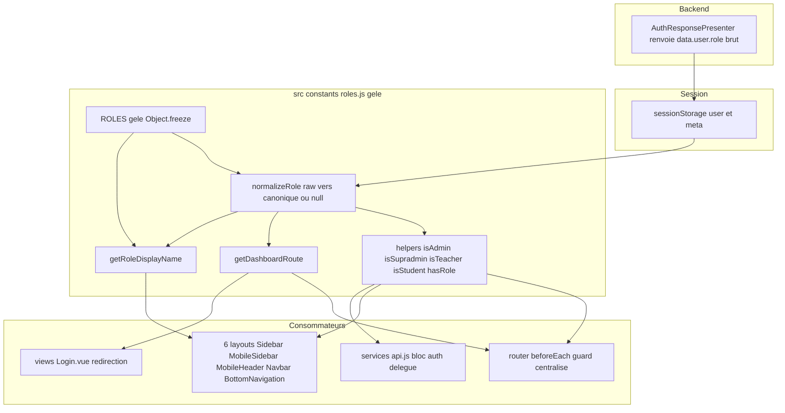
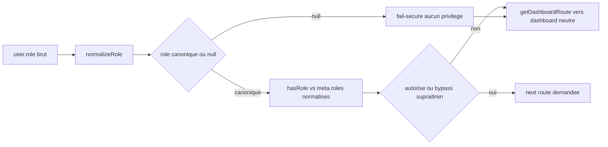
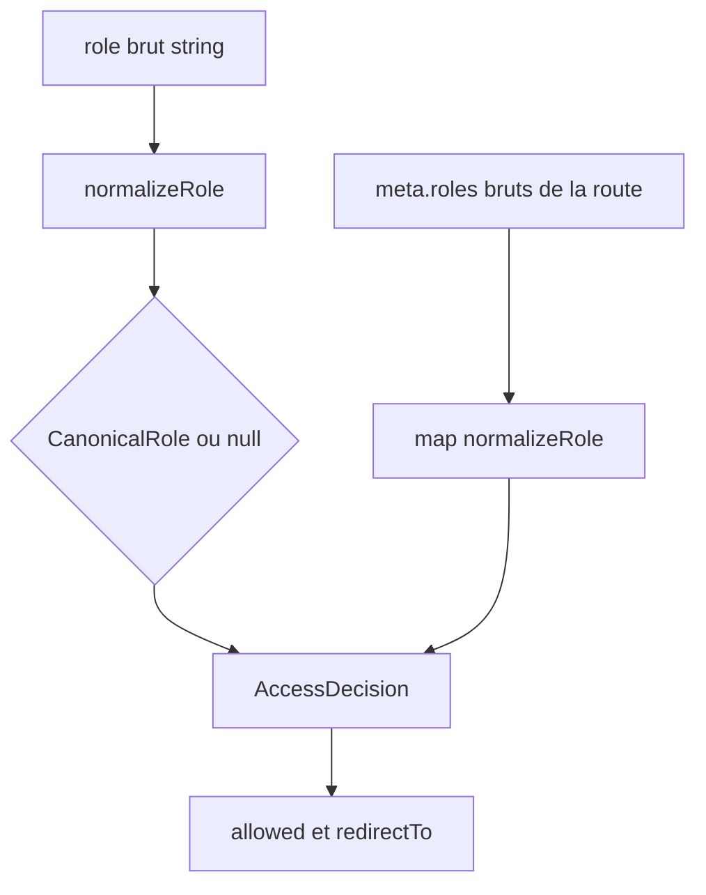

# Design Document — Normalisation des rôles (frontend)

> Issue GitHub #18 — TIER 0 CRITICAL (épique d'audit #16). Recoupe #8 et #12.
> Dépôt : `lms-frontend` (Vue 3). **Aucune modification backend autorisée.**
> Source de vérité backend (lecture seule) : `app/Enums/Role.php`
> (`tryFromString`, `isAdmin`) et `app/Http/Presenters/AuthResponsePresenter.php`.

## Overview

### Objectif

Remplacer le contrôle d'accès frontend fondé sur des comparaisons de chaînes de
rôles **brutes** (55 comparaisons inline / 19 fichiers, vérifié) par une **couche
d'autorisation unique et fail-secure** : un enum **gelé** de 5 rôles canoniques,
une fonction `normalizeRole(raw)` reproduisant **exactement** la table d'alias
`Role::tryFromString` du backend, et des helpers dérivés qui ne raisonnent que sur
le rôle **normalisé**. Les consommateurs (router, 6 layouts, services) délèguent à
cette couche.

### Scope du présent design

| Catégorie | Contenu |
|-----------|---------|
| **Inclus (migré dans ce design)** | `src/constants/roles.js` (neuf, enum + normalize + helpers) ; refonte `src/router/index.js` (guard centralisé, 4× dédupliqué) ; refonte logique de rôle des 6 layouts (`Sidebar`, `MobileSidebar`, `MobileHeader`, `Navbar`, `BottomNavigation`) ; `src/views/Login.vue` (redirection post-login) ; délégation de `src/services/api.js` bloc `auth` ; mise à jour `tests/unit/roles.test.js` |
| **Tracé en dette (hors scope, R4.4)** | Tout site inline `role === '...'` hors router/layout/Login : ~13 fichiers `src/views/**` restants. Listés au §Dette technique tracée |
| **Exclu (NFR-2)** | Toute modification backend ; correction de l'incohérence backend `is_admin` non enum-dérivé et de l'absence de `secretaire` dans l'enum backend (dette/issue séparée) |

### Preuves de lecture du code réel (2026-06-14)

Constats vérifiés qui pilotent les décisions de ce design :

1. **`@/utils/roles` n'est importé nulle part** dans `src/` (grep `from '@/utils/roles'`
   → 0 résultat). Ses helpers sont du **code mort** hors `tests/unit/roles.test.js`.
2. **`auth.isAdmin/isTeacher/isStudent/isSupradmin/hasRole` ne sont appelés nulle part**
   dans `src/` (grep `auth\.(isAdmin|isTeacher|...)` → 0 résultat). Seuls
   `auth.getUser/getMeta/isAuthenticated/getUserRole` sont réellement consommés.
3. **Divergence de redirection déjà présente** : `Login.vue:86` redirige `supradmin`
   → `/admin/dashboard`, alors que `router/index.js:66` redirige `supradmin`
   → `/admin/institutions`. La cascade dupliquée **a déjà divergé**.
4. **Tables de libellés divergentes** : `Sidebar.vue` mappe `superAdmin` →
   « Super Administrateur » ; `MobileSidebar.vue` → « Super Administrateur » +
   `supradmin` → « Supradmin » ; `Navbar.vue`/`MobileHeader.vue` → « Administrateur ».
   Trois libellés différents pour le même rôle.
5. **`secretaire`** : absent de `Role::tryFromString` backend (5 cas :
   etudiant/enseignant/coordinateur/admin/supradmin). Mais
   `docs/INTEGRATION_KLASSCI.md:53,811,931,968,1175` le documente comme rôle KLASSCI
   réel, groupé admin et redirigé `/admin/dashboard`. Décision §Décision C.

---

## Architecture

### Couche d'autorisation cible

L'autorisation suit un flux **unidirectionnel** : la valeur brute serveur entre par
un seul point de normalisation, et toute décision est prise sur la valeur canonique.



### Flux de données — décision d'accès sur une route protégée



---

## Décisions tranchées (une seule par point, justifiée)

### Décision A — Emplacement de l'enum : `src/constants/roles.js` (neuf)

**Tranché : créer `src/constants/roles.js`** (et non refondre `src/utils/roles.js`).

**Justification :**

1. **Sémantique correcte.** Un enum **gelé** (R1.3) est une **constante**, pas un
   utilitaire. `src/constants/` exprime l'intention d'immuabilité ; `src/utils/`
   regroupe des fonctions de transformation. Placer la source de vérité des rôles
   sous `constants/` est l'emplacement attendu (SOLID, lisibilité).
2. **Pas de casse des appelants.** `@/utils/roles` n'est importé **nulle part**
   (preuve grep §Overview-1). Le seul appelant est `tests/unit/roles.test.js`, qui
   sera mis à jour dans ce design (R9.1). Aucun code applicatif ne dépend du chemin
   actuel : déplacer ne casse rien.
3. **Cohérence avec #24 (TIER 1).** L'issue #24 prévoit un dossier `src/constants/`
   plus large. Ce design **pose la fondation** de ce dossier : #24 s'appuiera dessus
   au lieu de créer un conflit (deux emplacements concurrents). **Dette documentée :**
   ce design crée `src/constants/roles.js` ; #24 ajoutera ses propres modules dans le
   même dossier sans toucher à `roles.js`.
4. **`src/utils/roles.js` est retiré** (fichier supprimé), son rôle étant intégralement
   absorbé par `src/constants/roles.js` avec une API enrichie. Aucun import à corriger
   (preuve grep). Cela évite deux modules « rôles » concurrents (violation R1.5).

### Décision B — Périmètre de `isAdmin` : `admin` + `supradmin` (aligné backend)

**Tranché : `isAdmin(user)` est vrai ssi le rôle normalisé ∈ {`admin`, `supradmin`}**,
strictement aligné sur `Role::isAdmin()` backend (`$this === Admin || $this === Supradmin`).

**Justification :**

1. **Source de vérité backend (R1.6, R2.8).** Le backend définit « administratif » =
   `Admin || Supradmin`. Reproduire ce périmètre garantit qu'une même décision est
   prise des deux côtés (déterminisme R5.1, NFR-3).
2. **Le périmètre actuel frontend est faux.** `api.js isAdmin` =
   `['superAdmin','coordinateur','secretaire']` : il **inclut coordinateur** (rôle
   distinct, permissivité 3 < admin 4) et `secretaire` (absent backend), et **omet**
   `admin` canonique. C'est précisément la dérive que #18 corrige.
3. **L'usage UI ne casse pas.** `auth.isAdmin` n'est appelé nulle part (preuve grep
   §Overview-2). Les layouts qui distinguent « admin complet » de « coordinateur »
   (ex. `Sidebar.vue:160` « menu étendu pour admin/superAdmin pas coordinateur »)
   continueront d'utiliser des helpers **explicites** par rôle (`isSupradmin`,
   `hasRole(user, [ROLES.COORDINATEUR])`), et non un `isAdmin` fourre-tout. Le besoin
   UI « groupe admin élargi » (admin+coordinateur) est exprimé par un helper distinct
   **nommé** `isAdminScope` (cf. §API) pour ne pas surcharger la sémantique de
   `isAdmin` vs backend.

> **Conséquence nommée :** on distingue deux concepts au lieu de les confondre :
> `isAdmin` = strict backend (`admin`|`supradmin`) ; `isAdminScope` = périmètre
> d'**affichage** admin élargi (`admin`|`supradmin`|`coordinateur`). Cette séparation
> évite que la sémantique sécurité (backend) soit polluée par un besoin d'UI.

### Décision C — `secretaire` : conservé comme alias frontend, mappé `coordinateur`, avec dette tracée

**Preuve grep (deux dépôts) :**

| Source | Constat |
|--------|---------|
| `lms-backend` `Role.php` `tryFromString` | `secretaire` **absent** → normaliserait vers `null` côté backend |
| `lms-backend` `docs/INTEGRATION_KLASSCI.md:53` | « `secretaire` \| Secrétaire académique \| Gestion étudiants, notes, présences » |
| `INTEGRATION_KLASSCI.md:811,931,983,1175` | `secretaire` est groupé admin (`superAdmin,coordinateur,secretaire`) et redirigé `/admin/dashboard` |
| `lms-frontend` | `secretaire` présent dans `roles.js`, `api.js:118`, `router:68/94/114/706/730`, `Sidebar:160/381`, `Login:86` |

**Conclusion de la preuve :** `secretaire` **est un rôle réellement émis par KLASSCI**
(documenté, groupé, routé) mais **non mappé par l'enum backend** — divergence backend
réelle, non corrigeable ici (NFR-2). Le frontend reçoit donc potentiellement
`data.user.role === 'secretaire'`. Un fail-secure brutal (`secretaire` → `null` →
aucun accès) **régresserait** un utilisateur légitime aujourd'hui admis au dashboard
admin (violation NFR-4 non-régression).

**Tranché : conserver `secretaire` comme alias frontend mappé vers le canonique
`coordinateur`.**

**Justification du choix `coordinateur` (et non `admin`) :**

1. **Non-régression d'accès (NFR-4, R4.5).** Aujourd'hui `secretaire` accède au
   **dashboard admin** et aux routes `roles: ['superAdmin','coordinateur','secretaire']`.
   Mapper vers `coordinateur` (canonique, permissivité 3) conserve l'accès au dashboard
   admin (`getDashboardRoute(coordinateur) → /admin/dashboard`) **sans** lui octroyer
   le périmètre `admin` strict (permissivité 4) ni le bypass supradmin. C'est le
   **moindre privilège** compatible avec l'accès observé (R8.3).
2. **Cohérence fonctionnelle.** La doc KLASSCI décrit le secrétaire comme « gestion
   étudiants/notes/présences » — un périmètre opérationnel proche du coordinateur, pas
   du super-administrateur. Mapper vers `admin` sur-élèverait les privilèges.
3. **Divergence d'avec le backend tracée explicitement** (R2.8) : le backend renverrait
   `null` pour `secretaire` ; le frontend choisit `coordinateur` pour préserver l'accès
   légitime. **Dette tracée** (§Dette) : ouvrir une issue backend pour ajouter
   `'secretaire' => Coordinateur` (ou un case dédié) à `Role::tryFromString`, après quoi
   l'alias frontend pourra être réévalué.

> L'alias `secretaire → coordinateur` est **isolé et commenté** dans la table
> `normalizeRole` comme « divergence backend tracée #18 », de sorte qu'il soit
> retirable d'un seul endroit le jour où le backend l'intègre.

### Décision D — Migration : **incrémentale priorisée** (router + 6 layouts + Login d'abord)

**Tranché : migration incrémentale**, périmètre = couche `constants/roles.js` +
router + 6 layouts + `Login.vue` + `api.js auth.*`, reste **tracé en dette**.

**Justification :**

1. **Autorisé par les exigences** (R4.4, R4.5, NFR-4) : migration priorisée admise si
   non-régression entre sites migrés et non migrés.
2. **Non-régression garantie par construction.** Tant que `normalizeRole` reproduit la
   table d'alias **et** que `getDashboardRoute` reproduit les destinations actuelles, un
   site non migré (`role === 'enseignant'`) et un site migré (`isTeacher(user)`)
   produisent la **même** décision pour un même utilisateur (les alias `enseignant`/
   `teacher` mappent au même canonique). Aucune fenêtre d'incohérence.
3. **Risque maîtrisé.** Le router et les layouts concentrent les **décisions de
   sécurité** (#8, #12) et l'incohérence `supradmin`/`superAdmin`. Les migrer en
   priorité élimine les régressions critiques ; les `views/**` restants n'affichent que
   des conditions de présentation déjà couvertes par la garde router.

**Fichiers dans le périmètre de CE design :**

| Fichier | Action |
|---------|--------|
| `src/constants/roles.js` | **Créé** : enum gelé + `normalizeRole` + helpers + `getDashboardRoute` + `getRoleDisplayName` |
| `src/utils/roles.js` | **Supprimé** (absorbé ; 0 import applicatif) |
| `src/router/index.js` | **Refondu** : guard centralisé, redirections via `getDashboardRoute`, `meta.roles` évalué normalisé |
| `src/components/layout/Sidebar.vue` | Logique de rôle → helpers |
| `src/components/layout/MobileSidebar.vue` | Logique de rôle → helpers + libellé via `getRoleDisplayName` |
| `src/components/layout/MobileHeader.vue` | Logique de rôle → helpers + libellé via `getRoleDisplayName` |
| `src/components/layout/Navbar.vue` | Logique de rôle → helpers + libellé via `getRoleDisplayName` |
| `src/components/layout/BottomNavigation.vue` | Logique de rôle → helpers |
| `src/views/Login.vue` | Redirection post-login → `getDashboardRoute` (corrige la divergence supradmin) |
| `src/services/api.js` (bloc `auth`) | `isAdmin/isTeacher/isStudent/isSupradmin/hasRole` délèguent à `constants/roles.js` |
| `tests/unit/roles.test.js` | **Mis à jour** : import `@/constants/roles`, table d'alias, régressions #8/#12 |

**Fichiers tracés en dette (hors scope, §Dette).** Tous les `src/views/**` contenant
encore `role === '...'` inline (déduits des 19 fichiers initiaux moins ceux ci-dessus).

---

## Components and Interfaces

### `src/constants/roles.js` — module d'autorisation

- **Responsabilités :** source unique des rôles canoniques (gelée) ; normalisation
  brut→canonique ; helpers booléens fail-secure ; route de dashboard ; libellé d'affichage.
- **Dépendances :** aucune (module pur, sans I/O ni session). Les helpers acceptant un
  `user` lisent uniquement `user.role` — pas d'accès `sessionStorage` (testabilité,
  SOLID inversion de dépendance).
- **Interfaces (API publique) :** cf. §API du module rôles.

### `src/router/index.js` — guard centralisé

- **Responsabilités :** décision d'accès unique (`canActivate`) ; redirection unique
  (`getDashboardRoute`) ; bypass supradmin sur rôle **normalisé** ; fail-secure.
- **Dépendances :** `@/constants/roles` (helpers + `getDashboardRoute`), `@/services/api`
  (`auth.getUser/isAuthenticated`).

### 6 composants layout

- **Responsabilités :** affichage conditionnel par rôle (menus, libellé, URLs profil/
  settings) **dérivé des helpers normalisés** ; aucune table de libellés locale.
- **Dépendances :** `@/constants/roles` (helpers + `getRoleDisplayName` + `getDashboardRoute`).

### `src/services/api.js` bloc `auth`

- **Responsabilités :** I/O session (token, user, meta) **inchangée** ; les helpers de
  rôle **délèguent** à `@/constants/roles` pour ne plus comparer de chaîne brute.
- **Dépendances :** `@/constants/roles`.

---

## Data Models

### Enum gelé `ROLES`

```ts
// 5 valeurs canoniques — correspondance 1:1 avec app/Enums/Role.php (backend, lecture seule)
interface RolesEnum {
  readonly ETUDIANT: 'etudiant'
  readonly ENSEIGNANT: 'enseignant'
  readonly COORDINATEUR: 'coordinateur'
  readonly ADMIN: 'admin'
  readonly SUPRADMIN: 'supradmin'   // casse minuscule alignée backend (R1.2)
}
// Object.freeze(ROLES) — toute mutation lève en strict, ignorée sinon (R1.3, R1.4)
```

### Table d'alias (miroir exact de `Role::tryFromString` + 1 divergence tracée)

```ts
// Clé = alias brut accepté ; Valeur = rôle canonique
type AliasTable = Readonly<Record<string, CanonicalRole>>
// {
//   'etudiant': 'etudiant', 'student': 'etudiant', 'étudiant': 'etudiant',
//   'enseignant': 'enseignant', 'teacher': 'enseignant',
//   'coordinateur': 'coordinateur', 'coordinator': 'coordinateur',
//   'admin': 'admin', 'administrateur': 'admin',
//   'supradmin': 'supradmin', 'superAdmin': 'supradmin',
//   // --- Divergence backend tracée #18 (Décision C) : absent de Role::tryFromString ---
//   'secretaire': 'coordinateur',
// }
type CanonicalRole = 'etudiant' | 'enseignant' | 'coordinateur' | 'admin' | 'supradmin'
type NormalizedRole = CanonicalRole | null   // null = fail-secure (R2.6, R2.7)
```

### Modèle de décision

```ts
interface AccessDecision {
  normalizedRole: NormalizedRole   // source canonique unique (R7.1)
  isSupradminBypass: boolean       // vrai ssi normalizedRole === 'supradmin' (R5.4)
  allowed: boolean                 // hasRole(normalized, route.meta.roles normalisés) || bypass
  redirectTo: string               // getDashboardRoute(normalizedRole) si refus / route neutre si null
}
```

### Diagramme du modèle de données



---

## API du module rôles (`src/constants/roles.js`)

Signatures exactes. Les helpers acceptant un `user` tolèrent aussi un rôle brut en
chaîne, pour préserver les appelants existants de `getDashboardRoute(role)` et
`getRoleDisplayName(role)` (preuve : ces deux-là sont appelés par chaîne, cf. grep).

```ts
// --- Source canonique ---
export const ROLES: RolesEnum                    // Object.freeze, 5 clés (R1)

// --- Normalisation (R2) ---
export function normalizeRole(raw: unknown): NormalizedRole
// raw ∈ table d'alias → canonique ; sinon (null/undefined/''/non-string/inconnu) → null

// --- Helpers booléens, fail-secure (R3, R8) ---
export function hasRole(user: object|string|null, roles: string|string[]): boolean
// normalise le rôle de user ET chaque rôle attendu, puis compare canonique↔canonique.
// user inconnu/null → false ; un rôle attendu non normalisable est ignoré (pas de match accidentel)

export function isSupradmin(user: object|string|null): boolean   // === ROLES.SUPRADMIN (R3.3)
export function isAdmin(user: object|string|null): boolean        // ∈ {admin, supradmin} (Décision B, R3.4)
export function isAdminScope(user: object|string|null): boolean   // ∈ {admin, supradmin, coordinateur} — périmètre UI (Décision B)
export function isTeacher(user: object|string|null): boolean      // === ROLES.ENSEIGNANT (R3.5)
export function isStudent(user: object|string|null): boolean      // === ROLES.ETUDIANT (R3.6)

// --- Routage (R3.7, R3.8) ---
export function getDashboardRoute(userOrRole: object|string|null): string
// supradmin → '/admin/institutions' ; admin|coordinateur → '/admin/dashboard'
// enseignant → '/teacher/dashboard' ; etudiant → '/student/dashboard'
// null/inconnu → '/login' (fail-secure neutre, R8.2)

// --- Affichage (R4.3) ---
export function getRoleDisplayName(userOrRole: object|string|null): string
// libellé unique par canonique ; rôle inconnu → '' (pas de fuite de valeur brute en UI)
```

### Préservation des signatures publiques existantes

| Symbole existant | Statut | Chemin de migration |
|------------------|--------|---------------------|
| `ROLES` (utils) | **Remplacé** | Nouvel objet gelé, **clés canoniques** (`ETUDIANT/ENSEIGNANT/COORDINATEUR/ADMIN/SUPRADMIN`). Les anciennes clés `SUPER_ADMIN/SECRETAIRE/TEACHER` disparaissent. Aucun appelant applicatif (grep) ; le test est mis à jour. |
| `getDashboardRoute(role)` | **Préservé + élargi** | Accepte `role` (string) **ou** `user` (objet). Comportement string inchangé sauf `supradmin → /admin/institutions` (était `/dashboard` car non géré ; corrige une lacune). |
| `hasRole/isAdmin/isTeacher/isStudent` (utils) | **Préservés (signature)** | Mêmes noms/arités ; logique passe par `normalizeRole`. |
| `getRoleDisplayName(role)` | **Préservé** | Mêmes nom/arité ; libellé unique centralisé. |

### Délégation de `src/services/api.js` (bloc `auth`)

I/O session **inchangée** (`getUser/getMeta/getUserRole/isAuthenticated`). Les helpers
de rôle deviennent de **fines délégations** (R3.9, R1.5 — pas de liste concurrente) :

```js
import { isAdmin as roleIsAdmin, isTeacher as roleIsTeacher,
         isStudent as roleIsStudent, isSupradmin as roleIsSupradmin,
         hasRole as roleHasRole } from '@/constants/roles'
// ...
isAdmin()        { return roleIsAdmin(this.getUser()) }       // périmètre = admin|supradmin (Décision B)
isTeacher()      { return roleIsTeacher(this.getUser()) }
isStudent()      { return roleIsStudent(this.getUser()) }
isSupradmin()    { return roleIsSupradmin(this.getUser()) }
hasRole(roles)   { return roleHasRole(this.getUser(), roles) }
getUserRole()    { /* inchangé : retourne user.role brut (lecture) */ }
```

> **Changement de comportement assumé et tracé :** `auth.isAdmin()` passe de
> `['superAdmin','coordinateur','secretaire']` à `{admin, supradmin}`. Justifié
> Décision B ; **sans impact** car `auth.isAdmin()` n'a aucun appelant (grep). Noté en
> dette de vigilance pour les futurs appelants.

---

## Refonte du guard router (R6)

### Logique cible centralisée

Deux fonctions de décision, **zéro duplication** (élimine les 4 cascades `if (role===)`):

- `getDashboardRoute(user)` — **seule** source de redirection (racine, guest→authentifié,
  accès refusé). Importée de `@/constants/roles`.
- `hasRole(user, meta.roles)` + `isSupradmin(user)` — **seule** logique de décision
  d'accès. Le bypass supradmin est `isSupradmin(user)` (rôle **normalisé**, R5.4), donc
  fonctionne que le backend renvoie `supradmin` **ou** `superAdmin`.

`meta.roles` est évalué **après normalisation des deux côtés** : le rôle user est
normalisé, et chaque entrée de `meta.roles` est normalisée par `hasRole`. Ainsi une
route `roles: ['superAdmin', ...]` et un user `supradmin` matchent (R5.5) sans modifier
les `meta.roles` existants (rétro-compat).

### Pseudocode du `beforeEach` cible

```js
import { auth } from '@/services/api'
import { hasRole, isSupradmin, getDashboardRoute } from '@/constants/roles'

router.beforeEach((to, from, next) => {
  const isAuthenticated = auth.isAuthenticated()
  const user = auth.getUser()

  // 1. Route protégée sans auth → login
  if (to.meta.requiresAuth && !isAuthenticated) return next('/login')

  // 2. Utilisateur authentifié sur une route guest → son dashboard (UNE seule source)
  if (to.meta.guest && isAuthenticated) {
    return next(user ? getDashboardRoute(user) : '/dashboard')
  }

  // 3. Route avec rôles requis : décision unique, normalisée, fail-secure
  if (to.meta.roles && user) {
    const allowed = hasRole(user, to.meta.roles) || isSupradmin(user) // bypass normalisé (R5.4)
    if (!allowed) {
      // rôle inconnu → getDashboardRoute renvoie '/login' (fail-secure neutre, R8.2)
      logRoleDecision('access_denied', to.name, user) // observable, sans donnée sensible (R8.4, NFR-3)
      return next(getDashboardRoute(user))
    }
  }

  return next()
})
```

> Les `console.log`/`console.warn` de navigation actuels (l.690-695, exposant
> `user.name`/`role`) sont **retirés** au profit de `logRoleDecision` (message
> exploitable sans donnée sensible, cohérent #15 console désactivés en prod).

> Note : la fonction `redirect` de la route `/` (l.61) et de `/admin` (l.81) sont elles
> aussi réécrites pour appeler `getDashboardRoute(auth.getUser())`, supprimant 2 des 4
> cascades dupliquées ; les 2 autres (guest, accès refusé) sont supprimées par le
> pseudocode ci-dessus.

---

## Composants layout — mapping logique → helper

Aucun layout ne doit redéfinir de table de libellés (R4.3) : tous passent par
`getRoleDisplayName`. Constat : 3 tables divergentes existent (preuve §Overview-4) ;
elles sont **centralisées**.

| Composant | Logique actuelle (rôle) | Remplacement |
|-----------|-------------------------|--------------|
| **Sidebar.vue** | `roleLabels` local (l.120-131) ; `role === 'supradmin'` (l.150) ; `isStudent/isTeacher/isAdmin` inline (l.158-160) ; cascade profil (l.376-381) | libellé → `getRoleDisplayName(user)` ; `isSupradmin(user)` ; `isStudent/isTeacher(user)` + `isAdminScope(user)` ; profil → `getDashboardRoute` ou helper de section. `'student'`/`'secretaire'`/`'superAdmin'` couverts par normalisation. |
| **MobileSidebar.vue** | mélange `superAdmin`/`supradmin` (l.150,160,381) ; `role === 'etudiant'/...` (l.122-136) | `isSupradmin(user)` ; `isStudent/isTeacher(user)` ; `isAdminScope(user)`. Variante `superAdmin`/`supradmin` résolue par `normalizeRole` (R5.1). |
| **MobileHeader.vue** | table `roles` locale `superAdmin → Administrateur` (l.116-124) ; URLs profil (l.128-131) | libellé → `getRoleDisplayName` ; URLs → helpers `isTeacher/isStudent` + branche admin via `isAdminScope`. |
| **Navbar.vue** | teste `supradmin` ET `superAdmin` ET `coordinateur` (l.146,160) ; table libellés (l.224) | `isAdminScope(user)`/`isSupradmin(user)` ; libellé → `getRoleDisplayName`. |
| **BottomNavigation.vue** | `role === 'etudiant'/'enseignant'/'teacher'/'coordinateur'` (l.41-64) ; **ne connaît pas l'admin** | `isStudent/isTeacher(user)` + `hasRole(user, ROLES.COORDINATEUR)`. Branche admin ajoutée via `isAdminScope` si pertinent (sinon dette tracée). |

> **Régression #8 traitée ici :** dans `Sidebar`/`MobileSidebar`, la branche
> « entrées enseignant » est gardée par `isTeacher(user)` (=== `enseignant`
> uniquement). Un supradmin (`supradmin` **ou** `superAdmin`) n'est jamais `isTeacher`,
> donc ne voit pas le menu enseignant — quelle que soit la variante d'alias.

---

## Booléens serveur (R7) — signal secondaire uniquement

### Ce qui est consommé

- **`meta.is_supradmin`** (flux LOGIN LOCAL, présent en session via `auth.getMeta()`) :
  utilisé **uniquement** comme **vérification de cohérence** secondaire, jamais comme
  source d'autorisation (R7.1, R7.2). Point de contrôle : au login (dans `Login.vue` ou
  un hook post-login), comparer `isSupradmin(user)` (rôle normalisé) avec
  `meta.is_supradmin`. En cas de **contradiction**, la décision suit le **rôle normalisé**
  (R7.3) et l'incohérence est journalisée (`logRoleInconsistency`, sans donnée sensible).

```js
// Vérification de cohérence non bloquante (R7.2, R7.3)
const meta = auth.getMeta()
if (meta && typeof meta.is_supradmin === 'boolean') {
  if (meta.is_supradmin !== isSupradmin(user)) {
    logRoleInconsistency('supradmin_flag_mismatch') // diagnostic ; décision = rôle normalisé
  }
}
```

### Ce qui n'est PAS utilisé comme preuve

- **`data.user.is_admin`** (flux KLASSCI) : **brut**, `$klassciUser['is_admin'] ?? false`,
  **non enum-dérivé** (preuve `AuthResponsePresenter.php:93`). Le frontend **ne s'y fie
  pas** comme preuve d'autorisation (R7.4). Il n'est ni stocké comme source de décision
  ni consulté par les helpers.

### Absence de booléen (R7.5)

- Flux local : pas de `is_admin` ; flux KLASSCI : pas de `is_supradmin`. Dans les deux
  cas, le système fonctionne sur le **rôle normalisé** sans dégradation ni élargissement.

### Dette backend tracée (R7.4, NFR-2)

> **Dette #18-BE-1 :** `data.user.is_admin` (KLASSCI) n'est pas enum-dérivé côté backend
> (`?? false` brut). À signaler comme issue backend séparée ; **non corrigé ici**.
> **Dette #18-BE-2 :** `meta.is_supradmin` n'existe qu'en flux local ; absent en KLASSCI.
> Asymétrie à harmoniser côté backend (issue séparée).

---

## Error Handling / Fail-secure (R8)

| Situation | Comportement |
|-----------|--------------|
| `normalizeRole(raw)` reçoit `null`/`undefined`/`''`/non-string/inconnu | retourne `null`, **jamais d'exception** (R2.6, R2.7) |
| Helper booléen sur rôle `null`/inconnu | retourne **`false`** (aucun privilège, R3.8, R8.1) |
| `getDashboardRoute(null/inconnu)` | retourne **`/login`** (route neutre, R8.2) — jamais une route admin |
| Route `meta.roles` + rôle inconnu | accès **refusé** + redirection neutre, **pas de fallback permissif** (R8.3) |
| Affichage dépendant du rôle, rôle indéterminé | éléments réservés **masqués par défaut** (helpers → false, R8.5) |
| Rôle inconnu rencontré | **journalisé** via `logRoleDecision('unknown_role')` — message exploitable, **sans donnée sensible** (R8.4, NFR-3) |

### Journalisation

Un utilitaire `logRoleDecision(event, context)` centralise les logs. Il :
- n'émet **aucune donnée sensible** (pas de `name`, pas d'e-mail ; au plus le rôle brut
  tronqué/catégorisé) ;
- est compatible avec la désactivation des `console.log` en production (#15) : utilise le
  niveau approprié (`console.warn` pour incohérence/refus) ou un logger conditionné par
  `import.meta.env.PROD`.

---

## Testing Strategy (R9)

### Niveau de test — décision pragmatique

**Tranché : tester la couche `constants/roles.js` exhaustivement en isolation
(Vitest pur, sans montage Vue) + tester la décision du guard via une fonction
extraite pure.** Justification : les régressions #8/#12 sont des **décisions
d'autorisation**, pas du rendu DOM. Tester les helpers et une fonction de décision
`canActivate(user, metaRoles)` extraite du guard couvre la sécurité avec un coût
minimal et un déterminisme total. Le montage `@vue/test-utils` des 6 layouts est
**hors scope** de ce design (dette de test tracée) : le menu enseignant masqué pour
supradmin (#8) est garanti par `isTeacher(supradmin) === false`, testable sans DOM.

### Cas de test par requirement (`tests/unit/roles.test.js`, mis à jour)

| Requirement | Cas de test |
|-------------|-------------|
| R1 | `ROLES` a exactement 5 clés canoniques ; `Object.isFrozen(ROLES) === true` ; mutation en strict lève / est ignorée |
| R2 (table complète) | `normalizeRole` mappe **chaque** alias : `supradmin`/`superAdmin`→`supradmin` ; `etudiant`/`student`/`étudiant`→`etudiant` ; `enseignant`/`teacher`→`enseignant` ; `coordinateur`/`coordinator`→`coordinateur` ; `admin`/`administrateur`→`admin` ; `secretaire`→`coordinateur` (divergence tracée) |
| R2.6/R2.7 (cas limites) | `null`, `undefined`, `''`, `42`, `{}`, `'hacker'`, `'SUPRADMIN'` (casse hors table) → `null` |
| R3.4 (Décision B) | `isAdmin({role:'admin'})` et `isAdmin({role:'superAdmin'})` → true ; `isAdmin({role:'coordinateur'})` → false ; `isAdminScope({role:'coordinateur'})` → true |
| R3 (helpers via alias) | `isTeacher({role:'teacher'})`, `isStudent({role:'student'})`, `isSupradmin({role:'superAdmin'})`, `hasRole({role:'superAdmin'}, ['supradmin'])` → true |
| R3.8/R8 (fail-secure) | helpers sur `{role:null}`/`{}`/`'hacker'` → false ; `getDashboardRoute('hacker')`/`getDashboardRoute(null)` → `/login` |
| R3.7 (dashboard) | `supradmin`→`/admin/institutions` ; `admin`/`coordinateur`→`/admin/dashboard` ; `enseignant`→`/teacher/dashboard` ; `etudiant`→`/student/dashboard` |
| R5.6 / R9.6 (multi-variant) | même user en `superAdmin` puis `supradmin` → **même** `getDashboardRoute` ET même décision `canActivate` |
| **R9.4 (régression #8)** | un supradmin (testé en `supradmin` **ET** `superAdmin`) : `isTeacher` → false (ne voit pas le menu enseignant) |
| **R9.5 (régression #12)** | `canActivate({role:'coordinateur'}, ['supradmin'])` → false (refusé sur route supradmin) ; `getDashboardRoute({role:'coordinateur'})` → `/admin/dashboard` |
| R4.3 (libellé unique) | `getRoleDisplayName` retourne un libellé stable par canonique (`superAdmin` et `supradmin` → même libellé) ; rôle inconnu → `''` |
| R6.3 (guard normalisé) | `canActivate(user, metaRoles)` : route `['superAdmin']` + user `supradmin` → autorisé ; route `['enseignant']` + user `etudiant` → refusé |

### Fonction testable extraite du guard

Pour tester le guard sans router réel, la décision d'accès est extraite en fonction pure
réutilisée par `beforeEach` :

```js
// canActivate(user, metaRoles?) → { allowed: boolean, redirectTo: string }
export function canActivate(user, metaRoles) {
  if (!metaRoles) return { allowed: true, redirectTo: null }
  const allowed = hasRole(user, metaRoles) || isSupradmin(user)
  return { allowed, redirectTo: allowed ? null : getDashboardRoute(user) }
}
```

Cette fonction (placée dans `@/constants/roles` ou un `@/router/guards.js` dédié) est la
**même** que celle appelée dans `beforeEach`, garantissant que le test reflète le
comportement réel (pas de logique dupliquée entre test et runtime).

---

## Dette technique tracée

| ID | Description | Justification |
|----|-------------|---------------|
| #18-FE-1 | `secretaire → coordinateur` est un alias frontend **non présent** dans le backend `Role::tryFromString`. Retirable d'un seul endroit quand le backend l'intègre. | Décision C — non-régression NFR-4 |
| #18-FE-2 | Migration **incrémentale** : ~13 `src/views/**` avec `role === '...'` inline restent hors scope. Non-régression garantie par `normalizeRole` (alias = même canonique). | Décision D, R4.4 autorise migration priorisée |
| #18-FE-3 | Montage `@vue/test-utils` des 6 layouts non couvert ; #8 garanti par `isTeacher(supradmin)===false` au niveau helper. | Coût/valeur — décisions de sécurité testées en isolation |
| #18-BE-1 | `data.user.is_admin` (KLASSCI) non enum-dérivé (`?? false` brut). Issue backend séparée. | NFR-2, R7.4 — aucune modif backend ici |
| #18-BE-2 | `meta.is_supradmin` absent du flux KLASSCI (asymétrie). Issue backend séparée. | NFR-2, R7.5 |

---

## Conformité PRODUCTION_STANDARDS

- **§1.1 (limites de lignes) :** `constants/roles.js` reste un module compact (enum +
  table + ~7 helpers courts) ; le guard `beforeEach` passe de ~60 lignes dupliquées à
  ~15 lignes déléguées.
- **§1.6 (SOLID, sécurité, moindre privilège) :** source unique (SRP) ; helpers purs sans
  I/O (DIP) ; fail-secure par défaut ; bypass supradmin sur rôle normalisé ; aucun
  fallback permissif.
- **§5 / NFR-1 :** aucune liste de rôles concurrente (R1.5) ; raccourcis déclarés en
  dette tracée explicite, jamais masqués.
- **NFR-2 :** aucune modification backend ; divergences backend signalées en issues.

---

Does the design look good? If so, we can move on to the implementation plan.
