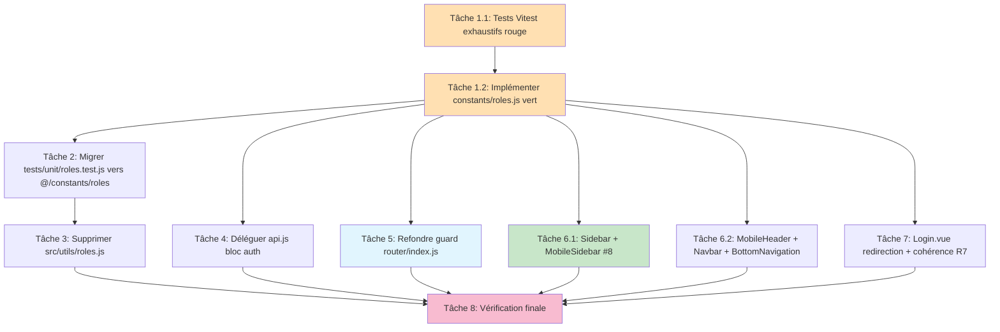

# Implementation Plan — Normalisation des rôles (frontend)

> Issue GitHub #18 — TIER 0 CRITICAL (épique d'audit #16). Recoupe #8 et #12.
> Dépôt : `lms-frontend` (Vue 3). **Aucune modification backend autorisée** (NFR-2).
> Approche **TDD** via Vitest (#21) : rouge → vert, conformément à PRODUCTION_STANDARDS §1.3.
>
> Chaque tâche cite ses requirements (`_Requirements: Rx.y_`), la/les décision(s) de
> design concernées (A/B/C/D), les fichiers touchés et le critère de complétion (le ou
> les tests qui passent). Aucune tâche backend, aucune tâche non technique.
>
> **Conflits de fichiers (exécution séquentielle requise) :**
> - Tâches 1 → 2 → 3 sont strictement séquentielles (la 2 importe le module créé en 1 ;
>   la 3 supprime l'ancien fichier après que plus rien ne l'importe).
> - Les tâches 4, 5, 6, 7 dépendent toutes de la tâche 1 (couche `constants/roles.js`)
>   mais touchent des fichiers **disjoints** (api.js / router / 6 layouts / Login.vue) :
>   parallélisables entre elles une fois la tâche 1 verte.
> - La tâche 8 (vérification finale) doit être exécutée en dernier.

---

- [x] 1. Créer la couche d'autorisation `src/constants/roles.js` en TDD (enum gelé + `normalizeRole` + helpers + `getDashboardRoute` + `getRoleDisplayName` + `canActivate`)

- [ ] 1.1 Écrire les tests Vitest exhaustifs AVANT l'implémentation (rouge)
  - Créer un nouveau fichier de tests `tests/unit/roles.normalize.test.js` (ou ajouter une
    suite dédiée dans `tests/unit/roles.test.js` — voir tâche 2) important `@/constants/roles`.
  - **Enum gelé (R1) :** `ROLES` possède exactement 5 clés canoniques
    (`ETUDIANT/ENSEIGNANT/COORDINATEUR/ADMIN/SUPRADMIN`) avec les valeurs
    `etudiant/enseignant/coordinateur/admin/supradmin` ; `Object.isFrozen(ROLES) === true` ;
    une tentative de mutation (`'use strict'`) lève / est ignorée sans altérer l'enum.
  - **Table d'alias complète (R2.1→R2.5, R9.2) :** `normalizeRole` mappe **chaque** alias —
    `supradmin`/`superAdmin`→`supradmin` ; `etudiant`/`student`/`étudiant`→`etudiant` ;
    `enseignant`/`teacher`→`enseignant` ; `coordinateur`/`coordinator`→`coordinateur` ;
    `admin`/`administrateur`→`admin` ; **`secretaire`→`coordinateur`** (divergence backend
    tracée #18-FE-1, Décision C).
  - **Cas limites / fail-secure (R2.6, R2.7, R8) :** `null`, `undefined`, `''`, `42`, `{}`,
    `'hacker'`, `'SUPRADMIN'` (casse hors table) → `null`, **jamais d'exception**.
  - **Helpers via alias (R3, R9.7) :** `isTeacher({role:'teacher'})`,
    `isStudent({role:'student'})`, `isSupradmin({role:'superAdmin'})`,
    `hasRole({role:'superAdmin'}, ['supradmin'])` → true.
  - **Décision B (R3.4) :** `isAdmin({role:'admin'})` et `isAdmin({role:'superAdmin'})` → true ;
    `isAdmin({role:'coordinateur'})` → false ; `isAdminScope({role:'coordinateur'})` → true ;
    `isAdminScope({role:'admin'})`/`isAdminScope({role:'supradmin'})` → true.
  - **Fail-secure helpers (R3.8, R8.1, R8.5) :** tous les helpers booléens sur `{role:null}`,
    `{}`, `{role:'hacker'}` → `false`.
  - **`getDashboardRoute` (R3.7, R8.2) :** `supradmin`→`/admin/institutions` ;
    `admin`/`coordinateur`→`/admin/dashboard` ; `enseignant`→`/teacher/dashboard` ;
    `etudiant`→`/student/dashboard` ; `null`/`'hacker'`→`/login`.
  - **Multi-variant (R5.6, R9.6) :** même user testé en `superAdmin` puis `supradmin` →
    **même** `getDashboardRoute` ET même résultat `canActivate`.
  - **Régression #8 (R9.4) :** un supradmin (testé en `supradmin` **ET** `superAdmin`) :
    `isTeacher(user) === false`.
  - **Régression #12 (R9.5) :** `canActivate({role:'coordinateur'}, ['supradmin']).allowed
    === false` ; `getDashboardRoute({role:'coordinateur'}) === '/admin/dashboard'`.
  - **Guard normalisé (R6.3) :** `canActivate({role:'superAdmin'}, ['supradmin']).allowed
    === true` ; `canActivate({role:'etudiant'}, ['enseignant']).allowed === false`.
  - **Libellé unique (R4.3) :** `getRoleDisplayName` retourne un libellé stable par
    canonique (`superAdmin` et `supradmin` → **même** libellé) ; rôle inconnu → `''`.
  - Critère de complétion : la suite **échoue** (rouge) car `@/constants/roles` n'existe pas encore.
  - _Requirements: R1, R2, R3, R5.6, R6.3, R8, R9.2, R9.3, R9.4, R9.5, R9.6, R9.7 — Décisions B, C_

- [ ] 1.2 Implémenter `src/constants/roles.js` jusqu'au vert
  - Créer `src/constants/roles.js` (module **pur**, sans I/O ni accès `sessionStorage` —
    DIP, testabilité ; Décision A).
  - `export const ROLES = Object.freeze({ ETUDIANT, ENSEIGNANT, COORDINATEUR, ADMIN,
    SUPRADMIN })` ; `SUPRADMIN: 'supradmin'` (casse minuscule, R1.2). Documenter en
    commentaire la correspondance 1:1 avec `app/Enums/Role.php` et la contrainte « aucune
    modification backend » (R1.6).
  - Table d'alias gelée miroir de `Role::tryFromString` ; isoler et **commenter** l'alias
    `'secretaire': ROLES.COORDINATEUR` comme « divergence backend tracée #18-FE-1
    (Décision C) — retirable d'un seul endroit » (R2.8, Décision C).
  - `normalizeRole(raw)` : si `raw` non-string ou vide → `null` ; sinon lookup dans la table ;
    inconnu → `null` (fail-secure, R2.6, R2.7).
  - Helpers fail-secure : `hasRole(user|string|null, roles)` (normalise le rôle user **et**
    chaque rôle attendu, compare canonique↔canonique ; rôle attendu non normalisable ignoré,
    pas de match accidentel) ; `isSupradmin` (=== `supradmin`, R3.3) ; `isAdmin`
    (∈ {`admin`,`supradmin`}, **Décision B**, R3.4) ; `isAdminScope`
    (∈ {`admin`,`supradmin`,`coordinateur`}, périmètre UI, Décision B) ;
    `isTeacher` (=== `enseignant`, R3.5) ; `isStudent` (=== `etudiant`, R3.6).
  - `getDashboardRoute(userOrRole)` : accepte objet **ou** string (R3.9, rétro-compat) ;
    supradmin→`/admin/institutions`, admin|coordinateur→`/admin/dashboard`,
    enseignant→`/teacher/dashboard`, etudiant→`/student/dashboard`, null/inconnu→`/login`
    (R3.7, R8.2).
  - `getRoleDisplayName(userOrRole)` : libellé unique par canonique ; inconnu → `''`
    (pas de fuite de valeur brute en UI, R4.3, R8).
  - `canActivate(user, metaRoles)` : **fonction pure unique** réutilisée par le guard ET
    les tests (pas de logique dupliquée) — `if (!metaRoles) return { allowed: true,
    redirectTo: null }` ; sinon `allowed = hasRole(user, metaRoles) || isSupradmin(user)` ;
    `redirectTo = allowed ? null : getDashboardRoute(user)` (R6.3, R5.4).
  - Utilitaire de journalisation `logRoleDecision(event, context)` : **aucune donnée
    sensible** (pas de `name`/email), niveau `console.warn` ou conditionné
    `import.meta.env.PROD` (R8.4, NFR-3, cohérent #15).
  - Respecter PRODUCTION_STANDARDS §1.1 (module compact, helpers courts).
  - Critère de complétion : `npm run test` — la suite de la tâche 1.1 passe **intégralement** (vert).
  - _Requirements: R1, R2, R3, R5.4, R6.3, R8, NFR-1, NFR-3 — Décisions A, B, C_

- [x] 2. Migrer le test existant `tests/unit/roles.test.js` vers `@/constants/roles` sans perdre les cas valides
  - Remplacer l'import `from '@/utils/roles'` par `from '@/constants/roles'`.
  - Adapter les références d'enum disparues : `ROLES.SUPER_ADMIN`→`ROLES.SUPRADMIN`,
    `ROLES.SECRETAIRE`→supprimer (couvert par l'alias `secretaire` testé en 1.1),
    `ROLES.TEACHER`→utiliser l'alias chaîne `'teacher'` (la clé `TEACHER` n'existe plus).
  - Corriger les attentes devenues fausses par design : `getDashboardRoute(supradmin)` →
    `/admin/institutions` (et non `/admin/dashboard`) ; rôle inconnu → `/login`
    (et non `/dashboard`, l'ancien fallback permissif est supprimé, R8.2) ;
    `getRoleDisplayName('inconnu')` → `''` (et non la valeur brute, R4.3) ;
    `getRoleDisplayName(supradmin)` → libellé unique centralisé.
  - **Ne pas supprimer** les cas valides existants (`getDashboardRoute` enseignant/étudiant,
    `hasRole` user nul + tableau, `isTeacher/isStudent`) : les conserver en les pointant sur
    le nouveau module.
  - Critère de complétion : `npm run test` vert sur `tests/unit/roles.test.js` migré
    (+ suite de la tâche 1 toujours verte). Dépend de la tâche 1.
  - _Requirements: R3.9, R9.1, R9.2, R9.3 — Décision A_

- [x] 3. Supprimer `src/utils/roles.js` (code mort, 0 import applicatif)
  - Avant suppression, vérifier par grep qu'aucun fichier de `src/` n'importe encore
    `@/utils/roles` ni `./roles` depuis `utils` (preuve design §Overview-1 : 0 import
    applicatif ; seul consommateur = l'ancien test, migré en tâche 2).
  - Supprimer le fichier `src/utils/roles.js` (rôle absorbé par `src/constants/roles.js`,
    évite deux modules « rôles » concurrents — violation R1.5).
  - Critère de complétion : `grep -r "@/utils/roles" src tests` → 0 résultat ;
    `npm run test` toujours vert. Dépend des tâches 1 et 2.
  - _Requirements: R1.5 — Décision A_

- [x] 4. Déléguer le bloc `auth` de `src/services/api.js` vers `@/constants/roles`
  - Importer `isAdmin/isTeacher/isStudent/isSupradmin/hasRole` depuis `@/constants/roles`
    (avec alias d'import pour éviter la collision de noms avec les méthodes de l'objet).
  - Remplacer les corps des méthodes `auth` (lignes ~109-145 vérifiées) par de **fines
    délégations** : `isAdmin()` → `roleIsAdmin(this.getUser())` (périmètre passe de
    `['superAdmin','coordinateur','secretaire']` à `{admin,supradmin}`, **Décision B**,
    changement assumé et tracé — 0 appelant, preuve design §Overview-2) ;
    `isTeacher/isStudent/isSupradmin()` → délégations équivalentes ;
    `hasRole(roles)` → `roleHasRole(this.getUser(), roles)`.
  - **`getUserRole()` reste inchangé** (retourne `user.role` brut, lecture — R3.9). Le reste
    de l'I/O session (`getUser/getMeta/isAuthenticated`) est **inchangé**.
  - Fichier touché : `src/services/api.js` (bloc `auth` uniquement). Disjoint des tâches 5/6/7.
  - Critère de complétion : `npm run test` vert ; `npm run test:contract` toujours vert
    (non-régression #17). Dépend de la tâche 1.
  - _Requirements: R3.9, R1.5 — Décision B_

- [x] 5. Refondre le guard de `src/router/index.js` (centralisation, dédup 4×, normalisation, fail-secure)
  - Importer `hasRole, isSupradmin, getDashboardRoute, canActivate, logRoleDecision` depuis
    `@/constants/roles` et `auth` depuis `@/services/api`.
  - Réécrire les `redirect` des routes `/` (l.~61) et `/admin` (l.~81) pour appeler
    `getDashboardRoute(auth.getUser())` — supprime 2 des 4 cascades dupliquées (R6.2).
  - Réécrire `router.beforeEach` selon le pseudocode du design §Refonte guard :
    (1) `requiresAuth && !isAuthenticated` → `/login` ; (2) `meta.guest && isAuthenticated`
    → `getDashboardRoute(user)` (UNE seule source, R6.2) ; (3) `meta.roles && user` →
    décision unique via `canActivate(user, to.meta.roles)` (ou `hasRole || isSupradmin`,
    **la même** fonction que les tests) ; refus → `logRoleDecision('access_denied', ...)` +
    `next(getDashboardRoute(user))` (R6.1, R6.3, R6.4).
  - **Bypass supradmin sur rôle NORMALISÉ** (`isSupradmin(user)`, R5.4) : fonctionne que le
    backend renvoie `supradmin` **ou** `superAdmin`. `meta.roles` évalué normalisé des deux
    côtés sans modifier les `meta.roles` existants (R5.5, rétro-compat).
  - **Fail-secure** : rôle inconnu → `getDashboardRoute` renvoie `/login`, accès refusé,
    aucun fallback permissif (R8.2, R8.3).
  - **Retirer les `console.log`/`console.warn` de navigation** (l.~690-695) exposant
    `user.name`/`role` au profit de `logRoleDecision` (cohérent #15, R8.4, NFR-3).
  - Aucune comparaison `role === '...'` ne doit subsister dans ce fichier (R4.1).
  - Fichier touché : `src/router/index.js`. Disjoint des tâches 4/6/7.
  - Critère de complétion : `npm run test` vert (les régressions #8/#12 et le cas guard R6.3
    sont couverts via `canActivate` en tâche 1) ;
    `grep -nE "role\s*===\s*['\"]" src/router/index.js` → 0 résultat. Dépend de la tâche 1.
  - _Requirements: R4.1, R5.4, R5.5, R6.1, R6.2, R6.3, R6.4, R6.5, R8.2, R8.3, R8.4, NFR-3 — Décisions B, C, D_

- [x] 6. Migrer la logique de rôle des 6 composants de layout vers les helpers normalisés
  - Pour chacun, importer les helpers nécessaires depuis `@/constants/roles` et appliquer le
    **tableau de mapping logique→helper** du design (§Composants layout). Centraliser tout
    libellé via `getRoleDisplayName` (supprimer les 3 tables divergentes, R4.3).

- [ ] 6.1 `Sidebar.vue` et `MobileSidebar.vue` (régression #8 traitée ici)
  - `Sidebar.vue` : supprimer `roleLabels` local (l.~120-131) → `getRoleDisplayName(user)` ;
    `role === 'supradmin'` (l.~150) → `isSupradmin(user)` ; `isStudent/isTeacher/isAdmin`
    inline (l.~158-160) → helpers + `isAdminScope(user)` ; cascade profil (l.~376-381) →
    `getDashboardRoute`/helper de section. `student`/`secretaire`/`superAdmin` couverts par
    normalisation.
  - `MobileSidebar.vue` : résoudre le mélange `superAdmin`/`supradmin` (l.~150,160,381) via
    `isSupradmin(user)` ; `role === 'etudiant'/...` (l.~122-136) → `isStudent/isTeacher` ;
    branche admin → `isAdminScope(user)` ; libellé → `getRoleDisplayName`.
  - **Régression #8 :** la branche « entrées enseignant » est gardée par `isTeacher(user)`
    (=== `enseignant` uniquement) ; un supradmin (quelle que soit la variante) n'est jamais
    `isTeacher` → ne voit pas le menu enseignant (R5.2).
  - Fichiers : `src/components/layout/Sidebar.vue`, `src/components/layout/MobileSidebar.vue`.
  - Critère de complétion : `grep -nE "role\s*===\s*['\"]" sur les 2 fichiers → 0 résultat ;
    `npm run build` réussi. Dépend de la tâche 1.
  - _Requirements: R4.2, R4.3, R5.1, R5.2 — Décisions B, C_

- [ ] 6.2 `MobileHeader.vue`, `Navbar.vue`, `BottomNavigation.vue`
  - `MobileHeader.vue` : supprimer la table `roles` locale `superAdmin → Administrateur`
    (l.~116-124) → `getRoleDisplayName` ; URLs profil (l.~128-131) → `isTeacher/isStudent` +
    branche admin via `isAdminScope`.
  - `Navbar.vue` : remplacer les tests `supradmin`+`superAdmin`+`coordinateur` (l.~146,160)
    par `isAdminScope(user)`/`isSupradmin(user)` ; table libellés (l.~224) →
    `getRoleDisplayName`.
  - `BottomNavigation.vue` : `role === 'etudiant'/'enseignant'/'teacher'/'coordinateur'`
    (l.~41-64) → `isStudent/isTeacher(user)` + `hasRole(user, ROLES.COORDINATEUR)` ; ajouter
    la branche admin via `isAdminScope` si pertinent (sinon tracer en dette #18-FE-2).
  - Fichiers : `src/components/layout/MobileHeader.vue`, `src/components/layout/Navbar.vue`,
    `src/components/layout/BottomNavigation.vue`.
  - Critère de complétion : `grep -nE "role\s*===\s*['\"]"` sur les 3 fichiers → 0 résultat ;
    `npm run build` réussi. Dépend de la tâche 1.
  - _Requirements: R4.2, R4.3, R5.1 — Décisions B, C_

- [x] 7. `src/views/Login.vue` — redirection post-login centralisée + vérification de cohérence secondaire
  - Remplacer la redirection post-login (l.~86, qui envoie `supradmin`→`/admin/dashboard`,
    divergente du router) par `getDashboardRoute(user)` importé de `@/constants/roles` —
    corrige la divergence supradmin (R5.1, R6.2 ; supradmin→`/admin/institutions`).
  - Ajouter la **vérification de cohérence secondaire non bloquante** (R7) : lire
    `auth.getMeta()` ; si `typeof meta.is_supradmin === 'boolean'` et
    `meta.is_supradmin !== isSupradmin(user)`, appeler `logRoleInconsistency`/
    `logRoleDecision('supradmin_flag_mismatch')` — **la décision suit le rôle normalisé**,
    le booléen serveur n'est qu'un signal secondaire (R7.1, R7.2, R7.3). Ne pas se fier à
    `data.user.is_admin` (R7.4) ; fonctionner normalement si le booléen est absent (R7.5).
  - Aucune comparaison `role === '...'` ne doit subsister dans ce fichier (R4.4).
  - Fichier touché : `src/views/Login.vue`. Disjoint des tâches 4/5/6.
  - Critère de complétion : `grep -nE "role\s*===\s*['\"]" src/views/Login.vue` → 0 résultat ;
    `npm run build` réussi. Dépend de la tâche 1.
  - _Requirements: R4.4, R5.1, R6.2, R7.1, R7.2, R7.3, R7.4, R7.5 — Décisions B, D_

- [x] 8. Vérification finale d'ensemble (non-régression et preuve d'élimination)
  - `npm run test` (Vitest) **tout vert**, incluant : table d'alias complète, cas
    limites/fail-secure, régression #8 (`isTeacher(supradmin)===false` en `supradmin` ET
    `superAdmin`), régression #12 (`canActivate(coordinateur, ['supradmin'])` refusé),
    multi-variant, et le test migré `tests/unit/roles.test.js`.
  - `npm run test:contract` **toujours vert** (non-régression #17).
  - `npm run build` **réussi** (Vite).
  - Grep prouvant l'**absence** de comparaisons `role === '...'` dans le périmètre migré :
    `grep -nE "role\s*===\s*['\"]"` sur `src/router/index.js`, les 6 layouts
    (`Sidebar/MobileSidebar/MobileHeader/Navbar/BottomNavigation`) et `src/views/Login.vue`
    → **0 résultat**.
  - Confirmer que les ~13 `src/views/**` restants avec `role === '...'` inline sont la
    **dette assumée #18-FE-2** (Décision D) — leur présence n'est **pas** un échec ; les
    lister tels quels.
  - Critère de complétion : les 3 commandes vertes/réussies + les greps du périmètre migré à
    0 résultat. Dépend de toutes les tâches précédentes.
  - _Requirements: R4.4, R4.5, R9.1, R9.2, R9.3, R9.4, R9.5, R9.6, R9.7, NFR-4 — Décision D_

---

## Diagramme de dépendances des tâches

> Légende : orange = fondation TDD (séquentielle stricte) ; bleu = décision sécurité guard ;
> vert = régression #8 ; rose = porte de vérification finale.
> Les tâches 4, 5, 6.1, 6.2, 7 touchent des fichiers **disjoints** et sont parallélisables
> une fois la tâche 1 verte. Les tâches 1→2→3 sont strictement séquentielles.
