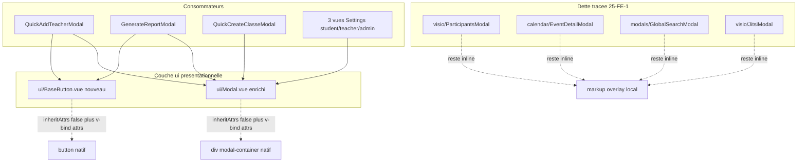
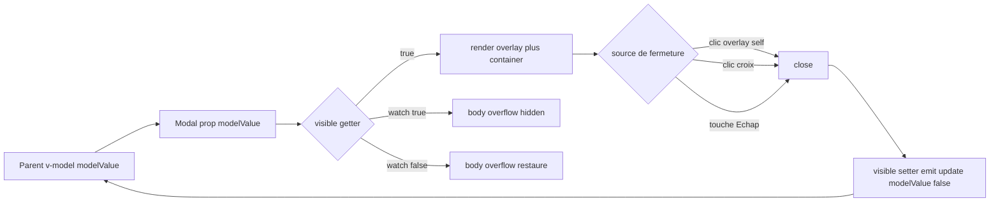
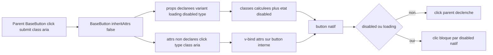
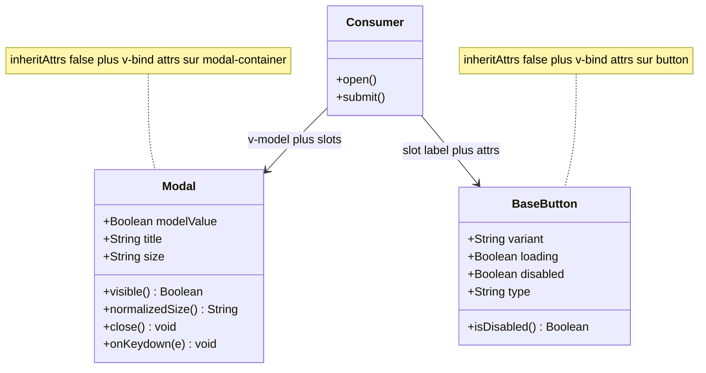
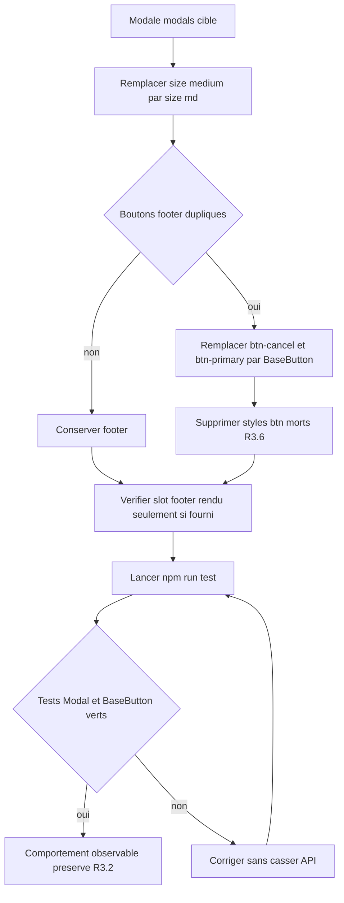
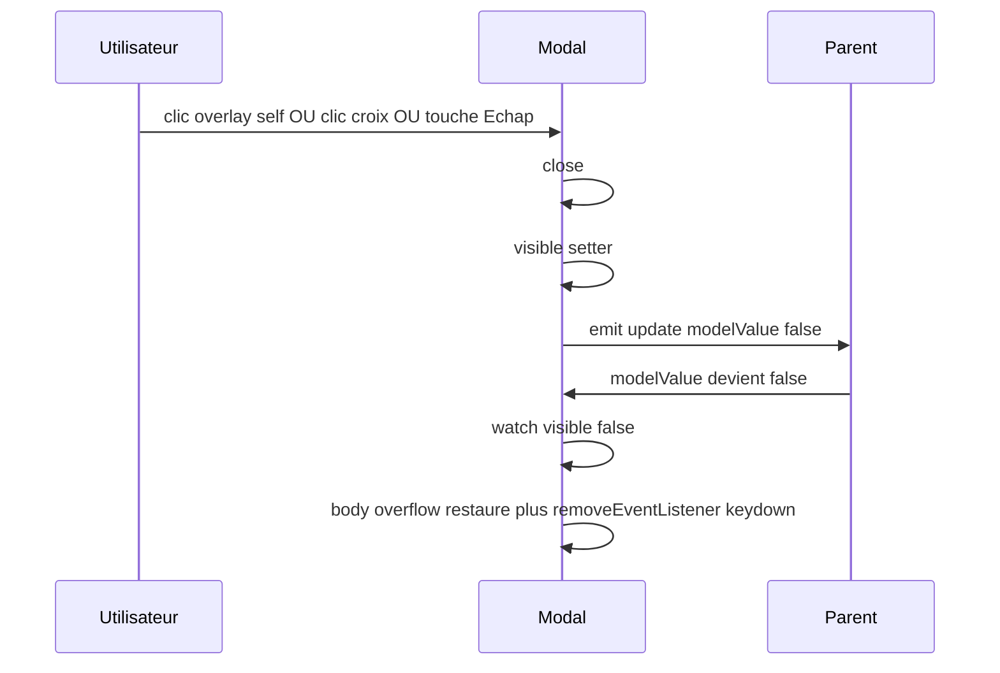
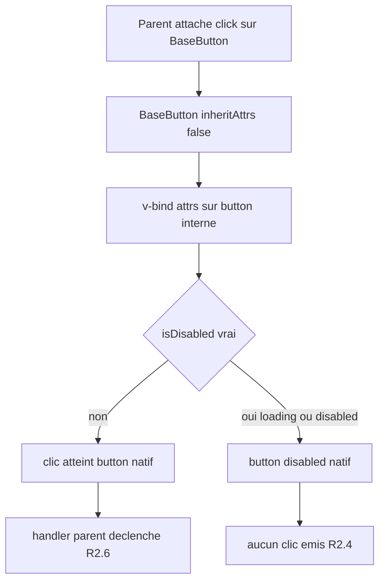

# Design Document — Réutilisabilité des composants UI (ui-components)

> Issue GitHub #25, TIER 1 de la roadmap d'audit (épique #16).
> Spec-driven (CONTRIBUTING §A). Requirements approuvé : `.claude/specs/ui-components/requirements.md`.
> Toutes les décisions ci-dessous appliquent la règle « UNE seule solution, jamais A ou B » (PRODUCTION_STANDARDS §6, citée dans la mémoire projet `lms-backend-rules-location.md`).

## Overview

### Objectif

Remplacer la duplication massive de markup de modales et de boutons par les **mécanismes officiels de réutilisation de Vue 3** : composition par slots, fallthrough attributes (`$attrs` + `inheritAttrs:false`), et base components purement présentationnels. La cible est `src/components/ui/Modal.vue` (déjà existant, sous-utilisé) enrichi sans régression, complété par un nouveau `BaseButton.vue` qui pose le pattern wrapper transparent.

### Scope de cette feature (livrable)

1. **Enrichir `ui/Modal.vue`** : `title` optionnelle, slot `header`, prop `size` validée, fermeture Échap, `inheritAttrs:false` + `v-bind="$attrs"`, source de fermeture unique — sans casser les 6 consommateurs actuels ni l'API `v-model:modelValue` / slot défaut / slot `footer` / close overlay+✕ / scroll-lock.
2. **Créer `BaseButton.vue`** (`<script setup>`, `inheritAttrs:false`) : `variant`, `loading`, `disabled`, `type`, slot défaut (label) + slot `icon`.
3. **Migrer 3 modales** inline/quasi-inline simples vers le pattern enrichi et **adopter `BaseButton`** dans 2 d'entre elles (preuve d'usage).
4. **Documenter** les patterns (emplacement tranché : Décision E).
5. **Tests Vitest** d'abord (TDD, PRODUCTION_STANDARDS §1.3) pour `Modal` et `BaseButton`.

### Hors scope (et dette tracée)

- Migration des modales complexes (`ParticipantsModal`, `JitsiModal`, `GlobalSearchModal`, `EventDetailModal`) → **dette `#25-FE-1`** (voir section « Dette tracée »).
- Remplacement de tous les boutons du projet par `BaseButton` (#28, refonte god components).
- Aucune modification backend ni de contrat d'API (R6.5).

### État vérifié du code (lecture réelle, 2026-06-16)

| Fichier | Constat (cité) |
|---|---|
| `src/components/ui/Modal.vue:28-31` | `title` `{ type: String, required: true }` → à rendre optionnelle (R1.3). |
| `src/components/ui/Modal.vue:2-17` | Options API, `<transition>` racine, pas de `header`, pas de `size`, pas d'Échap, pas de `$attrs`. |
| `src/components/ui/Modal.vue:44-46` | `close()` unique existe déjà → réutilisé comme source de fermeture unique (R1.11). |
| `src/components/ui/Modal.vue:48-59` | scroll-lock via `watch(visible)` + `beforeUnmount` → à préserver (R1.1). |
| `modals/QuickAddTeacherModal.vue:2` | `<Modal ... size="medium">` (prop non déclarée, ignorée → bug latent R1.8). Boutons locaux `.btn-cancel`/`.btn-primary` (lignes 277-311). |
| `modals/GenerateReportModal.vue:2` | idem `size="medium"` + boutons locaux dupliqués (lignes 293-327). |
| `modals/QuickCreateClasseModal.vue:2` | idem `size="medium"` + boutons locaux dupliqués (lignes 291-325). |
| `visio/ParticipantsModal.vue` | header dégradé custom, tableau, auto-refresh 15 s, export PDF/Excel → **complexe, dette**. |
| `calendar/EventDetailModal.vue` | overlay `.modal-overlay`/`.modal-container`, header avec badge, footer d'actions par rôle → **dette** (risque régression). |
| `modals/GlobalSearchModal.vue:2-5` | `Teleport` + navigation clavier custom (↑/↓/Enter/Esc) → **complexe, dette**. |
| `tests/unit/roles.test.js` | convention de test : docstring FR d'en-tête, import via `@`, `vitest`, `it.each`. Aucun `mount` encore. |
| `vitest.config.js:19` | `include: ['tests/**/*.test.{js,mjs}', 'src/**/*.test.{js,mjs}']`, `environment: jsdom`, `globals: true`. |

---

## Architecture Design

### System Architecture Diagram



### Data Flow Diagram — ouverture/fermeture d'une Modal



### Data Flow Diagram — fallthrough `$attrs` de BaseButton



---

## Décisions tranchées (une seule option par point, justifiée — §6)

### D1 — `title` optionnelle + slot `header` (Tranche A, R1.3 / R1.4 / R1.5)

**Décision.** `title` devient `{ type: String, default: '' }` (suppression de `required: true`). Le rendu de l'en-tête suit cette priorité unique :

1. Si le slot `header` est fourni → on rend `<slot name="header" />` **à la place** du header par défaut, suivi d'un bouton ✕ accessible **toujours présent** (positionné en absolu dans la zone header) pour garantir une commande de fermeture (R1.5).
2. Sinon, si `title` est non vide → header par défaut `title` + ✕ (comportement actuel préservé).
3. Sinon (ni slot ni title) → header réduit ne contenant que le ✕ accessible (`aria-label="Fermer"`), pas de plantage (R1.5).

**Justification.** Le slot `header` doit pouvoir porter un header custom (cas dégradé des modales inline) tout en conservant une fermeture accessible, ce que R1.4 et R1.5 imposent conjointement. Garder le ✕ hors du slot évite d'obliger chaque header custom à réimplémenter la fermeture (DRY) et garantit l'accessibilité invariante.

### D2 — `size` : ensemble `sm|md|lg|xl` + alias `medium`→`md` normalisé (Tranche A, R1.6 / R1.7 / R1.8)

**Décision.** `size: { type: String, default: 'md', validator }`. Le `validator` accepte l'ensemble canonique `['sm','md','lg','xl']` **et** l'alias historique `'medium'` (pour ne pas faire échouer la validation des 3 consommateurs actuels). Une `computed normalizedSize` mappe `'medium' -> 'md'` puis applique une **classe par taille** (`modal-sm` … `modal-xl`) portant le `max-width`. Toute valeur hors ensemble déclenche l'avertissement Vue (dev) et `normalizedSize` retombe sur `'md'`.

Largeurs (alignées sur l'existant `max-width: 500px`, qui devient `md`) :

| size | max-width | classe |
|---|---|---|
| `sm` | 400px | `.modal-sm` |
| `md` (défaut) | 500px | `.modal-md` |
| `lg` | 720px | `.modal-lg` |
| `xl` | 960px | `.modal-xl` |

**Justification.** R1.8 exige de résoudre l'incohérence `medium` **sans casser** QuickAddTeacher/GenerateReport. Deux issues étaient possibles : (a) normaliser `medium`→`md` dans le composant, ou (b) éditer les 3 consommateurs pour passer `md`. On choisit **(a) la normalisation dans le composant** comme comportement canonique robuste (un consommateur tiers futur qui écrirait `medium` ne casse pas), **et** on corrige aussi les 3 consommateurs vers `md` lors de leur migration (D5) pour supprimer la dette de nommage à la source. L'alias reste supporté et **documenté** : c'est un mapping explicite, pas un attribut ignoré (R1.8 satisfait). `medium` n'est pas dans l'ensemble canonique annoncé (on ne l'encourage pas), seulement toléré.

### D3 — `Modal.vue` reste en Options API + `inheritAttrs:false` (Tranche A, R1.9)

**Décision.** Conserver l'Options API existante et ajouter `inheritAttrs: false`, puis `v-bind="$attrs"` sur le **conteneur de contenu** (`.modal-container`), pas sur le `<transition>` racine. La fermeture Échap utilise `mounted`/`beforeUnmount` + un `watch(visible)` pour attacher/détacher le listener `keydown`.

**Justification.** Réécrire en `<script setup>` est un risque de régression gratuit sur un composant à 6 consommateurs, sans bénéfice fonctionnel pour les critères demandés ; PRODUCTION_STANDARDS impose « meilleure solution, jamais la plus rapide » mais aussi non-régression (R6.4) — ici la valeur est la transparence d'attributs, atteignable en Options API par `inheritAttrs:false`. Migration de paradigme = hors scope, non justifiée par un requirement.

### D4 — `BaseButton.vue` en `<script setup>`, sous `src/components/ui/` (Tranche B, R2)

**Décision.** Nouveau composant `src/components/ui/BaseButton.vue` en `<script setup>` (composant neuf, aucun consommateur à protéger → paradigme moderne adopté d'emblée), `inheritAttrs: false` (via `defineOptions`) + `v-bind="$attrs"` sur le `<button>` interne. Emplacement `ui/` (et non un dossier `base/` séparé) pour cohabiter avec `Modal.vue` et limiter la dispersion ; le préfixe `Base` marque la nature présentationnelle (Style Guide Vue).

**Justification.** Un composant neuf doit poser le **meilleur** pattern (composition + `$attrs`), pas dupliquer le legacy Options. `defineOptions({ inheritAttrs: false })` est la voie idiomatique en `<script setup>` (doc Vue, fallthrough attributes).

### D5 — Périmètre de migration : 3 modales `modals/*` (Tranche D, R3)

**Décision.** Migrer **exactement** ces 3 fichiers, déjà construits autour de `<Modal>` (donc « quasi-inline » : ils consomment Modal mais dupliquent boutons + passent `size="medium"`) :

| Fichier | Action de migration |
|---|---|
| `modals/QuickAddTeacherModal.vue` | `size="medium"` → `size="md"` ; remplacer `.btn-cancel`/`.btn-primary` locaux par `<BaseButton>` ; supprimer les styles de boutons morts (R3.6). |
| `modals/GenerateReportModal.vue` | idem (adoption `BaseButton` démonstrative R2.9). |
| `modals/QuickCreateClasseModal.vue` | `size="medium"` → `size="md"` ; conserve ses boutons OU adopte `BaseButton` (au minimum corrige `size`). |

**Adoption `BaseButton` (R2.9, 1 à 2 emplacements)** : `QuickAddTeacherModal` **et** `GenerateReportModal` (2 emplacements démonstratifs). `QuickCreateClasseModal` corrige au moins `size` (les 3 partagent le bug latent R1.8).

**Justification.** Ces 3 fichiers présentent **le bug latent `size="medium"` (R1.8)** et la **duplication exacte** des styles `.btn-cancel`/`.btn-primary` (vérifié : blocs identiques dans les 3). Les migrer corrige le bug à la source et démontre les deux patterns (slots Modal + `$attrs` BaseButton) sur du markup réel, à faible risque (formulaires simples, footer standard). Les vraies modales `modal-overlay` inline restantes sont soit complexes (dette, voir ci-dessous), soit hors du « représentatif simple » exigé par R3.1.

### D6 — Modales laissées en dette `#25-FE-1` (Tranche D, R3.3)

**Décision.** Restent inline, tracées :

| Fichier | Raison (risque de régression) |
|---|---|
| `visio/ParticipantsModal.vue` | Header dégradé violet custom, tableau de présence, **auto-refresh 15 s** (`setInterval`), export PDF/Excel, prop `seanceId` + `$emit('close')` (pas `v-model`). Migration ≠ triviale. |
| `calendar/EventDetailModal.vue` | Footer d'actions conditionnelles par rôle, badge de statut dans le header, `$emit('close'/'action')` (pas `v-model`). Risque sur le contrat d'événements. |
| `modals/GlobalSearchModal.vue` | `Teleport to body` + navigation clavier custom (↑/↓/Enter/Esc) qui entrerait en conflit avec l'Échap de `Modal`. |
| `visio/JitsiModal.vue` | Intégration tierce (Jitsi), cycle de vie spécifique. |

**Justification.** R3.3 autorise explicitement la dette tracée pour les modales à risque. Forcer leur migration violerait R6.4 (non-régression). La dette est **incrémentale** et documentée (D7), pas masquée (PRODUCTION_STANDARDS §1.6).

### D7 — Documentation des patterns : section de CE design + `src/components/ui/README.md` court (Tranche E, R4)

**Décision.** La documentation de référence vit dans **`src/components/ui/README.md`** (court, au plus près du code, lu par tout contributeur ouvrant `ui/`), et la présente conception en conserve la synthèse (section « Documentation des patterns »). Le README couvre : composition par slots, wrapper transparent `inheritAttrs:false` + `v-bind="$attrs"`, convention `Base*` (préfixe, présentationnel, sans store), API publique de `Modal` et `BaseButton`, référence à la dette `#25-FE-1`, et la règle anti-copier-coller sourcée Vue.

**Justification.** Un `design.md` n'est pas lu lors de l'écriture quotidienne de composants ; un `README.md` dans `ui/` est découvert naturellement et survit à la clôture de la spec. Le design garde la version normative (traçabilité), le README la version opérationnelle.

### D8 — Base components additionnels : `BaseButton` seul maintenant (Tranche C, R2.1)

**Décision.** Créer **uniquement `BaseButton.vue`** dans cette feature. `BaseCard`/`BaseInput` ne sont **pas** créés ici → dette d'opportunité tracée `#25-FE-2` (non bloquante, à créer quand un 2e besoin réel apparaît).

**Justification.** R2 n'exige qu'« au moins un » base component pour **poser le pattern**. Créer `BaseCard`/`BaseInput` sans consommateur réel serait de l'abstraction prématurée (anti-pattern, à l'inverse du besoin DRY constaté sur les boutons). On crée l'abstraction là où la duplication est **prouvée** (boutons `.btn-*` recopiés dans ≥3 fichiers).

### D9 — Emplacement des tests : `tests/unit/` (Tranche test, R5.1)

**Décision.** Les tests vont dans **`tests/unit/Modal.test.js`** et **`tests/unit/BaseButton.test.js`**, conformément à R5.1 (« sous `tests/unit/` ») et à la convention existante `tests/unit/roles.test.js`. (Le prompt évoquait `src/components/ui/__tests__/` ; `vitest.config.js:19` collecte les deux emplacements, mais R5.1 est normatif → on suit `tests/unit/`.)

**Justification.** Cohérence avec le seul test existant et avec le requirement normatif. `vitest.config.js` collecte `tests/**/*.test.{js,mjs}` (ligne 19) → exécutable par `npm run test` sans config supplémentaire (R5.1).

---

## Composants et Interfaces (API exacte)

### `ui/Modal.vue` (enrichi — Options API)

**Props**

```ts
interface ModalProps {
  modelValue: boolean            // default false — v-model (inchangé)
  title?: string                 // default '' — OPTIONNELLE désormais (R1.3)
  size?: 'sm' | 'md' | 'lg' | 'xl'   // default 'md' ; alias toléré 'medium' -> 'md' (R1.6/1.8)
}
```

`size` validator (rejette + warn dev, retombe sur défaut via `normalizedSize`) :

```js
size: {
  type: String,
  default: 'md',
  validator: (v) => ['sm', 'md', 'lg', 'xl', 'medium'].includes(v),
}
```

**Computed**

- `visible` (get/set) — inchangé (`get` = `modelValue`, `set` = `emit('update:modelValue', value)`).
- `normalizedSize` — `this.size === 'medium' ? 'md' : (['sm','md','lg','xl'].includes(this.size) ? this.size : 'md')`. Pilote la classe `modal-{normalizedSize}` sur `.modal-container`.

**Émissions**

- `update:modelValue: (value: boolean)` — unique canal de fermeture (R1.11).

**Slots**

| Slot | Rendu |
|---|---|
| `header` (nommé) | Remplace le header par défaut quand fourni ; ✕ accessible toujours rendu (R1.4/R1.5). |
| défaut | body (inchangé). |
| `footer` (nommé) | rendu **uniquement** si `$slots.footer` (R1.2, inchangé). |

**Attributs**

- `inheritAttrs: false` ; `v-bind="$attrs"` sur `.modal-container` (R1.9). `class`/`id`/`aria-*`/`data-*` non déclarés atteignent le conteneur visible.

**Cycle de vie / fermeture (R1.10, R1.11)**

- `close()` : unique point de sortie → `this.visible = false`. Appelé par overlay (`@click.self`), ✕, et Échap.
- `onKeydown(e)` : si `e.key === 'Escape'` et `visible` → `close()`.
- `watch(visible)` : `true` → `document.body.style.overflow='hidden'` + `document.addEventListener('keydown', onKeydown)` ; `false` → restaure overflow + `removeEventListener`.
- `beforeUnmount()` : restaure overflow + `removeEventListener` (pas de fuite, R1.10).

**Taille de fichier (R1.12 / §1.1).** Cible < 300 lignes. Estimation ~210 lignes (template + script + style). Pas d'extraction nécessaire ; si dépassement, extraction d'un composable `useScrollLock`/`useEscapeClose` (tracée). Marge actuelle suffisante → pas d'extraction prématurée (D8 même logique).

**Squelette template (priorité header — D1)**

```html
<transition name="modal-fade">
  <div v-if="visible" class="modal-overlay" @click.self="close">
    <div class="modal-container" :class="`modal-${normalizedSize}`" v-bind="$attrs">
      <div class="modal-header">
        <slot name="header">
          <h3 v-if="title" class="modal-title">{{ title }}</h3>
        </slot>
        <button class="modal-close-btn" aria-label="Fermer" @click="close">✕</button>
      </div>
      <div class="modal-body"><slot></slot></div>
      <div class="modal-footer" v-if="$slots.footer"><slot name="footer"></slot></div>
    </div>
  </div>
</transition>
```

> Note D1 : le ✕ est **hors** du slot `header`, donc présent dans les 3 cas (slot custom, title, ni l'un ni l'autre) → fermeture accessible garantie (R1.5).

### `ui/BaseButton.vue` (nouveau — `<script setup>`)

**Props**

```ts
interface BaseButtonProps {
  variant?: 'primary' | 'secondary' | 'danger' | 'ghost'  // default 'primary' (R2.2)
  loading?: boolean    // default false (R2.3/2.4)
  disabled?: boolean   // default false (R2.3)
  type?: 'button' | 'submit'  // default 'button' (note ci-dessous)
}
```

`variant` validator : `(v) => ['primary','secondary','danger','ghost'].includes(v)`.

> `type` est **déclaré en prop** avec `default:'button'` pour un comportement sûr par défaut, **et** `type="submit"` passé par le parent doit traverser (R2.7). Comme une prop déclarée ne tombe pas dans `$attrs`, on lie `type` explicitement : `:type="type"`. Le test R5.7 (`type="submit"` → `<button type="submit">`) passe via cette liaison. Tout **autre** attribut natif non déclaré (`@click`, `aria-*`, `class`, `id`, `form`, `name`, `value`) traverse via `v-bind="$attrs"`.

**État désactivé (R2.3/R2.4 — non contournable client)**

- `isDisabled = computed(() => props.disabled || props.loading)`.
- `<button :disabled="isDisabled">` → quand `loading` OU `disabled`, le bouton natif est désactivé ; un `@click` parent ne se déclenche pas (R2.4/R2.6 négatif).

**Attributs**

- `defineOptions({ inheritAttrs: false })` ; `v-bind="$attrs"` sur le `<button>` interne (R2.5). Le `@click` non déclaré traverse (R2.6) ; `type="submit"` via liaison explicite (R2.7).

**Slots**

| Slot | Rendu |
|---|---|
| défaut | label du bouton (R2.8, pas de prop texte). |
| `icon` (nommé, optionnel) | icône avant le label. |

**Émissions** : aucune émission propre. Les listeners (`@click`, etc.) traversent via `$attrs` directement sur le `<button>` natif (pas de ré-émission manuelle — évite le double-clic et reste idiomatique).

**Squelette**

```html
<template>
  <button :type="type" :disabled="isDisabled" :class="['base-btn', `base-btn--${variant}`, { 'is-loading': loading }]" v-bind="$attrs">
    <span v-if="loading" class="base-btn__spinner" aria-hidden="true"></span>
    <span v-else-if="$slots.icon" class="base-btn__icon"><slot name="icon" /></span>
    <span class="base-btn__label"><slot /></span>
  </button>
</template>

<script setup>
import { computed } from 'vue'
defineOptions({ inheritAttrs: false })
const props = defineProps({
  variant: { type: String, default: 'primary', validator: (v) => ['primary','secondary','danger','ghost'].includes(v) },
  loading: { type: Boolean, default: false },
  disabled: { type: Boolean, default: false },
  type: { type: String, default: 'button', validator: (v) => ['button','submit'].includes(v) },
})
const isDisabled = computed(() => props.disabled || props.loading)
</script>
```

Styles scopés via variables CSS du projet (`--card-bg`, `--text-primary`, `--border-primary`, etc.), `primary` reproduisant le dégradé bleu existant (`.btn-primary` des modales) pour parité visuelle après migration.

---

## Data Models

### Core Data Structure Definitions

Les composants sont **présentationnels et sans état global** (R2.1 / R6.2). Pas de store, pas d'entité métier. Les seuls « modèles » sont les contrats de props/slots ci-dessus et les tables de mapping internes.

```ts
// Mapping de taille (Modal) — interne, pur
type CanonicalSize = 'sm' | 'md' | 'lg' | 'xl'
const SIZE_MAX_WIDTH: Record<CanonicalSize, string> = {
  sm: '400px', md: '500px', lg: '720px', xl: '960px',
}
const SIZE_ALIASES: Record<string, CanonicalSize> = { medium: 'md' } // R1.8

// Variantes (BaseButton) — interne, pur
type ButtonVariant = 'primary' | 'secondary' | 'danger' | 'ghost'
```

### Data Model Diagram



---

## Business Process

### Process 1 — Migration d'une modale `modals/*` vers le pattern enrichi



### Process 2 — Fermeture unique de la Modal (overlay / ✕ / Échap)



### Process 3 — Clic sur BaseButton avec fallthrough `$attrs`



---

## Error Handling

Composants purement présentationnels → pas d'I/O, pas d'erreur réseau à gérer dans `Modal`/`BaseButton`. La stratégie d'erreur porte sur la **robustesse du contrat de composant** :

| Cas | Comportement | Critère |
|---|---|---|
| `size` invalide | `validator` → warn Vue (dev) ; `normalizedSize` retombe sur `'md'` ; aucun crash ni largeur indéfinie. | R1.7 |
| `size="medium"` (alias legacy) | accepté, mappé `md`, documenté. | R1.8 |
| Ni slot `header` ni `title` | header réduit au ✕ accessible, rendu non cassé. | R1.5 |
| `footer` absent | aucune zone footer (`v-if="$slots.footer"`). | R1.2 |
| Listener Échap | ajouté à l'ouverture, retiré à la fermeture **et** `beforeUnmount` → pas de fuite. | R1.10 |
| `variant` invalide (BaseButton) | `validator` → warn dev ; classe `base-btn--undefined` évitée car défaut `'primary'` appliqué par Vue. | R2.2 |
| Clic sur bouton `loading`/`disabled` | bloqué côté natif (`:disabled`), handler parent non appelé — état non contournable client (R4 §1.4 production : ne jamais faire confiance au client → désactivation effective, pas seulement visuelle). | R2.3/R2.4 |

Les erreurs métier (soumission de formulaire, appels API) restent dans les **consommateurs** (ex. `handleSubmit` de `QuickAddTeacherModal` conserve son `try/catch` + `toast`), inchangés par la migration (R3.2 : comportement observable préservé).

---

## Testing Strategy

> TDD obligatoire : tests écrits **avant** l'implémentation (PRODUCTION_STANDARDS §1.3, R5.9). Outils : Vitest + `@vue/test-utils` (`mount`), `jsdom` (déjà configurés). Convention `tests/unit/roles.test.js` : docstring FR d'en-tête, import via `@`, `describe/it`, `it.each`.

### Fichier `tests/unit/Modal.test.js`

| # | Cas testé | Assertion | Req |
|---|---|---|---|
| 1 | slot défaut (body) rendu | `wrapper.find('.modal-body').text()` contient le contenu | R5.3 |
| 2 | slot `footer` rendu **seulement** si fourni | sans slot → `find('.modal-footer').exists() === false` ; avec → `true` | R5.3 |
| 3 | slot `header` remplace l'en-tête par défaut | header custom rendu, `.modal-title` par défaut absent, ✕ toujours présent | R5.3 |
| 4 | fermeture ✕ | `find('.modal-close-btn').trigger('click')` → `emitted('update:modelValue')[0] === [false]` | R5.2 |
| 5 | fermeture overlay | `find('.modal-overlay').trigger('click')` (self) → émet `false` | R5.2 |
| 6 | fermeture Échap | `document` keydown `Escape` (visible) → émet `false` | R5.2 |
| 7 | scroll-lock | à `modelValue=true` → `document.body.style.overflow === 'hidden'` ; à `false`/unmount → `''` | R5.4 |
| 8 | `size` valide | `size:'lg'` → `.modal-container` porte `.modal-lg` | R5.5 |
| 9 | `size` invalide + alias | validator(`'zzz'`)=false ; `normalizedSize` rendu = `md` ; `size:'medium'` → `.modal-md` | R5.5 |
| 10 | `$attrs` traverse | `attrs:{ id:'x', class:'custom' }` → présents sur `.modal-container`, pas sur racine `<transition>` | R1.9 |

### Fichier `tests/unit/BaseButton.test.js`

| # | Cas testé | Assertion | Req |
|---|---|---|---|
| 1 | `@click` non déclaré traverse | `mount(BaseButton, { attrs:{ onClick } }); find('button').trigger('click')` → `onClick` appelé | R5.6 |
| 2 | `type="submit"` traverse | `attrs/props type:'submit'` → `find('button').attributes('type') === 'submit'` | R5.7 |
| 3 | `variant` applique la classe | `variant:'danger'` → `find('button').classes()` contient `base-btn--danger` | R5.8 |
| 4 | défaut `variant` | sans prop → `base-btn--primary` | R5.8 |
| 5 | `disabled` | `disabled:true` → `button[disabled]` présent ; clic ne déclenche pas le handler | R5.8 |
| 6 | `loading` | `loading:true` → `button[disabled]` + spinner rendu + aucun clic effectif | R5.8 |
| 7 | slot défaut (label) | `slots:{ default:'Enregistrer' }` → texte rendu | R2.8 |
| 8 | slot `icon` | `slots:{ icon, default }` → icône rendue avant label | R2 |

### Critère d'échec (R5.9)

`npm run test` **doit échouer** si l'un de ces contrats est violé (assertions de régression). Aucun test « tolérant ». Les tests sont commités/validés avant le code d'implémentation (TDD).

---

## Mapping de migration

| Source (avant) | Cible (après) | Changement précis | Statut |
|---|---|---|---|
| `Modal.vue` `title` requis | `title` optionnel `default:''` | suppression `required:true` | Enrichi |
| `Modal.vue` (pas de header) | slot `header` + ✕ invariant | nouveau slot, priorité D1 | Enrichi |
| `Modal.vue` (pas de size) | prop `size` validée + classes | `sm/md/lg/xl` + alias `medium`→`md` | Enrichi |
| `Modal.vue` (pas d'Échap) | listener keydown Escape | ajout/cleanup watch+beforeUnmount | Enrichi |
| `Modal.vue` (pas d'attrs) | `inheritAttrs:false`+`v-bind="$attrs"` sur `.modal-container` | transparence d'attributs | Enrichi |
| `QuickAddTeacherModal` `size="medium"` | `size="md"` | corrige bug latent R1.8 | Migré |
| `QuickAddTeacherModal` `.btn-cancel/.btn-primary` | `<BaseButton variant="secondary">` / `<BaseButton variant="primary" type="submit" :loading>` | adoption BaseButton + suppression styles morts | Migré |
| `GenerateReportModal` `size="medium"` + boutons | `size="md"` + `<BaseButton>` | idem (2e adoption démonstrative) | Migré |
| `QuickCreateClasseModal` `size="medium"` | `size="md"` (+ BaseButton optionnel) | corrige bug latent | Migré |
| `visio/ParticipantsModal` | — | inchangé | **Dette #25-FE-1** |
| `calendar/EventDetailModal` | — | inchangé | **Dette #25-FE-1** |
| `modals/GlobalSearchModal` | — | inchangé | **Dette #25-FE-1** |
| `visio/JitsiModal` | — | inchangé | **Dette #25-FE-1** |
| `BaseCard` / `BaseInput` | — | non créés | **Dette #25-FE-2** |

> Les 11 autres fichiers `modal-overlay`/`fixed inset-0` listés par grep (`ChapterManager`, `SeanceAttendanceHistory`, `AdminUsers`, `AdminEnseignants`, `AdminInstitutions`, `TeacherEvaluations`, `TeacherLessons`, `AdminMatieres`, `TakeEvaluation`, `MatiereDetails`, `AttendanceHistory`, `TipTapEditor`, `CalendarWidget`) ne sont **pas** dans le périmètre de cette feature (R3.1 = « sous-ensemble représentatif »). Ils relèvent de la migration incrémentale future, non bloquante (R6.7). Aucune **nouvelle** modale inline ne sera introduite dans les fichiers migrés (R3.5).

---

## Dette tracée

### `#25-FE-1` — Modales inline complexes non migrées

Voir D6. Justification par fichier documentée. Migration incrémentale autorisée par R3.3/R6.7. **Risque** : duplication persistante de markup overlay sur 4 fichiers complexes. **Quand la payer** : à l'apparition d'un besoin de cohérence visuelle ou lors de la refonte god components (#28). **Non masquée** : référencée dans `src/components/ui/README.md` (D7/R4.4).

### `#25-FE-2` — Base components additionnels non créés

`BaseCard`, `BaseInput` non créés (D8). **Risque** : faible (pas de duplication prouvée comparable aux boutons). **Quand la payer** : au 2e besoin réel concret. Anti-abstraction-prématurée assumée.

### `#25-FE-3` (potentielle, conditionnelle) — Extraction composable si `Modal.vue` dépasse §1.1

Si l'enrichissement porte `Modal.vue` au-delà de ~300 lignes, extraire `useScrollLock` / `useEscapeClose`. Estimation actuelle ~210 lignes → **non déclenchée**, mais tracée pour vigilance (R1.12).

> Aucune dette n'est silencieuse (PRODUCTION_STANDARDS §1.6 « surfacer plutôt que masquer »).

---

## Conformité PRODUCTION_STANDARDS

| Règle (source : mémoire `lms-backend-rules-location.md`) | Application dans ce design |
|---|---|
| **§1.1 Zero God Code / taille de fichier** | `Modal.vue` cible <300 l (~210 estimé) ; `BaseButton.vue` ~80 l ; dépassement éventuel → extraction composable tracée `#25-FE-3` (R1.12/R6.6). |
| **§1.3 Tests obligatoires (TDD)** | 10 tests `Modal` + 8 tests `BaseButton`, écrits **avant** l'implémentation ; `npm run test` échoue sur violation de contrat (R5.9). |
| **§1.6 Citer la règle / sourcer la best practice** | Chaque décision cite son requirement (R1.x…) ; patterns sourcés doc Vue (slots, fallthrough attributes, base components — vuejs.org) dans le README ; dette explicitement tracée. |
| **SOLID — SRP** | `Modal` = présentation modale ; `BaseButton` = présentation bouton ; logique métier reste dans les consommateurs (séparation présentation/métier). |
| **SOLID — OCP** | Extension par slots/`$attrs`/`variant` sans édition du composant (R6.1). |
| **Production, pas prototype** | État `disabled`/`loading` désactivé **effectivement** côté natif (non contournable client), accessibilité du ✕ et `aria-label`, validators de props, pas de copier-coller (R6.1). |
| **Une seule solution (§6)** | D1–D9 tranchent chacune une unique option justifiée, jamais « A ou B ». |
| **CONTRIBUTING §A (spec-driven)** | Ce design suit requirements approuvé ; accord explicite requis avant implémentation et avant tout commit/push. |
| **Pas de modif backend** | Aucun fichier backend ni contrat d'API touché (R6.5). |

---

## Traçabilité design → requirements

| Requirement | Critères | Couvert par |
|---|---|---|
| **R1** Modal enrichie sans régression | 1.1–1.12 | D1, D2, D3, API `Modal`, Process 2, Error Handling, tests 1-10 |
| R1.1/1.2 API préservée | — | API `Modal` (slots/footer/close/scroll-lock), test 2/4/5/7 |
| R1.3 `title` optionnelle | — | D1, props `Modal` |
| R1.4/1.5 slot `header` + ✕ accessible | — | D1, squelette template, test 3 |
| R1.6/1.7 `size` validée | — | D2, validator, test 8/9 |
| R1.8 incohérence `medium` | — | D2 (alias normalisé + correction consommateurs), test 9, mapping |
| R1.9 `$attrs` sur conteneur | — | D3, squelette, test 10 |
| R1.10/1.11 Échap + fermeture unique | — | API `close()`/`onKeydown`, Process 2, test 6 |
| R1.12 taille fichier | — | §1.1, dette `#25-FE-3` |
| **R2** BaseButton `$attrs` | 2.1–2.9 | D4, D8, API `BaseButton`, Process 3, tests B1-B8 |
| R2.2 `variant` | — | props, test B3/B4 |
| R2.3/2.4 disabled/loading non contournable | — | `isDisabled`, Error Handling, test B5/B6 |
| R2.5/2.6/2.7 fallthrough click/type | — | D4, `v-bind="$attrs"` + `:type`, test B1/B2 |
| R2.8 slot label | — | slot défaut, test B7 |
| R2.9 adoption 1-2 emplacements | — | D5 (QuickAddTeacher + GenerateReport) |
| **R3** Migration sous-ensemble | 3.1–3.6 | D5, D6, Mapping de migration, Process 1 |
| R3.3 dette modales complexes | — | D6, dette `#25-FE-1` |
| R3.6 pas de code mort | — | D5 (suppression styles `.btn-*`), Process 1 |
| **R4** Documentation patterns | 4.1–4.5 | D7, `src/components/ui/README.md` |
| **R5** Tests Vitest | 5.1–5.9 | D9, Testing Strategy (18 cas), TDD |
| **R6** Conformité Vue + non-régression | 6.1–6.7 | Conformité PRODUCTION_STANDARDS, D3 (non-régression Options API), R6.2 (sans store), dette incrémentale R6.7 |

---

## Documentation des patterns (synthèse — détail dans `src/components/ui/README.md`)

1. **Composition par slots** : un composant fournit des « trous » nommés/défaut ; le parent injecte le contenu. Ne jamais recopier le markup d'une modale — utiliser `Modal` + slots `header`/défaut/`footer`. (vuejs.org/guide/components/slots)
2. **Wrapper transparent `$attrs`** : `inheritAttrs:false` + `v-bind="$attrs"` sur l'élément interne réel pour que `class`/listeners/`aria-*`/`type` du parent atteignent l'élément natif sans re-déclarer chaque attribut en prop. (vuejs.org/guide/components/attrs)
3. **Base components** : préfixe `Base`, purement présentationnels, **sans store ni état global**, pilotés par props + slots. (vuejs.org/style-guide)
4. **Règle anti-copier-coller** : interdiction d'introduire un nouveau markup `modal-overlay`/`fixed inset-0 … bg-opacity-50` ; toute nouvelle modale passe par `ui/Modal.vue`, tout nouveau bouton standard par `ui/BaseButton.vue`. (DRY, vuejs.org/guide/reusability)
5. **Dette `#25-FE-1`** : modales restées inline et raison (ParticipantsModal, EventDetailModal, GlobalSearchModal, JitsiModal).

---

**Does the design look good? If so, we can move on to the implementation plan.**
(Si vous souhaitez des ajustements — valeurs de `size`, périmètre de migration, emplacement de la doc, ou tout autre point tranché — indiquez-les et je révise avant de produire les tasks.)
