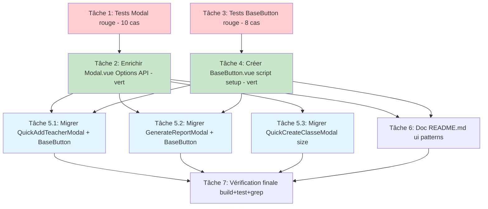

# Implementation Plan — Réutilisabilité des composants UI (ui-components)

> Issue GitHub #25, TIER 1 (épique #16). Spec-driven (CONTRIBUTING §A).
> Requirements + Design approuvés : `.claude/specs/ui-components/requirements.md`, `.claude/specs/ui-components/design.md`.
> **TDD obligatoire** (PRODUCTION_STANDARDS §1.3 / R5.9) : les tests de montage sont écrits **avant** l'implémentation (rouge → vert). Outils : Vitest 4 + `@vue/test-utils` 2 + jsdom (déjà configurés, `vitest.config.js:19` collecte `tests/**/*.test.{js,mjs}` et `src/**/*.test.{js,mjs}`).
> **Ordre imposé par le design** : tests Modal (rouge) → Modal enrichi (vert) → tests BaseButton (rouge) → BaseButton (vert) → migration des 3 modales → doc → vérification finale.
>
> **Conflits de fichiers à respecter (séquence stricte)** :
> - `src/components/ui/Modal.vue` est **enrichi en tâche 2** puis **consommé en tâche 5** → la tâche 5 dépend de 2.
> - `src/components/ui/BaseButton.vue` est **créé en tâche 4** puis **adopté en tâche 5** → la tâche 5 dépend de 4.
> - Les tests de chaque composant (tâches 1 et 3) doivent rester **rouges** jusqu'à l'implémentation correspondante (tâches 2 et 4), conformément au TDD.

---

- [ ] 1. Écrire les tests de montage de `Modal` (rouge, TDD) — 10 cas du design
  - Créer `tests/unit/Modal.test.js` (convention `tests/unit/roles.test.js` : docstring FR d'en-tête, import via alias `@`, `vitest`, `describe/it`, `it.each` au besoin) ; importer `Modal` depuis `@/components/ui/Modal.vue`, monter via `mount` de `@vue/test-utils`.
  - Cas 1 — slot défaut (body) : `wrapper.find('.modal-body').text()` contient le contenu injecté.
  - Cas 2 — slot `footer` conditionnel : sans slot `footer` → `find('.modal-footer').exists() === false` ; avec slot `footer` → `exists() === true`.
  - Cas 3 — slot `header` remplace l'en-tête : header custom rendu, `.modal-title` par défaut absent, **bouton ✕ toujours présent** (D1, ✕ hors slot).
  - Cas 4 — fermeture ✕ : `find('.modal-close-btn').trigger('click')` → `emitted('update:modelValue')[0]` égal `[false]`.
  - Cas 5 — fermeture overlay : `find('.modal-overlay').trigger('click')` (`@click.self`) → émet `false`.
  - Cas 6 — fermeture Échap : dispatch `keydown` `Escape` sur `document` alors que `modelValue=true` → émet `false`.
  - Cas 7 — scroll-lock : `modelValue=true` → `document.body.style.overflow === 'hidden'` ; passage à `false` puis `unmount()` → overflow restauré (`''`).
  - Cas 8 — `size` valide : `size:'lg'` → `.modal-container` porte la classe `modal-lg`.
  - Cas 9 — `size` invalide + alias : valeur `'zzz'` → `normalizedSize` rend `modal-md` ; `size:'medium'` → `modal-md` (D2).
  - Cas 10 — `$attrs` traverse : monter avec `attrs:{ id:'x', class:'custom' }` → présents sur `.modal-container`, **absents** de l'élément racine (`<transition>`) (R1.9).
  - Exécuter `npm run test tests/unit/Modal.test.js` et **constater l'échec** (composant pas encore enrichi : ni `header`, ni `size`, ni Échap, ni `$attrs`) — preuve TDD rouge.
  - Fichiers : `tests/unit/Modal.test.js`.
  - Critère de complétion : `npm run test` exécute ces 10 cas et ils échouent (rouge). `grep -c "it(" tests/unit/Modal.test.js` ≥ 10 (ou décompte équivalent via `it.each`).
  - Décision design : D9 (emplacement `tests/unit/`), D1, D2, D3, Testing Strategy (tableau 10 cas).
  - _Requirements: R5.1, R5.2, R5.3, R5.4, R5.5, R1.9_

- [ ] 2. Enrichir `src/components/ui/Modal.vue` sans régression (Options API) → tests tâche 1 au vert
  - **NE PAS migrer en `<script setup>`** : conserver l'Options API existante (D3). Préserver l'API publique : `v-model:modelValue`, slot défaut (body), slot `footer` conditionnel (`v-if="$slots.footer"`), fermeture overlay (`@click.self`) + ✕, scroll-lock via `watch(visible)` + `beforeUnmount`, animation `modal-fade` (R1.1, R1.2).
  - Prop `title` : passer de `{ type: String, required: true }` à `{ type: String, default: '' }` (R1.3).
  - Slot `header` (D1) : `<slot name="header">` enveloppant le rendu par défaut `<h3 v-if="title" class="modal-title">{{ title }}</h3>` ; **bouton ✕ rendu hors du slot** (toujours présent : slot custom, title seul, ou ni l'un ni l'autre → ✕ accessible `aria-label="Fermer"`) (R1.4, R1.5).
  - Prop `size` (D2) : `{ type: String, default: 'md', validator: (v) => ['sm','md','lg','xl','medium'].includes(v) }`. `computed normalizedSize` : `'medium' → 'md'`, valeur hors ensemble canonique → `'md'`. Appliquer `:class="`modal-${normalizedSize}`"` sur `.modal-container` (R1.6, R1.7, R1.8). Styles `.modal-sm`(400px) `.modal-md`(500px) `.modal-lg`(720px) `.modal-xl`(960px) — `md` reprend l'actuel `max-width:500px`.
  - Fallthrough attributs : ajouter `inheritAttrs: false` dans les options + `v-bind="$attrs"` sur `.modal-container` (et **non** sur le `<transition>` racine) (R1.9).
  - Fermeture Échap (R1.10, R1.11) : méthode `close()` unique (réutiliser l'existante `Modal.vue:44-46`) appelée par overlay/✕/Échap ; méthode `onKeydown(e)` (`Escape` + `visible` → `close()`) ; dans `watch(visible)` : `true` → `document.addEventListener('keydown', onKeydown)`, `false` → `removeEventListener` ; `beforeUnmount()` retire le listener **et** restaure l'overflow (pas de fuite).
  - Vérifier la taille de fichier < 300 lignes (R1.12 / §1.1) ; aucune extraction de composable attendue (~210 l estimé, dette `#25-FE-3` non déclenchée).
  - Exécuter `npm run test tests/unit/Modal.test.js` → **10 cas verts**.
  - Fichiers : `src/components/ui/Modal.vue`.
  - Critère de complétion : `npm run test tests/unit/Modal.test.js` tous verts ; `grep -n "inheritAttrs" src/components/ui/Modal.vue` présent ; `grep -n "required: true" src/components/ui/Modal.vue` absent ; nb de lignes < 300.
  - Décision design : D1, D2, D3 ; API `Modal` ; squelette template du design.
  - _Requirements: R1.1, R1.2, R1.3, R1.4, R1.5, R1.6, R1.7, R1.8, R1.9, R1.10, R1.11, R1.12, R6.4_

- [ ] 3. Écrire les tests de montage de `BaseButton` (rouge, TDD) — 8 cas du design
  - Créer `tests/unit/BaseButton.test.js` (même convention : docstring FR, import `@`, `vitest`, `mount`) ; importer depuis `@/components/ui/BaseButton.vue`.
  - Cas 1 — `@click` non déclaré traverse : `mount(BaseButton, { attrs: { onClick } })` ; `find('button').trigger('click')` → `onClick` appelé (preuve `$attrs`) (R5.6).
  - Cas 2 — `type="submit"` traverse : passer `type:'submit'` → `find('button').attributes('type') === 'submit'` (R5.7).
  - Cas 3 — `class` custom traverse : `attrs:{ class:'ma-classe' }` → `find('button').classes()` contient `ma-classe` (R5.6 / R1.9 analogue).
  - Cas 4 — `variant` applique la classe : `variant:'danger'` → classes du `<button>` contiennent `base-btn--danger` (R5.8).
  - Cas 5 — défaut `variant` : sans prop → `base-btn--primary` (R5.8).
  - Cas 6 — `disabled` : `disabled:true` → attribut `disabled` présent sur `<button>` ; un `@click` parent **ne se déclenche pas** (R5.8, R2.6 négatif).
  - Cas 7 — `loading` : `loading:true` → `<button>` `disabled` + spinner rendu (`.base-btn__spinner`) + aucun clic effectif (R5.8, R2.4).
  - Cas 8 — slot label + slot icon : `slots:{ default:'Enregistrer' }` → texte rendu ; `slots:{ icon, default }` → icône rendue avant le label (R2.8, R2).
  - Exécuter `npm run test tests/unit/BaseButton.test.js` et **constater l'échec** (fichier composant inexistant) — preuve TDD rouge.
  - Fichiers : `tests/unit/BaseButton.test.js`.
  - Critère de complétion : `npm run test` exécute ces cas et ils échouent (rouge, import manquant). 8 cas présents.
  - Décision design : D9 (emplacement) ; D4 ; Testing Strategy (tableau 8 cas BaseButton).
  - _Requirements: R5.6, R5.7, R5.8, R2.8_

- [ ] 4. Créer `src/components/ui/BaseButton.vue` (`<script setup>`) → tests tâche 3 au vert
  - Créer le composant en `<script setup>` (composant neuf, paradigme moderne — D4) sous `src/components/ui/` (cohabitation avec `Modal.vue`, pas de dossier `base/` séparé — D4).
  - `defineOptions({ inheritAttrs: false })` ; props via `defineProps` : `variant` (`default:'primary'`, validator `['primary','secondary','danger','ghost']`), `loading` (Boolean, `false`), `disabled` (Boolean, `false`), `type` (`default:'button'`, validator `['button','submit']`) (R2.2, R2.3).
  - `computed isDisabled = props.disabled || props.loading` (R2.3, R2.4 — état désactivé non contournable côté client).
  - Template `<button>` : `:type="type"` lié **explicitement** (une prop déclarée ne tombe pas dans `$attrs`, donc liaison directe pour que `type="submit"` traverse — R2.7), `:disabled="isDisabled"`, `:class="['base-btn', `base-btn--${variant}`, { 'is-loading': loading }]"`, **`v-bind="$attrs"`** sur le `<button>` interne pour que `@click`/`aria-*`/`class`/`id`/`form`/`name`/`value` non déclarés traversent (R2.5, R2.6).
  - Slots : slot par défaut = label (`.base-btn__label`, pas de prop texte — R2.8) ; slot nommé `icon` (avant le label, `v-else-if="$slots.icon"`) ; spinner `.base-btn__spinner` `aria-hidden` quand `loading`.
  - Aucune émission propre (les listeners traversent via `$attrs` directement sur le natif — pas de ré-émission, design « Émissions : aucune »).
  - Styles **scopés** via variables CSS du projet (`--card-bg`, `--text-primary`, `--border-primary`, etc.) ; `primary` reproduit le dégradé bleu existant (`.btn-primary` des modales) pour parité visuelle post-migration. Sans store ni état global (R2.1, R6.2).
  - Exécuter `npm run test tests/unit/BaseButton.test.js` → **8 cas verts**.
  - Fichiers : `src/components/ui/BaseButton.vue`.
  - Critère de complétion : `npm run test tests/unit/BaseButton.test.js` tous verts ; `grep -n "inheritAttrs: false" src/components/ui/BaseButton.vue` présent ; `grep -n "useStore\|pinia" src/components/ui/BaseButton.vue` absent (sans état global).
  - Décision design : D4, D8 ; API `BaseButton` ; squelette du design.
  - _Requirements: R2.1, R2.2, R2.3, R2.4, R2.5, R2.6, R2.7, R2.8, R6.2, R6.3_

- [ ] 5. Migrer les 3 modales `modals/*` vers `ui/Modal` enrichi + adopter `BaseButton` (dépend de 2 et 4)
  - **Dépendance** : nécessite `Modal.vue` enrichi (tâche 2) **et** `BaseButton.vue` (tâche 4). Préserver le comportement observable de chaque modale : ouverture/fermeture, overlay/✕/Échap, soumission de formulaire, émissions existantes, rendu équivalent (R3.2).
- [ ] 5.1 `src/components/modals/QuickAddTeacherModal.vue` — corriger `size` + adopter `BaseButton`
  - Remplacer `size="medium"` par `size="md"` sur `<Modal>` (corrige le bug latent R1.8 à la source ; l'alias reste toléré par le composant mais on supprime la dette de nommage — D2/D5).
  - Remplacer les boutons locaux `.btn-cancel` / `.btn-primary` (lignes ~277-311) par `<BaseButton variant="secondary">` (annuler) et `<BaseButton variant="primary" type="submit" :loading="...">` (soumettre), via le slot `footer` de `Modal` si besoin.
  - Supprimer les styles `.btn-cancel` / `.btn-primary` désormais morts dans le `<style>` du fichier (R3.6 — pas de code mort).
  - Conserver `handleSubmit`/`try-catch`/`toast` inchangés (logique métier hors scope — R3.2).
  - Fichiers : `src/components/modals/QuickAddTeacherModal.vue`.
  - Critère : `grep -n "size=\"medium\"" src/components/modals/QuickAddTeacherModal.vue` absent ; `grep -n "BaseButton" ...` présent ; `grep -n "btn-cancel\|btn-primary" ...` absent (styles morts retirés).
  - Décision design : D5 (adoption démonstrative), D2.
  - _Requirements: R3.1, R3.2, R3.6, R2.9, R1.8_
- [ ] 5.2 `src/components/modals/GenerateReportModal.vue` — corriger `size` + adopter `BaseButton`
  - `size="medium"` → `size="md"` (R1.8).
  - Remplacer les boutons locaux dupliqués (lignes ~293-327) par `<BaseButton>` (2e adoption démonstrative R2.9) ; supprimer les styles `.btn-*` morts (R3.6).
  - Préserver le comportement (génération de rapport, émissions, fermeture).
  - Fichiers : `src/components/modals/GenerateReportModal.vue`.
  - Critère : `grep -n "size=\"medium\"" ...` absent ; `grep -n "BaseButton" ...` présent ; styles `.btn-*` dupliqués retirés.
  - Décision design : D5, D2.
  - _Requirements: R3.1, R3.2, R3.6, R2.9, R1.8_
- [ ] 5.3 `src/components/modals/QuickCreateClasseModal.vue` — corriger `size` (BaseButton optionnel)
  - `size="medium"` → `size="md"` (corrige le bug latent partagé R1.8 — minimum requis par D5).
  - Optionnel : adopter `<BaseButton>` (sinon conserver ses boutons) ; si adoption, supprimer les styles `.btn-*` morts (R3.6).
  - Préserver le comportement (création de classe, émissions, fermeture).
  - Fichiers : `src/components/modals/QuickCreateClasseModal.vue`.
  - Critère : `grep -n "size=\"medium\"" ...` absent ; si BaseButton adopté, styles morts retirés.
  - Décision design : D5, D2.
  - _Requirements: R3.1, R3.2, R3.6, R1.8_

- [ ] 6. Documenter les patterns dans `src/components/ui/README.md` (D7)
  - Créer `src/components/ui/README.md` (court, au plus près du code) couvrant : (1) composition par slots (ne jamais recopier le markup d'une modale, utiliser `Modal` + slots `header`/défaut/`footer`) ; (2) wrapper transparent `inheritAttrs:false` + `v-bind="$attrs"` sur l'élément interne ; (3) convention base components (préfixe `Base`, purement présentationnel, **sans store ni état global**) — sources doc Vue citées (vuejs.org slots / attrs / style-guide / reusability) (R4.1, R4.5).
  - Documenter l'API publique enrichie de `ui/Modal.vue` : props `modelValue`/`title`/`size` (+ alias `medium`→`md`), slots `header`/défaut/`footer`, événement `update:modelValue`, fermeture Échap/overlay/✕ (R4.2).
  - Documenter l'API publique de `BaseButton.vue` : props `variant`/`loading`/`disabled`/`type`, slot défaut (label) + slot `icon`, transmission `$attrs` (`@click`/`type`/`aria-*`/`class`) (R4.3).
  - Référencer la dette tracée **`#25-FE-1`** (ParticipantsModal, EventDetailModal, GlobalSearchModal, JitsiModal — fichier + raison) et mentionner `#25-FE-2` (BaseCard/BaseInput non créés) (R4.4).
  - Inclure la **règle anti-copier-coller** explicite (« ne pas dupliquer une modale ni un markup `modal-overlay`/`fixed inset-0 … bg-opacity-50` ; réutiliser `Modal`/`BaseButton` par slots et `$attrs` »), sourcée Vue/DRY (R4.5).
  - Fichiers : `src/components/ui/README.md`.
  - Critère : fichier présent ; `grep -i "25-FE-1" src/components/ui/README.md` présent ; sections Modal + BaseButton + règle anti-copier-coller présentes.
  - Décision design : D7, section « Documentation des patterns » du design.
  - _Requirements: R4.1, R4.2, R4.3, R4.4, R4.5_

- [ ] 7. Vérification finale (non-régression globale + traçabilité dette)
  - `npm run test` : la suite passe ; **Modal (10) + BaseButton (8) verts** ; total de tests ≥ avant la feature (aucun test existant cassé, ex. `roles.test.js`) (R5.9, R6.4).
  - `npm run test:contract` toujours vert (aucun contrat d'API touché — R6.5).
  - `npm run build` réussit (pas d'erreur de compilation sur les composants enrichis/migrés).
  - Grep de migration : pour `QuickAddTeacherModal.vue`, `GenerateReportModal.vue`, `QuickCreateClasseModal.vue` → confirmer l'import de `ui/Modal` (`grep -rn "ui/Modal" src/components/modals/`) et **l'absence de markup `modal-overlay` inline** (`grep -rn "modal-overlay" src/components/modals/QuickAddTeacherModal.vue src/components/modals/GenerateReportModal.vue src/components/modals/QuickCreateClasseModal.vue` → 0).
  - Confirmer l'absence de `size="medium"` dans les 3 modales migrées (`grep -rn 'size="medium"' src/components/modals/` → 0).
  - Compteur dette **`#25-FE-1`** : recompter les modales inline restantes (`grep -rln "modal-overlay\|fixed inset-0" src/ | wc -l`) et vérifier que les 4 fichiers de dette (ParticipantsModal, EventDetailModal, GlobalSearchModal, JitsiModal) sont **inchangés** (NE PAS migrer) ; consigner le compte dans la note de vérification.
  - Vérifier les 6 consommateurs historiques de `Modal` (3 vues Settings + 3 modales) : aucune erreur console, rendu/fermeture inchangés ou améliorés (R6.4).
  - Fichiers : aucun nouveau fichier (vérification seule).
  - Critère : toutes les commandes ci-dessus passent ; greps conformes ; dette `#25-FE-1` = 4 fichiers intacts.
  - Décision design : Mapping de migration, Dette tracée, Conformité PRODUCTION_STANDARDS.
  - _Requirements: R5.9, R6.4, R6.5, R6.6, R6.7, R3.3, R3.5_

---

## Tasks Dependency Diagram

**Notes de séquencement (conflits de fichiers)** :
- `Modal.vue` : **modifié en tâche 2**, puis **consommé en tâches 5.1/5.2/5.3** → 5.x après 2. Le TDD impose que les tests de la tâche 1 restent rouges jusqu'à la tâche 2.
- `BaseButton.vue` : **créé en tâche 4**, puis **adopté en tâches 5.1/5.2** → 5.1/5.2 après 4. Tests tâche 3 rouges jusqu'à la tâche 4.
- Les tâches 1 et 3 (tests rouges) sont indépendantes et parallélisables. Les tâches 2 et 4 sont indépendantes une fois leurs tests respectifs écrits. Les sous-tâches 5.1/5.2/5.3 touchent des fichiers distincts (parallélisables entre elles une fois 2 et 4 terminées).
- **Aucune tâche backend, aucune tâche non technique** (R6.5). Les 4 modales de dette `#25-FE-1` ne sont **pas** migrées (D6). `BaseCard`/`BaseInput` non créés → dette `#25-FE-2` (D8).
